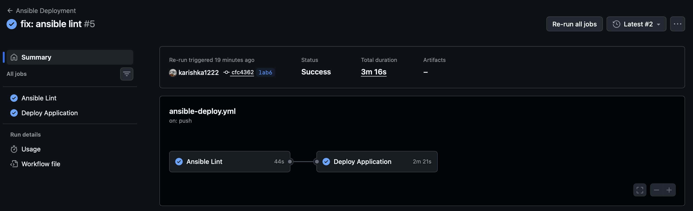
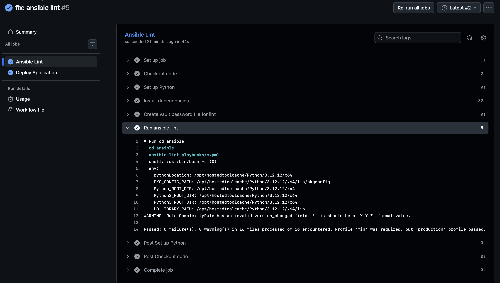
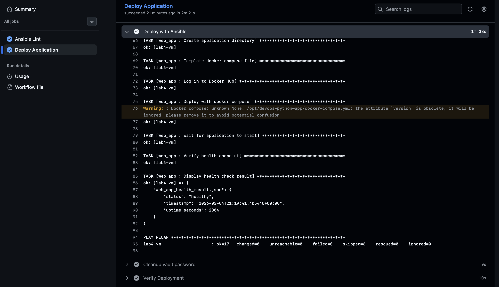
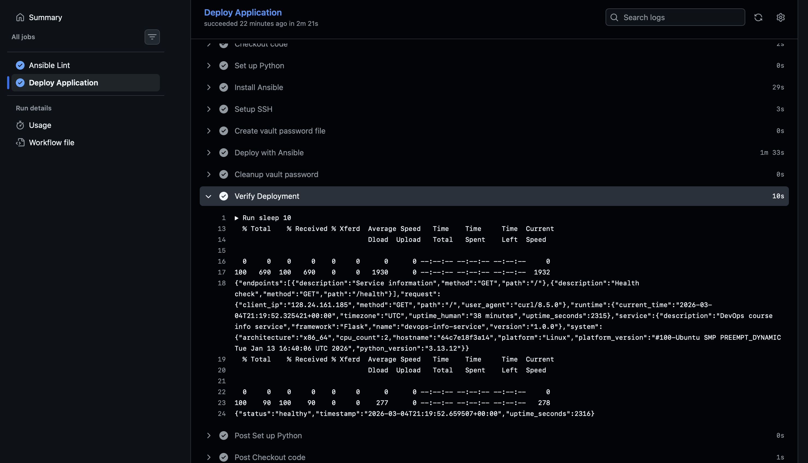

# Lab 6: Advanced Ansible & CI/CD

[](https://github.com/karishka1222/DevOps-Core-Course/actions/workflows/ansible-deploy.yml)
[](https://github.com/karishka1222/DevOps-Core-Course/actions/workflows/ansible-deploy-bonus.yml)

**Name:** Karina Siniatullina
**Date:** 2026-02-27
**Lab Points:** 10 + 2.5 bonus

---

## Task 1: Blocks & Tags (2 pts)

### Implementation

**common role** (`roles/common/tasks/main.yml`):
- `packages` block: groups apt cache update + package install, with rescue that runs `apt-get update --fix-missing` and retries. Always block logs completion to `/tmp/common_packages_done.log`.
- `users` block: timezone config with dedicated tag.

**docker role** (`roles/docker/tasks/main.yml`):
- `docker_install` block: prerequisites, GPG key, repo, package install. Rescue waits 10s and retries. Always block ensures Docker service is enabled.
- `docker_config` block: user group membership + python3-docker installation.

### Tag Strategy

| Tag | Scope |
|-----|-------|
| `common` | Entire common role (role-level) |
| `packages` | Package installation block |
| `users` | User/system config block |
| `docker` | Entire docker role (role-level) |
| `docker_install` | Docker installation block |
| `docker_config` | Docker configuration block |
| `app_deploy` | Application deployment |
| `compose` | Docker Compose tasks |
| `web_app_wipe` | Wipe logic |

### List of all tags

```bash
ansible-playbook playbooks/provision.yml --list-tags
```

```

playbook: playbooks/provision.yml

  play #1 (webservers): Provision web servers   TAGS: []
      TASK TAGS: [common, docker, docker_config, docker_install, packages, users]
```

### Selective execution with --tags "docker"

```bash
ansible-playbook playbooks/provision.yml --tags "docker"
```

```

PLAY [Provision web servers] **********************************************************************************************************************************************************************************************

TASK [Gathering Facts] ****************************************************************************************************************************************************************************************************
[WARNING]: Host 'lab4-vm' is using the discovered Python interpreter at '/usr/bin/python3.12', but future installation of another Python interpreter could cause a different interpreter to be discovered. See https://docs.ansible.com/ansible-core/2.20/reference_appendices/interpreter_discovery.html for more information.
ok: [lab4-vm]

TASK [docker : Install prerequisites for Docker repository] ***************************************************************************************************************************************************************
ok: [lab4-vm]

TASK [docker : Create keyrings directory] *********************************************************************************************************************************************************************************
ok: [lab4-vm]

TASK [docker : Add Docker GPG key] ****************************************************************************************************************************************************************************************
changed: [lab4-vm]

TASK [docker : Add Docker repository] *************************************************************************************************************************************************************************************
changed: [lab4-vm]

TASK [docker : Install Docker packages] ***********************************************************************************************************************************************************************************
changed: [lab4-vm]

TASK [docker : Ensure Docker service is enabled and started] **************************************************************************************************************************************************************
ok: [lab4-vm]

TASK [docker : Add user to docker group] **********************************************************************************************************************************************************************************
changed: [lab4-vm]

TASK [docker : Install python3-docker for Ansible docker modules] *********************************************************************************************************************************************************
changed: [lab4-vm]

RUNNING HANDLER [docker : restart docker] *********************************************************************************************************************************************************************************
changed: [lab4-vm]

PLAY RECAP ****************************************************************************************************************************************************************************************************************
lab4-vm                    : ok=10   changed=6    unreachable=0    failed=0    skipped=0    rescued=0    ignored=0   
```

### Skip common role

```bash
ansible-playbook playbooks/provision.yml --skip-tags "common"
```

```

PLAY [Provision web servers] **********************************************************************************************************************************************************************************************

TASK [Gathering Facts] ****************************************************************************************************************************************************************************************************
[WARNING]: Host 'lab4-vm' is using the discovered Python interpreter at '/usr/bin/python3.12', but future installation of another Python interpreter could cause a different interpreter to be discovered. See https://docs.ansible.com/ansible-core/2.20/reference_appendices/interpreter_discovery.html for more information.
ok: [lab4-vm]

TASK [docker : Install prerequisites for Docker repository] ***************************************************************************************************************************************************************
ok: [lab4-vm]

TASK [docker : Create keyrings directory] *********************************************************************************************************************************************************************************
ok: [lab4-vm]

TASK [docker : Add Docker GPG key] ****************************************************************************************************************************************************************************************
ok: [lab4-vm]

TASK [docker : Add Docker repository] *************************************************************************************************************************************************************************************
ok: [lab4-vm]

TASK [docker : Install Docker packages] ***********************************************************************************************************************************************************************************
ok: [lab4-vm]

TASK [docker : Ensure Docker service is enabled and started] **************************************************************************************************************************************************************
ok: [lab4-vm]

TASK [docker : Add user to docker group] **********************************************************************************************************************************************************************************
ok: [lab4-vm]

TASK [docker : Install python3-docker for Ansible docker modules] *********************************************************************************************************************************************************
ok: [lab4-vm]

PLAY RECAP ****************************************************************************************************************************************************************************************************************
lab4-vm                    : ok=9    changed=0    unreachable=0    failed=0    skipped=0    rescued=0    ignored=0 
```

### Only packages tag

```bash
ansible-playbook playbooks/provision.yml --tags "packages"
```

```

PLAY [Provision web servers] **********************************************************************************************************************************************************************************************

TASK [Gathering Facts] ****************************************************************************************************************************************************************************************************
[WARNING]: Host 'lab4-vm' is using the discovered Python interpreter at '/usr/bin/python3.12', but future installation of another Python interpreter could cause a different interpreter to be discovered. See https://docs.ansible.com/ansible-core/2.20/reference_appendices/interpreter_discovery.html for more information.
ok: [lab4-vm]

TASK [common : Update apt cache] ******************************************************************************************************************************************************************************************
ok: [lab4-vm]

TASK [common : Install common packages] ***********************************************************************************************************************************************************************************
changed: [lab4-vm]

TASK [common : Log package installation completion] ***********************************************************************************************************************************************************************
[WARNING]: Deprecation warnings can be disabled by setting `deprecation_warnings=False` in ansible.cfg.
[DEPRECATION WARNING]: INJECT_FACTS_AS_VARS default to `True` is deprecated, top-level facts will not be auto injected after the change. This feature will be removed from ansible-core version 2.24.
Origin: /Users/karinasiniatullina/innopolis/3 курс/2sem/devops/DevOps-Core-Course/ansible/roles/common/tasks/main.yml:26:18

24     - name: Log package installation completion
25       copy:
26         content: "Package installation completed at {{ ansible_date_time.iso8601 }}\n"
                    ^ column 18

Use `ansible_facts["fact_name"]` (no `ansible_` prefix) instead.

changed: [lab4-vm]

PLAY RECAP ****************************************************************************************************************************************************************************************************************
lab4-vm                    : ok=4    changed=2    unreachable=0    failed=0    skipped=0    rescued=0    ignored=0 
```

### Only docker_install tag

```bash
ansible-playbook playbooks/provision.yml --tags "docker_install"
```

```

PLAY [Provision web servers] **********************************************************************************************************************************************************************************************

TASK [Gathering Facts] ****************************************************************************************************************************************************************************************************
[WARNING]: Host 'lab4-vm' is using the discovered Python interpreter at '/usr/bin/python3.12', but future installation of another Python interpreter could cause a different interpreter to be discovered. See https://docs.ansible.com/ansible-core/2.20/reference_appendices/interpreter_discovery.html for more information.
ok: [lab4-vm]

TASK [docker : Install prerequisites for Docker repository] ***************************************************************************************************************************************************************
ok: [lab4-vm]

TASK [docker : Create keyrings directory] *********************************************************************************************************************************************************************************
ok: [lab4-vm]

TASK [docker : Add Docker GPG key] ****************************************************************************************************************************************************************************************
ok: [lab4-vm]

TASK [docker : Add Docker repository] *************************************************************************************************************************************************************************************
ok: [lab4-vm]

TASK [docker : Install Docker packages] ***********************************************************************************************************************************************************************************
ok: [lab4-vm]

TASK [docker : Ensure Docker service is enabled and started] **************************************************************************************************************************************************************
ok: [lab4-vm]

PLAY RECAP ****************************************************************************************************************************************************************************************************************
lab4-vm                    : ok=7    changed=0    unreachable=0    failed=0    skipped=0    rescued=0    ignored=0  
```

### Check mode (dry run)

```bash
ansible-playbook playbooks/provision.yml --tags "docker" --check
```

```

PLAY [Provision web servers] **********************************************************************************************************************************************************************************************

TASK [Gathering Facts] ****************************************************************************************************************************************************************************************************
[WARNING]: Host 'lab4-vm' is using the discovered Python interpreter at '/usr/bin/python3.12', but future installation of another Python interpreter could cause a different interpreter to be discovered. See https://docs.ansible.com/ansible-core/2.20/reference_appendices/interpreter_discovery.html for more information.
ok: [lab4-vm]

TASK [docker : Install prerequisites for Docker repository] ***************************************************************************************************************************************************************
ok: [lab4-vm]

TASK [docker : Create keyrings directory] *********************************************************************************************************************************************************************************
ok: [lab4-vm]

TASK [docker : Add Docker GPG key] ****************************************************************************************************************************************************************************************
ok: [lab4-vm]

TASK [docker : Add Docker repository] *************************************************************************************************************************************************************************************
ok: [lab4-vm]

TASK [docker : Install Docker packages] ***********************************************************************************************************************************************************************************
ok: [lab4-vm]

TASK [docker : Ensure Docker service is enabled and started] **************************************************************************************************************************************************************
ok: [lab4-vm]

TASK [docker : Add user to docker group] **********************************************************************************************************************************************************************************
ok: [lab4-vm]

TASK [docker : Install python3-docker for Ansible docker modules] *********************************************************************************************************************************************************
ok: [lab4-vm]

PLAY RECAP ****************************************************************************************************************************************************************************************************************
lab4-vm                    : ok=9    changed=0    unreachable=0    failed=0    skipped=0    rescued=0    ignored=0 
```

### Rescue block behavior

Rescue block was not triggered during testing — all tasks succeeded on first attempt. This is expected in a healthy environment.

The rescue block is configured to handle apt failures:
- `common` role: runs `apt-get update --fix-missing` and retries package installation
- `docker` role: waits 10 seconds, retries `apt update`, then retries Docker package installation

Rescue would activate if, for example, the apt cache was corrupted or a network timeout occurred during package download.

### Research Answers

**Q: What happens if rescue block also fails?**
The play fails for that host. Ansible does not have a "rescue the rescue" — if rescue fails, the always block still runs, then the task is marked failed.

**Q: Can you have nested blocks?**
Yes, blocks can be nested. Inner blocks can have their own rescue/always sections.

**Q: How do tags inherit to tasks within blocks?**
Tags applied at the block level are inherited by all tasks inside the block. Tasks can also have additional tags.

---

## Task 2: Docker Compose (3 pts)

### Migration from docker_container to Docker Compose

**Before (app_deploy):** Used `community.docker.docker_container` module with imperative stop-remove-run pattern.

**After (web_app):** Uses Jinja2-templated `docker-compose.yml.j2` deployed via `community.docker.docker_compose_v2` module. Declarative, idempotent, and extensible.

### Template Structure

`roles/web_app/templates/docker-compose.yml.j2`:
```yaml
version: '3.8'
services:
  {{ app_name }}:
    image: {{ docker_image }}:{{ docker_tag }}
    container_name: {{ app_name }}
    ports:
      - "{{ app_port }}:{{ app_internal_port }}"
    environment:
      ...
    restart: {{ app_restart_policy }}
```

### Role Dependencies

`roles/web_app/meta/main.yml` declares `docker` as a dependency, so running the `web_app` role automatically provisions Docker first.

### Role Rename

`app_deploy` → `web_app` for clarity and to support multi-app patterns.

### Docker Compose deployment — first run

```bash
ansible-playbook playbooks/deploy.yml
```

```

PLAY [Deploy application] **************************************************************************************************************************************************

TASK [Gathering Facts] *****************************************************************************************************************************************************
[WARNING]: Host 'lab4-vm' is using the discovered Python interpreter at '/usr/bin/python3.12', but future installation of another Python interpreter could cause a different interpreter to be discovered. See https://docs.ansible.com/ansible-core/2.20/reference_appendices/interpreter_discovery.html for more information.
ok: [lab4-vm]

TASK [docker : Install prerequisites for Docker repository] ****************************************************************************************************************
ok: [lab4-vm]

TASK [docker : Create keyrings directory] **********************************************************************************************************************************
ok: [lab4-vm]

TASK [docker : Add Docker GPG key] *****************************************************************************************************************************************
ok: [lab4-vm]

TASK [docker : Add Docker repository] **************************************************************************************************************************************
ok: [lab4-vm]

TASK [docker : Install Docker packages] ************************************************************************************************************************************
ok: [lab4-vm]

TASK [docker : Ensure Docker service is enabled and started] ***************************************************************************************************************
ok: [lab4-vm]

TASK [docker : Add user to docker group] ***********************************************************************************************************************************
ok: [lab4-vm]

TASK [docker : Install python3-docker for Ansible docker modules] **********************************************************************************************************
ok: [lab4-vm]

TASK [web_app : Include wipe tasks] ****************************************************************************************************************************************
included: /Users/karinasiniatullina/innopolis/3 курс/2sem/devops/DevOps-Core-Course/ansible/roles/web_app/tasks/wipe.yml for lab4-vm

TASK [web_app : Stop and remove containers via compose] ********************************************************************************************************************
skipping: [lab4-vm]

TASK [web_app : Remove docker-compose file] ********************************************************************************************************************************
skipping: [lab4-vm]

TASK [web_app : Remove application directory] ******************************************************************************************************************************
skipping: [lab4-vm]

TASK [web_app : Remove Docker image] ***************************************************************************************************************************************
skipping: [lab4-vm]

TASK [web_app : Log wipe completion] ***************************************************************************************************************************************
skipping: [lab4-vm]

TASK [web_app : Create application directory] ******************************************************************************************************************************
changed: [lab4-vm]

TASK [web_app : Template docker-compose file] ******************************************************************************************************************************
changed: [lab4-vm]

TASK [web_app : Log in to Docker Hub] **************************************************************************************************************************************
changed: [lab4-vm]

TASK [web_app : Deploy with docker compose] ********************************************************************************************************************************
[WARNING]: Docker compose: unknown None: /opt/devops-python-app/docker-compose.yml: the attribute `version` is obsolete, it will be ignored, please remove it to avoid potential confusion
changed: [lab4-vm]

TASK [web_app : Wait for application to start] *****************************************************************************************************************************
ok: [lab4-vm]

TASK [web_app : Verify health endpoint] ************************************************************************************************************************************
ok: [lab4-vm]

TASK [web_app : Display health check result] *******************************************************************************************************************************
ok: [lab4-vm] => {
    "health_result.json": {
        "status": "healthy",
        "timestamp": "2026-03-03T09:52:26.488107+00:00",
        "uptime_seconds": 7
    }
}

PLAY RECAP *****************************************************************************************************************************************************************
lab4-vm                    : ok=17   changed=4    unreachable=0    failed=0    skipped=5    rescued=0    ignored=0 
```

### Idempotency — second run (should be 0 changed)

```bash
ansible-playbook playbooks/deploy.yml
```

```

PLAY [Deploy application] ***********************************************************************************************************************************************************

TASK [Gathering Facts] **************************************************************************************************************************************************************
[WARNING]: Host 'lab4-vm' is using the discovered Python interpreter at '/usr/bin/python3.12', but future installation of another Python interpreter could cause a different interpreter to be discovered. See https://docs.ansible.com/ansible-core/2.20/reference_appendices/interpreter_discovery.html for more information.
ok: [lab4-vm]

TASK [docker : Install prerequisites for Docker repository] *************************************************************************************************************************
ok: [lab4-vm]

TASK [docker : Create keyrings directory] *******************************************************************************************************************************************
ok: [lab4-vm]

TASK [docker : Add Docker GPG key] **************************************************************************************************************************************************
ok: [lab4-vm]

TASK [docker : Add Docker repository] ***********************************************************************************************************************************************
ok: [lab4-vm]

TASK [docker : Install Docker packages] *********************************************************************************************************************************************
ok: [lab4-vm]

TASK [docker : Ensure Docker service is enabled and started] ************************************************************************************************************************
ok: [lab4-vm]

TASK [docker : Add user to docker group] ********************************************************************************************************************************************
ok: [lab4-vm]

TASK [docker : Install python3-docker for Ansible docker modules] *******************************************************************************************************************
ok: [lab4-vm]

TASK [web_app : Include wipe tasks] *************************************************************************************************************************************************
included: /Users/karinasiniatullina/innopolis/3 курс/2sem/devops/DevOps-Core-Course/ansible/roles/web_app/tasks/wipe.yml for lab4-vm

TASK [web_app : Stop and remove containers via compose] *****************************************************************************************************************************
skipping: [lab4-vm]

TASK [web_app : Remove docker-compose file] *****************************************************************************************************************************************
skipping: [lab4-vm]

TASK [web_app : Remove application directory] ***************************************************************************************************************************************
skipping: [lab4-vm]

TASK [web_app : Remove Docker image] ************************************************************************************************************************************************
skipping: [lab4-vm]

TASK [web_app : Log wipe completion] ************************************************************************************************************************************************
skipping: [lab4-vm]

TASK [web_app : Create application directory] ***************************************************************************************************************************************
ok: [lab4-vm]

TASK [web_app : Template docker-compose file] ***************************************************************************************************************************************
ok: [lab4-vm]

TASK [web_app : Log in to Docker Hub] ***********************************************************************************************************************************************
ok: [lab4-vm]

TASK [web_app : Deploy with docker compose] *****************************************************************************************************************************************
[WARNING]: Docker compose: unknown None: /opt/devops-python-app/docker-compose.yml: the attribute `version` is obsolete, it will be ignored, please remove it to avoid potential confusion
ok: [lab4-vm]

TASK [web_app : Wait for application to start] **************************************************************************************************************************************
ok: [lab4-vm]

TASK [web_app : Verify health endpoint] *********************************************************************************************************************************************
ok: [lab4-vm]

TASK [web_app : Display health check result] ****************************************************************************************************************************************
ok: [lab4-vm] => {
    "health_result.json": {
        "status": "healthy",
        "timestamp": "2026-03-03T09:56:29.002065+00:00",
        "uptime_seconds": 250
    }
}

PLAY RECAP **************************************************************************************************************************************************************************
lab4-vm                    : ok=17   changed=0    unreachable=0    failed=0    skipped=5    rescued=0    ignored=0 
```

### Templated docker-compose.yml on VM

```bash
ssh ubuntu@51.250.81.253 "cat /opt/devops-python-app/docker-compose.yml"
```

```
version: '3.8'

services:
  devops-python-app:
    image: karishka1222/devops-python-app:latest
    container_name: devops-python-app
    ports:
      - "5000:5000"
    environment:
      HOST: "0.0.0.0"
      PORT: "5000"
    restart: unless-stopped
```

### Application running — docker ps

```bash
ssh ubuntu@51.250.81.253 "docker ps"
```

```
CONTAINER ID   IMAGE                                   COMMAND           CREATED        STATUS                  PORTS                                         NAMES
59fe1a3e1fab   karishka1222/devops-python-app:latest   "python app.py"   25 hours ago   Up 25 hours (healthy)   0.0.0.0:5000->5000/tcp, [::]:5000->5000/tcp   devops-python-app
```

### Application accessible — curl

```bash
curl http://51.250.81.253:5000 && echo && curl http://51.250.81.253:5000/health
```

```
{"endpoints":[{"description":"Service information","method":"GET","path":"/"},{"description":"Health check","method":"GET","path":"/health"}],"request":{"client_ip":"45.89.244.78","method":"GET","path":"/","user_agent":"curl/8.7.1"},"runtime":{"current_time":"2026-03-04T10:25:17.603166+00:00","timezone":"UTC","uptime_human":"24 hours, 32 minutes","uptime_seconds":88379},"service":{"description":"DevOps course info service","framework":"Flask","name":"devops-info-service","version":"1.0.0"},"system":{"architecture":"x86_64","cpu_count":2,"hostname":"59fe1a3e1fab","platform":"Linux","platform_version":"#100-Ubuntu SMP PREEMPT_DYNAMIC Tue Jan 13 16:40:06 UTC 2026","python_version":"3.13.12"}}

{"status":"healthy","timestamp":"2026-03-04T10:25:17.906558+00:00","uptime_seconds":88379}
```

### Research Answers

**Q: Difference between `restart: always` and `restart: unless-stopped`?**
`always` restarts even after manual `docker stop`. `unless-stopped` skips restart if the container was manually stopped before the daemon restarted.

**Q: Docker Compose networks vs Docker bridge?**
Compose creates a project-scoped bridge network by default, providing DNS-based service discovery between containers. Plain bridge requires manual linking.

**Q: Can you reference Ansible Vault variables in the template?**
Yes. Vault-encrypted variables are decrypted at runtime and available in Jinja2 templates like any other variable.

---

## Task 3: Wipe Logic (1 pt)

### Implementation

File: `roles/web_app/tasks/wipe.yml`

Double-gated: requires **both** `web_app_wipe: true` (variable, `when` condition) **and** `--tags web_app_wipe` (tag). Default: `web_app_wipe: false` in `roles/web_app/defaults/main.yml`.

Wipe actions: compose down → remove compose file → remove app directory → remove Docker image.

### Scenario 1: Normal deployment (wipe should NOT run)

```bash
ansible-playbook playbooks/deploy.yml
```

```

PLAY [Deploy application] ***********************************************************************************************************************************************************************************************************

TASK [Gathering Facts] **************************************************************************************************************************************************************************************************************
[WARNING]: Host 'lab4-vm' is using the discovered Python interpreter at '/usr/bin/python3.12', but future installation of another Python interpreter could cause a different interpreter to be discovered. See https://docs.ansible.com/ansible-core/2.20/reference_appendices/interpreter_discovery.html for more information.
ok: [lab4-vm]

TASK [docker : Install prerequisites for Docker repository] *************************************************************************************************************************************************************************
ok: [lab4-vm]

TASK [docker : Create keyrings directory] *******************************************************************************************************************************************************************************************
ok: [lab4-vm]

TASK [docker : Add Docker GPG key] **************************************************************************************************************************************************************************************************
ok: [lab4-vm]

TASK [docker : Add Docker repository] ***********************************************************************************************************************************************************************************************
ok: [lab4-vm]

TASK [docker : Install Docker packages] *********************************************************************************************************************************************************************************************
ok: [lab4-vm]

TASK [docker : Ensure Docker service is enabled and started] ************************************************************************************************************************************************************************
ok: [lab4-vm]

TASK [docker : Add user to docker group] ********************************************************************************************************************************************************************************************
ok: [lab4-vm]

TASK [docker : Install python3-docker for Ansible docker modules] *******************************************************************************************************************************************************************
ok: [lab4-vm]

TASK [web_app : Include wipe tasks] *************************************************************************************************************************************************************************************************
included: /Users/karinasiniatullina/innopolis/3 курс/2sem/devops/DevOps-Core-Course/ansible/roles/web_app/tasks/wipe.yml for lab4-vm

TASK [web_app : Stop and remove containers via compose] *****************************************************************************************************************************************************************************
skipping: [lab4-vm]

TASK [web_app : Remove docker-compose file] *****************************************************************************************************************************************************************************************
skipping: [lab4-vm]

TASK [web_app : Remove application directory] ***************************************************************************************************************************************************************************************
skipping: [lab4-vm]

TASK [web_app : Remove Docker image] ************************************************************************************************************************************************************************************************
skipping: [lab4-vm]

TASK [web_app : Log wipe completion] ************************************************************************************************************************************************************************************************
skipping: [lab4-vm]

TASK [web_app : Create application directory] ***************************************************************************************************************************************************************************************
ok: [lab4-vm]

TASK [web_app : Template docker-compose file] ***************************************************************************************************************************************************************************************
ok: [lab4-vm]

TASK [web_app : Log in to Docker Hub] ***********************************************************************************************************************************************************************************************
ok: [lab4-vm]

TASK [web_app : Deploy with docker compose] *****************************************************************************************************************************************************************************************
[WARNING]: Docker compose: unknown None: /opt/devops-python-app/docker-compose.yml: the attribute `version` is obsolete, it will be ignored, please remove it to avoid potential confusion
ok: [lab4-vm]

TASK [web_app : Wait for application to start] **************************************************************************************************************************************************************************************
ok: [lab4-vm]

TASK [web_app : Verify health endpoint] *********************************************************************************************************************************************************************************************
ok: [lab4-vm]

TASK [web_app : Display health check result] ****************************************************************************************************************************************************************************************
ok: [lab4-vm] => {
    "health_result.json": {
        "status": "healthy",
        "timestamp": "2026-03-04T17:13:55.131696+00:00",
        "uptime_seconds": 112896
    }
}

PLAY RECAP **************************************************************************************************************************************************************************************************************************
lab4-vm                    : ok=17   changed=0    unreachable=0    failed=0    skipped=5    rescued=0    ignored=0
```

Verification:
```bash
ssh ubuntu@51.250.81.253 "docker ps"
```

```
CONTAINER ID   IMAGE                                   COMMAND           CREATED        STATUS                  PORTS                                         NAMES
59fe1a3e1fab   karishka1222/devops-python-app:latest   "python app.py"   31 hours ago   Up 31 hours (healthy)   0.0.0.0:5000->5000/tcp, [::]:5000->5000/tcp   devops-python-app
```

### Scenario 2: Wipe only (remove app, no deploy)

```bash
ansible-playbook playbooks/deploy.yml -e "web_app_wipe=true" --tags web_app_wipe
```

```

PLAY [Deploy application] ***********************************************************************************************************************************************************************************************************

TASK [Gathering Facts] **************************************************************************************************************************************************************************************************************
[WARNING]: Host 'lab4-vm' is using the discovered Python interpreter at '/usr/bin/python3.12', but future installation of another Python interpreter could cause a different interpreter to be discovered. See https://docs.ansible.com/ansible-core/2.20/reference_appendices/interpreter_discovery.html for more information.
ok: [lab4-vm]

TASK [web_app : Include wipe tasks] *************************************************************************************************************************************************************************************************
included: /Users/karinasiniatullina/innopolis/3 курс/2sem/devops/DevOps-Core-Course/ansible/roles/web_app/tasks/wipe.yml for lab4-vm

TASK [web_app : Stop and remove containers via compose] *****************************************************************************************************************************************************************************
[WARNING]: Docker compose: unknown None: /opt/devops-python-app/docker-compose.yml: the attribute `version` is obsolete, it will be ignored, please remove it to avoid potential confusion
changed: [lab4-vm]

TASK [web_app : Remove docker-compose file] *****************************************************************************************************************************************************************************************
changed: [lab4-vm]

TASK [web_app : Remove application directory] ***************************************************************************************************************************************************************************************
changed: [lab4-vm]

TASK [web_app : Remove Docker image] ************************************************************************************************************************************************************************************************
changed: [lab4-vm]

TASK [web_app : Log wipe completion] ************************************************************************************************************************************************************************************************
ok: [lab4-vm] => {
    "msg": "Application devops-python-app wiped successfully"
}

PLAY RECAP **************************************************************************************************************************************************************************************************************************
lab4-vm                    : ok=7    changed=4    unreachable=0    failed=0    skipped=0    rescued=0    ignored=0
```

Verification:
```bash
ssh ubuntu@51.250.81.253 "docker ps"
ssh ubuntu@51.250.81.253 "ls /opt/"
```

```
CONTAINER ID   IMAGE     COMMAND   CREATED   STATUS    PORTS     NAMES
containerd
```

### Scenario 3: Clean reinstall (wipe then deploy)

```bash
ansible-playbook playbooks/deploy.yml -e "web_app_wipe=true"
```

```

PLAY [Deploy application] ***********************************************************************************************************************************************************************************************************

TASK [Gathering Facts] **************************************************************************************************************************************************************************************************************
[WARNING]: Host 'lab4-vm' is using the discovered Python interpreter at '/usr/bin/python3.12', but future installation of another Python interpreter could cause a different interpreter to be discovered. See https://docs.ansible.com/ansible-core/2.20/reference_appendices/interpreter_discovery.html for more information.
ok: [lab4-vm]

TASK [docker : Install prerequisites for Docker repository] *************************************************************************************************************************************************************************
ok: [lab4-vm]

TASK [docker : Create keyrings directory] *******************************************************************************************************************************************************************************************
ok: [lab4-vm]

TASK [docker : Add Docker GPG key] **************************************************************************************************************************************************************************************************
ok: [lab4-vm]

TASK [docker : Add Docker repository] ***********************************************************************************************************************************************************************************************
ok: [lab4-vm]

TASK [docker : Install Docker packages] *********************************************************************************************************************************************************************************************
ok: [lab4-vm]

TASK [docker : Ensure Docker service is enabled and started] ************************************************************************************************************************************************************************
ok: [lab4-vm]

TASK [docker : Add user to docker group] ********************************************************************************************************************************************************************************************
ok: [lab4-vm]

TASK [docker : Install python3-docker for Ansible docker modules] *******************************************************************************************************************************************************************
ok: [lab4-vm]

TASK [web_app : Include wipe tasks] *************************************************************************************************************************************************************************************************
included: /Users/karinasiniatullina/innopolis/3 курс/2sem/devops/DevOps-Core-Course/ansible/roles/web_app/tasks/wipe.yml for lab4-vm

TASK [web_app : Check if app directory exists] **************************************************************************************************************************************************************************************
ok: [lab4-vm]

TASK [web_app : Stop and remove containers via compose] *****************************************************************************************************************************************************************************
[WARNING]: Docker compose: unknown None: /opt/devops-python-app/docker-compose.yml: the attribute `version` is obsolete, it will be ignored, please remove it to avoid potential confusion
changed: [lab4-vm]

TASK [web_app : Remove docker-compose file] *****************************************************************************************************************************************************************************************
changed: [lab4-vm]

TASK [web_app : Remove application directory] ***************************************************************************************************************************************************************************************
changed: [lab4-vm]

TASK [web_app : Remove Docker image] ************************************************************************************************************************************************************************************************
changed: [lab4-vm]

TASK [web_app : Log wipe completion] ************************************************************************************************************************************************************************************************
ok: [lab4-vm] => {
    "msg": "Application devops-python-app wiped successfully"
}

TASK [web_app : Create application directory] ***************************************************************************************************************************************************************************************
changed: [lab4-vm]

TASK [web_app : Template docker-compose file] ***************************************************************************************************************************************************************************************
changed: [lab4-vm]

TASK [web_app : Log in to Docker Hub] ***********************************************************************************************************************************************************************************************
ok: [lab4-vm]

TASK [web_app : Deploy with docker compose] *****************************************************************************************************************************************************************************************
changed: [lab4-vm]

TASK [web_app : Wait for application to start] **************************************************************************************************************************************************************************************
ok: [lab4-vm]

TASK [web_app : Verify health endpoint] *********************************************************************************************************************************************************************************************
ok: [lab4-vm]

TASK [web_app : Display health check result] ****************************************************************************************************************************************************************************************
ok: [lab4-vm] => {
    "health_result.json": {
        "status": "healthy",
        "timestamp": "2026-03-04T17:24:48.358096+00:00",
        "uptime_seconds": 12
    }
}

PLAY RECAP **************************************************************************************************************************************************************************************************************************
lab4-vm                    : ok=23   changed=7    unreachable=0    failed=0    skipped=0    rescued=0    ignored=0
```

Verification:
```bash
ssh ubuntu@51.250.81.253 "docker ps"
```

```
CONTAINER ID   IMAGE                                   COMMAND           CREATED         STATUS                   PORTS                                         NAMES
4a24e2daaac5   karishka1222/devops-python-app:latest   "python app.py"   5 minutes ago   Up 5 minutes (healthy)   0.0.0.0:5000->5000/tcp, [::]:5000->5000/tcp   devops-python-app
```

### Scenario 4: Tag specified but variable false (safety check)

```bash
ansible-playbook playbooks/deploy.yml --tags web_app_wipe
```

```

PLAY [Deploy application] ***********************************************************************************************************************************************************************************************************

TASK [Gathering Facts] **************************************************************************************************************************************************************************************************************
[WARNING]: Host 'lab4-vm' is using the discovered Python interpreter at '/usr/bin/python3.12', but future installation of another Python interpreter could cause a different interpreter to be discovered. See https://docs.ansible.com/ansible-core/2.20/reference_appendices/interpreter_discovery.html for more information.
ok: [lab4-vm]

TASK [web_app : Include wipe tasks] *************************************************************************************************************************************************************************************************
included: /Users/karinasiniatullina/innopolis/3 курс/2sem/devops/DevOps-Core-Course/ansible/roles/web_app/tasks/wipe.yml for lab4-vm

TASK [web_app : Check if app directory exists] **************************************************************************************************************************************************************************************
skipping: [lab4-vm]

TASK [web_app : Stop and remove containers via compose] *****************************************************************************************************************************************************************************
skipping: [lab4-vm]

TASK [web_app : Remove docker-compose file] *****************************************************************************************************************************************************************************************
skipping: [lab4-vm]

TASK [web_app : Remove application directory] ***************************************************************************************************************************************************************************************
skipping: [lab4-vm]

TASK [web_app : Remove Docker image] ************************************************************************************************************************************************************************************************
skipping: [lab4-vm]

TASK [web_app : Log wipe completion] ************************************************************************************************************************************************************************************************
skipping: [lab4-vm]

PLAY RECAP **************************************************************************************************************************************************************************************************************************
lab4-vm                    : ok=2    changed=0    unreachable=0    failed=0    skipped=6    rescued=0    ignored=0
```

### Research Answers

**Q: Why use both variable AND tag?**
Double safety: tag prevents accidental execution during normal runs, variable prevents execution even if tag is accidentally included.

**Q: Difference from `never` tag?**
The `never` tag approach is built-in but less flexible. Our approach allows combining wipe + deploy in one run (clean reinstall), which `never` tag cannot do without `--tags never`.

**Q: Why must wipe come BEFORE deployment?**
To support clean reinstallation: wipe old state, then deploy fresh — all in a single playbook run.

**Q: When clean reinstall vs rolling update?**
Clean reinstall: major version changes, config schema changes, corrupted state. Rolling update: minor patches, zero-downtime required.

**Q: How to extend wipe for volumes and images?**
Add `docker volume prune` and `docker image rm` tasks to `wipe.yml` (image removal is already included).

---

## Task 4: CI/CD (3 pts)

### Workflow Architecture

File: `.github/workflows/ansible-deploy.yml`

```
Push to ansible/** → Lint job (ansible-lint) → Deploy job (ansible-playbook) → Verify (curl health)
```

### Jobs

1. **lint** — installs ansible + ansible-lint, runs `ansible-lint playbooks/*.yml`
2. **deploy** — sets up SSH, creates vault password file, runs `ansible-playbook playbooks/deploy.yml`, verifies with curl

### Required GitHub Secrets

| Secret | Purpose |
|--------|---------|
| `ANSIBLE_VAULT_PASSWORD` | Decrypt vault-encrypted variables |
| `SSH_PRIVATE_KEY` | SSH to target VM |
| `VM_HOST` | Target VM IP address |
| `VM_USER` | SSH username |

### Path Filters

Workflow triggers only on changes to `ansible/**` and the workflow file itself.

### Status Badge

Added to root `README.md`:

```
[](https://github.com/karishka1222/DevOps-Core-Course/actions/workflows/ansible-deploy.yml)
```

### Successful workflow run screenshot



### ansible-lint passing (from workflow logs)



### ansible-playbook execution (from workflow logs)



### Verification step — curl output (from workflow logs)



### Research Answers

**Q: Security implications of SSH keys in GitHub Secrets?**
Secrets are encrypted at rest and masked in logs, but anyone with repo write access can exfiltrate them via workflow changes. Use deploy keys with minimal permissions.

**Q: How to implement staging → production pipeline?**
Use separate inventory files and jobs: deploy to staging first, run smoke tests, then deploy to production with manual approval gate.

**Q: What to add for rollbacks?**
Store previous docker image tag, add a rollback job that redeploys the previous version using `-e docker_tag=<previous>`.

**Q: Self-hosted runner security advantages?**
No secrets leave your network, no SSH keys stored in GitHub, runner has direct access to target infrastructure.

---

## Bonus Part 1: Multi-App Deployment (1.5 pts)

### Architecture

The `web_app` role is reused for both Python and Go apps with different variable files:
- `vars/app_python.yml` — Python app on port 5000
- `vars/app_bonus.yml` — Go app on port 8001

### Playbooks

- `deploy_python.yml` — deploys Python app only
- `deploy_bonus.yml` — deploys Go app only
- `deploy_all.yml` — deploys both apps via `include_role`

### Port Strategy

Python: host port 5000, Go: host port 8001. Different ports allow both apps to run simultaneously.

### Deploy both apps

```bash
ansible-playbook playbooks/deploy_all.yml
```

```

PLAY [Deploy All Applications] ***********************************************************************************************************************************************************************************

TASK [Gathering Facts] *******************************************************************************************************************************************************************************************
[WARNING]: Host 'lab4-vm' is using the discovered Python interpreter at '/usr/bin/python3.12', but future installation of another Python interpreter could cause a different interpreter to be discovered. See https://docs.ansible.com/ansible-core/2.20/reference_appendices/interpreter_discovery.html for more information.
ok: [lab4-vm]

TASK [Deploy Python App] *****************************************************************************************************************************************************************************************
included: web_app for lab4-vm

TASK [docker : Install prerequisites for Docker repository] ******************************************************************************************************************************************************
ok: [lab4-vm]

TASK [docker : Create keyrings directory] ************************************************************************************************************************************************************************
ok: [lab4-vm]

TASK [docker : Add Docker GPG key] *******************************************************************************************************************************************************************************
ok: [lab4-vm]

TASK [docker : Add Docker repository] ****************************************************************************************************************************************************************************
ok: [lab4-vm]

TASK [docker : Install Docker packages] **************************************************************************************************************************************************************************
ok: [lab4-vm]

TASK [docker : Ensure Docker service is enabled and started] *****************************************************************************************************************************************************
ok: [lab4-vm]

TASK [docker : Add user to docker group] *************************************************************************************************************************************************************************
ok: [lab4-vm]

TASK [docker : Install python3-docker for Ansible docker modules] ************************************************************************************************************************************************
ok: [lab4-vm]

TASK [web_app : Include wipe tasks] ******************************************************************************************************************************************************************************
included: /Users/karinasiniatullina/innopolis/3 курс/2sem/devops/DevOps-Core-Course/ansible/roles/web_app/tasks/wipe.yml for lab4-vm

TASK [web_app : Check if app directory exists] *******************************************************************************************************************************************************************
skipping: [lab4-vm]

TASK [web_app : Stop and remove containers via compose] **********************************************************************************************************************************************************
skipping: [lab4-vm]

TASK [web_app : Remove docker-compose file] **********************************************************************************************************************************************************************
skipping: [lab4-vm]

TASK [web_app : Remove application directory] ********************************************************************************************************************************************************************
skipping: [lab4-vm]

TASK [web_app : Remove Docker image] *****************************************************************************************************************************************************************************
skipping: [lab4-vm]

TASK [web_app : Log wipe completion] *****************************************************************************************************************************************************************************
skipping: [lab4-vm]

TASK [web_app : Create application directory] ********************************************************************************************************************************************************************
ok: [lab4-vm]

TASK [web_app : Template docker-compose file] ********************************************************************************************************************************************************************
ok: [lab4-vm]

TASK [web_app : Log in to Docker Hub] ****************************************************************************************************************************************************************************
ok: [lab4-vm]

TASK [web_app : Deploy with docker compose] **********************************************************************************************************************************************************************
[WARNING]: Docker compose: unknown None: /opt/devops-python-app/docker-compose.yml: the attribute `version` is obsolete, it will be ignored, please remove it to avoid potential confusion
ok: [lab4-vm]

TASK [web_app : Wait for application to start] *******************************************************************************************************************************************************************
ok: [lab4-vm]

TASK [web_app : Verify health endpoint] **************************************************************************************************************************************************************************
ok: [lab4-vm]

TASK [web_app : Display health check result] *********************************************************************************************************************************************************************
ok: [lab4-vm] => {
    "health_result.json": {
        "status": "healthy",
        "timestamp": "2026-03-04T20:15:06.607184+00:00",
        "uptime_seconds": 10230
    }
}

TASK [Deploy Go App] *********************************************************************************************************************************************************************************************
included: web_app for lab4-vm

TASK [web_app : Include wipe tasks] ******************************************************************************************************************************************************************************
included: /Users/karinasiniatullina/innopolis/3 курс/2sem/devops/DevOps-Core-Course/ansible/roles/web_app/tasks/wipe.yml for lab4-vm

TASK [web_app : Check if app directory exists] *******************************************************************************************************************************************************************
skipping: [lab4-vm]

TASK [web_app : Stop and remove containers via compose] **********************************************************************************************************************************************************
skipping: [lab4-vm]

TASK [web_app : Remove docker-compose file] **********************************************************************************************************************************************************************
skipping: [lab4-vm]

TASK [web_app : Remove application directory] ********************************************************************************************************************************************************************
skipping: [lab4-vm]

TASK [web_app : Remove Docker image] *****************************************************************************************************************************************************************************
skipping: [lab4-vm]

TASK [web_app : Log wipe completion] *****************************************************************************************************************************************************************************
skipping: [lab4-vm]

TASK [web_app : Create application directory] ********************************************************************************************************************************************************************
ok: [lab4-vm]

TASK [web_app : Template docker-compose file] ********************************************************************************************************************************************************************
ok: [lab4-vm]

TASK [web_app : Log in to Docker Hub] ****************************************************************************************************************************************************************************
ok: [lab4-vm]

TASK [web_app : Deploy with docker compose] **********************************************************************************************************************************************************************
[WARNING]: Docker compose: unknown None: /opt/devops-go/docker-compose.yml: the attribute `version` is obsolete, it will be ignored, please remove it to avoid potential confusion
changed: [lab4-vm]

TASK [web_app : Wait for application to start] *******************************************************************************************************************************************************************
ok: [lab4-vm]

TASK [web_app : Verify health endpoint] **************************************************************************************************************************************************************************
ok: [lab4-vm]

TASK [web_app : Display health check result] *********************************************************************************************************************************************************************
ok: [lab4-vm] => {
    "health_result.json": {
        "status": "healthy",
        "timestamp": "2026-03-04T20:15:27.209983038Z",
        "uptime_seconds": 8
    }
}

PLAY RECAP *******************************************************************************************************************************************************************************************************
lab4-vm                    : ok=27   changed=1    unreachable=0    failed=0    skipped=12   rescued=0    ignored=0
```

### docker ps — both containers running

```bash
ssh ubuntu@51.250.81.253 "docker ps"
```

```
CONTAINER ID   IMAGE                                   COMMAND           CREATED         STATUS                   PORTS                                         NAMES
003da18beeaf   karishka1222/devops-go-app:latest       "/app"            3 minutes ago   Up 3 minutes (healthy)   0.0.0.0:8001->8080/tcp, [::]:8001->8080/tcp   devops-go
4a24e2daaac5   karishka1222/devops-python-app:latest   "python app.py"   3 hours ago     Up 3 hours (healthy)     0.0.0.0:5000->5000/tcp, [::]:5000->5000/tcp   devops-python-app
```

### curl — both apps accessible

Python app: port **5000**, bonus (Go) app: port **8001**.

```bash
curl http://51.250.81.253:5000
curl http://51.250.81.253:5000/health
curl http://51.250.81.253:8001
curl http://51.250.81.253:8001/health
```

```
{"endpoints":[{"description":"Service information","method":"GET","path":"/"},{"description":"Health check","method":"GET","path":"/health"}],"request":{"client_ip":"188.130.155.166","method":"GET","path":"/","user_agent":"curl/8.7.1"},"runtime":{"current_time":"2026-03-04T20:22:54.142123+00:00","timezone":"UTC","uptime_human":"2 hours, 58 minutes","uptime_seconds":10698},"service":{"description":"DevOps course info service","framework":"Flask","name":"devops-info-service","version":"1.0.0"},"system":{"architecture":"x86_64","cpu_count":2,"hostname":"4a24e2daaac5","platform":"Linux","platform_version":"#100-Ubuntu SMP PREEMPT_DYNAMIC Tue Jan 13 16:40:06 UTC 2026","python_version":"3.13.12"}}

{"status":"healthy","timestamp":"2026-03-04T20:22:54.312871+00:00","uptime_seconds":10698}

{"service":{"name":"devops-info-service","version":"1.0.0","description":"DevOps course info service","framework":"Go net/http"},"system":{"hostname":"003da18beeaf","platform":"linux","platform_version":"linux amd64","architecture":"amd64","cpu_count":2,"go_version":"go1.23.12"},"runtime":{"uptime_seconds":828,"uptime_human":"13 minutes","current_time":"2026-03-04T20:29:07.75625806Z","timezone":"UTC"},"request":{"client_ip":"45.89.244.78:63326","user_agent":"curl/8.7.1","method":"GET","path":"/"},"endpoints":[{"path":"/","method":"GET","description":"Service information"},{"path":"/health","method":"GET","description":"Health check"}]}

{"status":"healthy","timestamp":"2026-03-04T20:29:28.897909616Z","uptime_seconds":849}
```

### Independent wipe — wipe Python, Go stays

```bash
ansible-playbook playbooks/deploy_python.yml -e "web_app_wipe=true" --tags web_app_wipe
ssh ubuntu@51.250.81.253 "docker ps"
```

```

PLAY [Deploy Python Application] *********************************************************************************************************************************************************************************

TASK [Gathering Facts] *******************************************************************************************************************************************************************************************
[WARNING]: Host 'lab4-vm' is using the discovered Python interpreter at '/usr/bin/python3.12', but future installation of another Python interpreter could cause a different interpreter to be discovered. See https://docs.ansible.com/ansible-core/2.20/reference_appendices/interpreter_discovery.html for more information.
ok: [lab4-vm]

TASK [web_app : Include wipe tasks] ******************************************************************************************************************************************************************************
included: /Users/karinasiniatullina/innopolis/3 курс/2sem/devops/DevOps-Core-Course/ansible/roles/web_app/tasks/wipe.yml for lab4-vm

TASK [web_app : Check if app directory exists] *******************************************************************************************************************************************************************
ok: [lab4-vm]

TASK [web_app : Stop and remove containers via compose] **********************************************************************************************************************************************************
[WARNING]: Docker compose: unknown None: /opt/devops-python-app/docker-compose.yml: the attribute `version` is obsolete, it will be ignored, please remove it to avoid potential confusion
changed: [lab4-vm]

TASK [web_app : Remove docker-compose file] **********************************************************************************************************************************************************************
changed: [lab4-vm]

TASK [web_app : Remove application directory] ********************************************************************************************************************************************************************
changed: [lab4-vm]

TASK [web_app : Remove Docker image] *****************************************************************************************************************************************************************************
changed: [lab4-vm]

TASK [web_app : Log wipe completion] *****************************************************************************************************************************************************************************
ok: [lab4-vm] => {
    "msg": "Application devops-python-app wiped successfully"
}

PLAY RECAP *******************************************************************************************************************************************************************************************************
lab4-vm                    : ok=8    changed=4    unreachable=0    failed=0    skipped=0    rescued=0   


CONTAINER ID   IMAGE                               COMMAND   CREATED          STATUS                    PORTS                                         NAMES
003da18beeaf   karishka1222/devops-go-app:latest   "/app"    24 minutes ago   Up 24 minutes (healthy)   0.0.0.0:8001->8080/tcp, [::]:8001->8080/tcp   devops-go ignored=0
```

### Idempotency — deploy_all second run

```bash
ansible-playbook playbooks/deploy_all.yml
```

```

PLAY [Deploy All Applications] ***********************************************************************************************************************************************************************************

TASK [Gathering Facts] *******************************************************************************************************************************************************************************************
[WARNING]: Host 'lab4-vm' is using the discovered Python interpreter at '/usr/bin/python3.12', but future installation of another Python interpreter could cause a different interpreter to be discovered. See https://docs.ansible.com/ansible-core/2.20/reference_appendices/interpreter_discovery.html for more information.
ok: [lab4-vm]

TASK [Deploy Python App] *****************************************************************************************************************************************************************************************
included: web_app for lab4-vm

TASK [docker : Install prerequisites for Docker repository] ******************************************************************************************************************************************************
ok: [lab4-vm]

TASK [docker : Create keyrings directory] ************************************************************************************************************************************************************************
ok: [lab4-vm]

TASK [docker : Add Docker GPG key] *******************************************************************************************************************************************************************************
ok: [lab4-vm]

TASK [docker : Add Docker repository] ****************************************************************************************************************************************************************************
ok: [lab4-vm]

TASK [docker : Install Docker packages] **************************************************************************************************************************************************************************
ok: [lab4-vm]

TASK [docker : Ensure Docker service is enabled and started] *****************************************************************************************************************************************************
ok: [lab4-vm]

TASK [docker : Add user to docker group] *************************************************************************************************************************************************************************
ok: [lab4-vm]

TASK [docker : Install python3-docker for Ansible docker modules] ************************************************************************************************************************************************
ok: [lab4-vm]

TASK [web_app : Include wipe tasks] ******************************************************************************************************************************************************************************
included: /Users/karinasiniatullina/innopolis/3 курс/2sem/devops/DevOps-Core-Course/ansible/roles/web_app/tasks/wipe.yml for lab4-vm

TASK [web_app : Check if app directory exists] *******************************************************************************************************************************************************************
skipping: [lab4-vm]

TASK [web_app : Stop and remove containers via compose] **********************************************************************************************************************************************************
skipping: [lab4-vm]

TASK [web_app : Remove docker-compose file] **********************************************************************************************************************************************************************
skipping: [lab4-vm]

TASK [web_app : Remove application directory] ********************************************************************************************************************************************************************
skipping: [lab4-vm]

TASK [web_app : Remove Docker image] *****************************************************************************************************************************************************************************
skipping: [lab4-vm]

TASK [web_app : Log wipe completion] *****************************************************************************************************************************************************************************
skipping: [lab4-vm]

TASK [web_app : Create application directory] ********************************************************************************************************************************************************************
ok: [lab4-vm]

TASK [web_app : Template docker-compose file] ********************************************************************************************************************************************************************
ok: [lab4-vm]

TASK [web_app : Log in to Docker Hub] ****************************************************************************************************************************************************************************
ok: [lab4-vm]

TASK [web_app : Deploy with docker compose] **********************************************************************************************************************************************************************
[WARNING]: Docker compose: unknown None: /opt/devops-python-app/docker-compose.yml: the attribute `version` is obsolete, it will be ignored, please remove it to avoid potential confusion
ok: [lab4-vm]

TASK [web_app : Wait for application to start] *******************************************************************************************************************************************************************
ok: [lab4-vm]

TASK [web_app : Verify health endpoint] **************************************************************************************************************************************************************************
ok: [lab4-vm]

TASK [web_app : Display health check result] *********************************************************************************************************************************************************************
ok: [lab4-vm] => {
    "health_result.json": {
        "status": "healthy",
        "timestamp": "2026-03-04T20:43:45.356540+00:00",
        "uptime_seconds": 148
    }
}

TASK [Deploy Go App] *********************************************************************************************************************************************************************************************
included: web_app for lab4-vm

TASK [web_app : Include wipe tasks] ******************************************************************************************************************************************************************************
included: /Users/karinasiniatullina/innopolis/3 курс/2sem/devops/DevOps-Core-Course/ansible/roles/web_app/tasks/wipe.yml for lab4-vm

TASK [web_app : Check if app directory exists] *******************************************************************************************************************************************************************
skipping: [lab4-vm]

TASK [web_app : Stop and remove containers via compose] **********************************************************************************************************************************************************
skipping: [lab4-vm]

TASK [web_app : Remove docker-compose file] **********************************************************************************************************************************************************************
skipping: [lab4-vm]

TASK [web_app : Remove application directory] ********************************************************************************************************************************************************************
skipping: [lab4-vm]

TASK [web_app : Remove Docker image] *****************************************************************************************************************************************************************************
skipping: [lab4-vm]

TASK [web_app : Log wipe completion] *****************************************************************************************************************************************************************************
skipping: [lab4-vm]

TASK [web_app : Create application directory] ********************************************************************************************************************************************************************
ok: [lab4-vm]

TASK [web_app : Template docker-compose file] ********************************************************************************************************************************************************************
ok: [lab4-vm]

TASK [web_app : Log in to Docker Hub] ****************************************************************************************************************************************************************************
ok: [lab4-vm]

TASK [web_app : Deploy with docker compose] **********************************************************************************************************************************************************************
[WARNING]: Docker compose: unknown None: /opt/devops-go/docker-compose.yml: the attribute `version` is obsolete, it will be ignored, please remove it to avoid potential confusion
ok: [lab4-vm]

TASK [web_app : Wait for application to start] *******************************************************************************************************************************************************************
ok: [lab4-vm]

TASK [web_app : Verify health endpoint] **************************************************************************************************************************************************************************
ok: [lab4-vm]

TASK [web_app : Display health check result] *********************************************************************************************************************************************************************
ok: [lab4-vm] => {
    "health_result.json": {
        "status": "healthy",
        "timestamp": "2026-03-04T20:44:17.980366562Z",
        "uptime_seconds": 1738
    }
}

PLAY RECAP *******************************************************************************************************************************************************************************************************
lab4-vm                    : ok=27   changed=0    unreachable=0    failed=0    skipped=12   rescued=0    ignored=0 
```

### Wipe Independence

Each app has its own `app_name` and `compose_project_dir`, so wipe only affects the targeted app.

---

## Bonus Part 2: Multi-App CI/CD (1 pt)

### Workflow Strategy

Separate workflows per app with path filters:
- `ansible-deploy.yml` — triggers on Python app variable/playbook changes
- `ansible-deploy-bonus.yml` — triggers on Go app variable/playbook changes
- Both trigger on `roles/web_app/**` changes (shared role)

### Path Filter Logic

| Change | Python workflow | Go workflow |
|--------|----------------|-------------|
| `vars/app_python.yml` | Runs | Skipped |
| `vars/app_bonus.yml` | Skipped | Runs |
| `roles/web_app/**` | Runs | Runs |

### Status Badges

```
[](https://github.com/karishka1222/DevOps-Core-Course/actions/workflows/ansible-deploy.yml)
[](https://github.com/karishka1222/DevOps-Core-Course/actions/workflows/ansible-deploy-bonus.yml)
```

---

## Summary

- Refactored all roles with blocks, rescue/always, and comprehensive tags
- Migrated from `docker_container` to Docker Compose with Jinja2 templates
- Implemented double-gated wipe logic (variable + tag)
- Created CI/CD pipeline with linting, deployment, and verification
- Extended to multi-app deployment with role reusability
- Added independent CI/CD workflows per application

### Key Learnings

- Blocks simplify error handling and reduce repetition of `become`/`when`/`tags`
- Docker Compose is more maintainable than imperative container management
- Double-gating (variable + tag) prevents accidental destructive operations
- Path filters in CI/CD reduce unnecessary workflow runs
