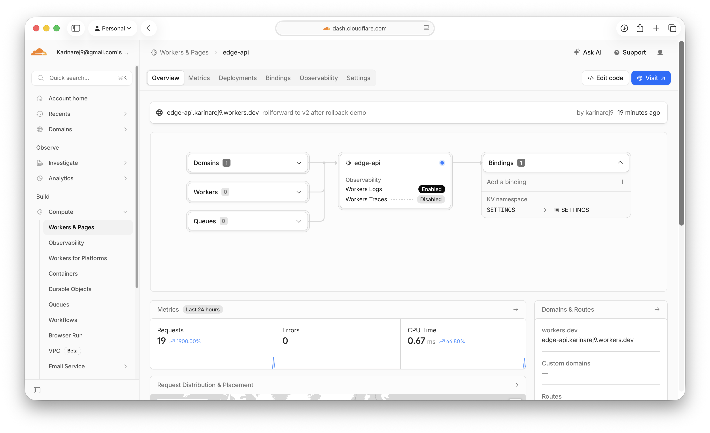
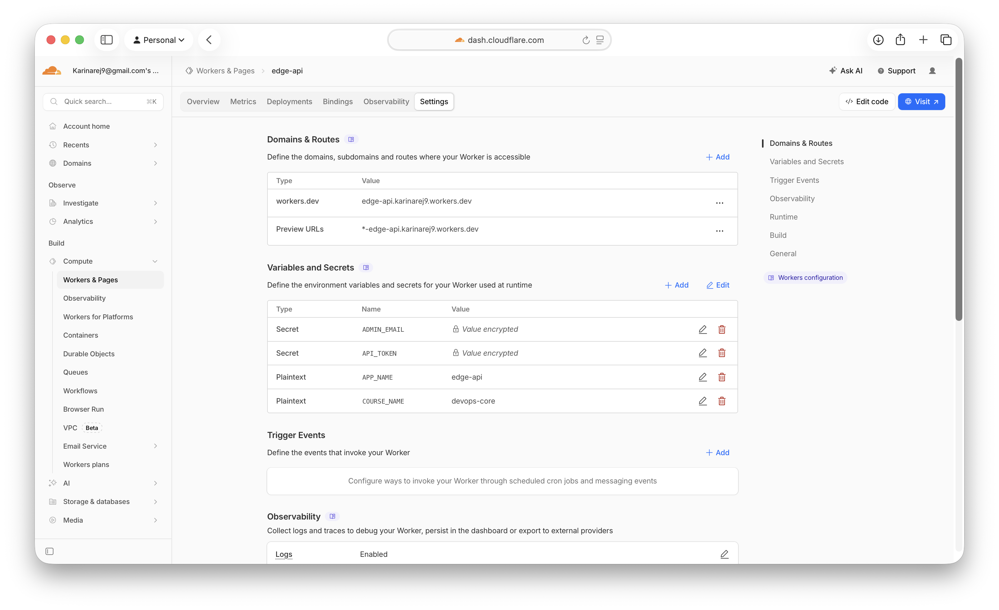
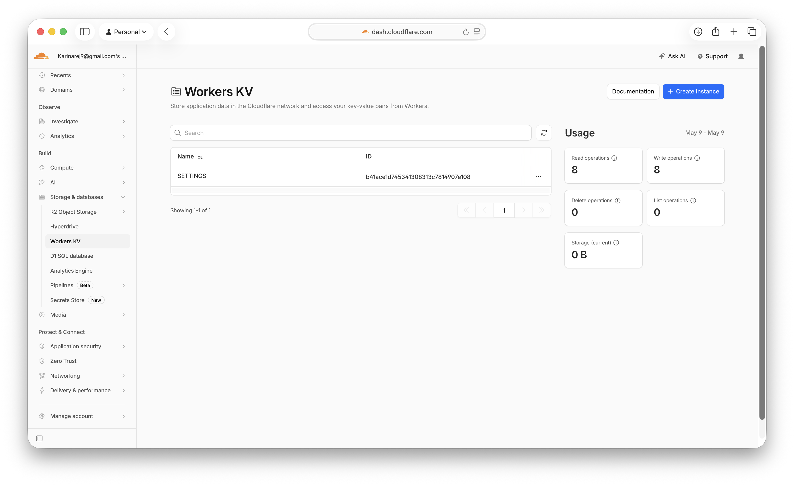
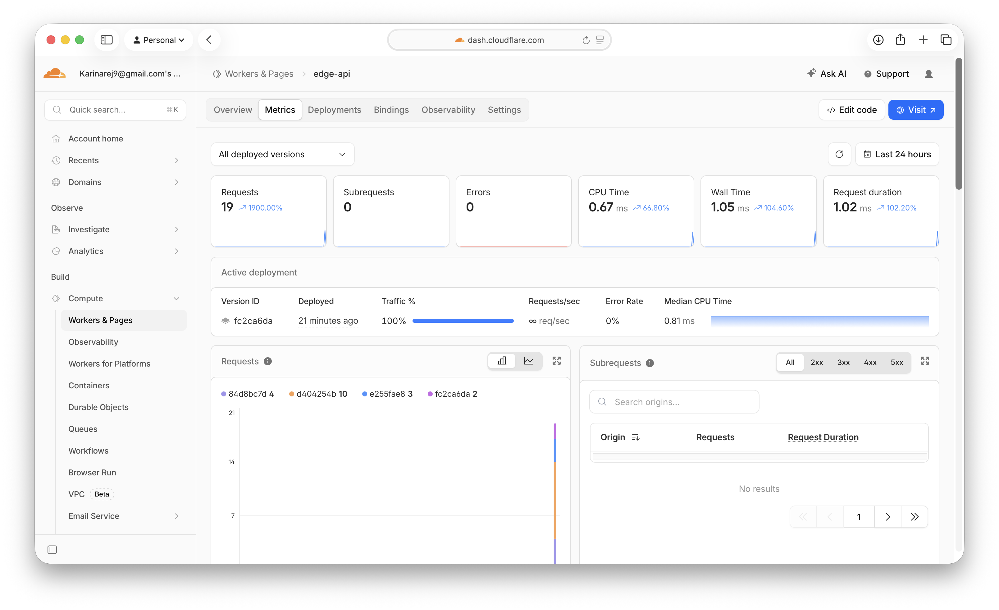
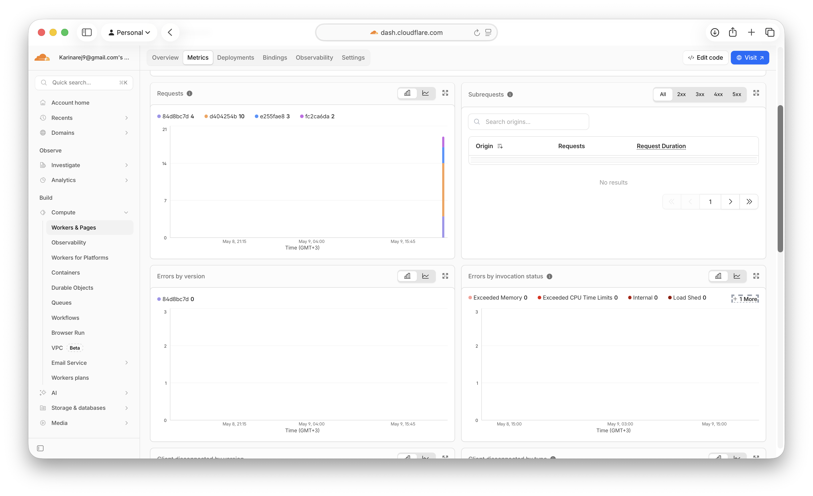
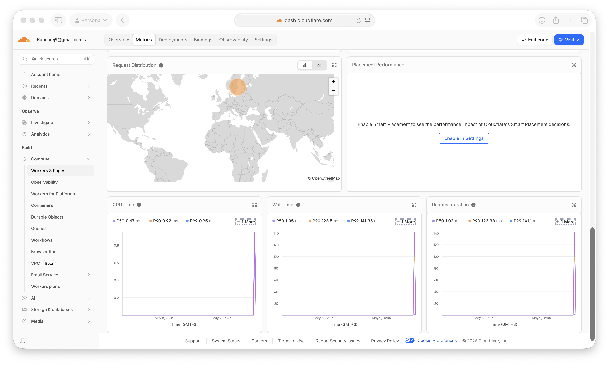
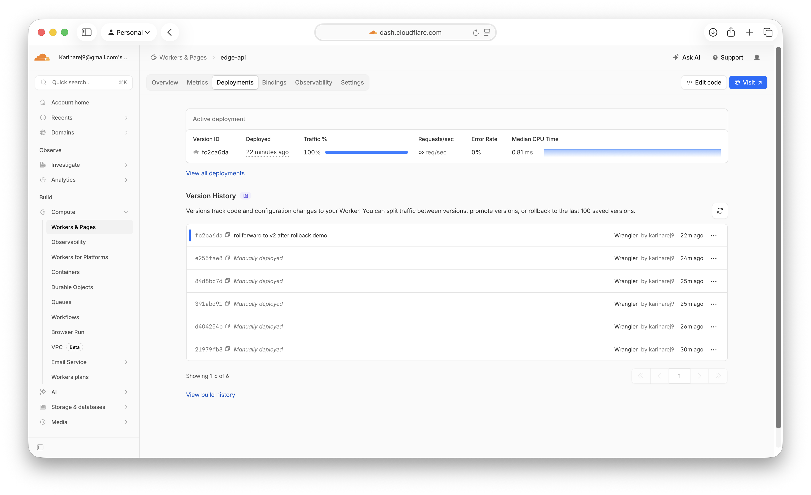

# Cloudflare Workers — Edge API

Lab 17: serverless HTTP API on Cloudflare's global edge network.



## 1. Deployment Summary

- **Project:** [`cloudflare/edge-api/`](edge-api/)
- **Worker name:** `edge-api`
- **Public URL:** https://edge-api.karinarej9.workers.dev
- **Account:** `karinarej9@gmail.com`'s Account (`a8f35bbf7cc342bd359b3e12c1dd42b8`)
- **Runtime:** Cloudflare Workers (V8 isolates)
- **Language:** TypeScript
- **Entrypoint:** [`src/index.ts`](edge-api/src/index.ts)
- **Config:** [`wrangler.jsonc`](edge-api/wrangler.jsonc)
- **Current Version ID:** `fc2ca6da-6a92-43f1-ac13-e78c8e52c2d0`

### Routes

| Method | Path       | Description |
|--------|------------|-------------|
| GET    | `/`        | App metadata + list of routes (uses `APP_NAME`, `COURSE_NAME`) |
| GET    | `/health`  | Liveness probe — `{status: "ok"}` |
| GET    | `/edge`    | Edge metadata from `request.cf` (colo, country, asn, tlsVersion, …) |
| GET    | `/config`  | Plaintext vars + flags showing whether secrets are bound (does not expose secret values) |
| GET    | `/counter` | KV-backed visit counter, state stored in Workers KV |

### Configuration

- **Plaintext vars** (in `wrangler.jsonc`, public): `APP_NAME=edge-api`, `COURSE_NAME=devops-core`
- **Secrets** (via `wrangler secret put`, encrypted at rest): `API_TOKEN`, `ADMIN_EMAIL`
- **KV namespace:** binding `SETTINGS` → `b41ace1d745341308313c7814907e108`
- **Observability:** `observability.enabled = true` (workers logs available via `wrangler tail` and in the dashboard)

Plaintext vars in `wrangler.jsonc` are committed to git and visible to anyone with repo access — never put passwords, tokens, or keys there. Secrets are stored encrypted at rest by Cloudflare, set via `wrangler secret put`, and cannot be read back after they are set (only the names are listed by `wrangler secret list`).

```
$ npx wrangler secret list
[
  {
    "name": "ADMIN_EMAIL",
    "type": "secret_text"
  },
  {
    "name": "API_TOKEN",
    "type": "secret_text"
  }
]
```

The dashboard (Worker → Settings → Variables and Secrets) shows plaintext vars in the open while secrets are marked `Value encrypted`:



---

## 2. Evidence

### `/health`

```
$ curl -s https://edge-api.karinarej9.workers.dev/health
{
  "status": "ok",
  "app": "edge-api"
}
```

### `/edge` — real edge metadata

```
$ curl -s https://edge-api.karinarej9.workers.dev/edge
{
  "colo": "ARN",
  "country": "FI",
  "city": "Helsinki",
  "region": "Uusimaa",
  "asn": 56971,
  "asOrganization": "CGI GLOBAL LIMITED",
  "httpProtocol": "HTTP/2",
  "tlsVersion": "TLSv1.3",
  "timezone": "Europe/Helsinki"
}
```

`colo: ARN` is the Stockholm Arlanda PoP, the closest one to the request origin (Helsinki, FI). The Worker executed on that PoP — there are no manual region flags in the config.

### `/config` (after secrets are set)

```
$ curl -s https://edge-api.karinarej9.workers.dev/config
{
  "app": "edge-api",
  "course": "devops-core",
  "secretsConfigured": {
    "apiToken": true,
    "adminEmail": true
  }
}
```

### `/` (current v2)

```
$ curl -s https://edge-api.karinarej9.workers.dev/
{
  "app": "edge-api",
  "course": "devops-core",
  "version": "v2",
  "message": "Hello from Cloudflare Workers",
  "routes": [
    "/",
    "/health",
    "/edge",
    "/config",
    "/counter"
  ],
  "timestamp": "2026-05-09T12:38:12.715Z"
}
```

### `/counter` — persistence across redeploy and rollback

| Moment | Counter |
|--------|---------|
| First hit after v1 deploy | `1` |
| Third hit before v2 deploy | `3` |
| After v2 deploy | `5`, `6` |
| After rollback to v1 | `7` |
| After rollforward to v2 | `8` |

KV state is independent of the Worker version: the counter keeps growing across code changes and rollbacks. KV is a separate binding — its data lives outside the Worker bundle.

```
$ curl -s https://edge-api.karinarej9.workers.dev/counter
{
  "visits": 8,
  "key": "visits"
}
```

The dashboard (Storage & Databases → Workers KV) shows the `SETTINGS` namespace with the same id as in `wrangler.jsonc`, and the operation counter — exactly 8 reads / 8 writes (one per `/counter` hit during the lab):



### Logs (`wrangler tail --format pretty`)

```
GET https://edge-api.karinarej9.workers.dev/edge - Ok @ 5/9/2026, 3:35:17 PM
  (log) request GET /edge colo ARN country FI
GET https://edge-api.karinarej9.workers.dev/health - Ok @ 5/9/2026, 3:35:17 PM
  (log) request GET /health colo ARN country FI
GET https://edge-api.karinarej9.workers.dev/counter - Ok @ 5/9/2026, 3:35:18 PM
  (log) request GET /counter colo ARN country FI
```

`console.log()` calls in the Worker code surface in `wrangler tail` and in the dashboard (Workers → edge-api → Logs).

### Metrics

The Metrics tab summary: 19 requests, 0 errors, CPU 0.67 ms, Wall 1.05 ms, Request duration 1.02 ms. Below that — request distribution by Worker version (`84d8bc7d` 4 requests, `d404254b` 10, `e255fae8` 3, `fc2ca6da` 2, reflecting which version was active at each moment):



Next — Errors by invocation status (Exceeded Memory / CPU Limits / Internal / Load Shed — all zero, no runtime errors):



At the bottom — Request Distribution map (traffic came from my IP in Finland) and percentile charts for CPU / Wall / Request duration (P50 0.67 / 1.05 / 1.02 ms, P99 0.95 / 141.35 / 141.1 ms):



The same 19 requests / 0 errors are returned by the Cloudflare GraphQL Analytics API:

```
{
  "data": {
    "viewer": {
      "accounts": [
        {
          "workersInvocationsAdaptive": [
            {
              "dimensions": { "status": "success" },
              "sum": { "requests": 19, "errors": 0 }
            }
          ]
        }
      ]
    }
  }
}
```

### Deployments list

```
$ npx wrangler deployments list

Created:     2026-05-09T12:33:11.898Z
Author:      karinarej9@gmail.com
Source:      Unknown (deployment)
Version(s):  (100%) d404254b-09ef-42b2-b050-87187f85940a   <- v1: first deploy

Created:     2026-05-09T12:34:27.919Z
Author:      karinarej9@gmail.com
Source:      Secret Change
Version(s):  (100%) 391abd91-345b-4e9c-93a0-3cfb9d97fdb5   <- API_TOKEN secret added

Created:     2026-05-09T12:34:30.997Z
Author:      karinarej9@gmail.com
Source:      Secret Change
Version(s):  (100%) 84d8bc7d-31b7-4c45-b06d-7fcf23930b42   <- ADMIN_EMAIL secret added

Created:     2026-05-09T12:35:47.678Z
Author:      karinarej9@gmail.com
Source:      Unknown (deployment)
Version(s):  (100%) e255fae8-13a7-4ca2-b614-fc70a6264349   <- v2: "version" field added

Created:     2026-05-09T12:36:53.273Z
Author:      karinarej9@gmail.com
Source:      Unknown (deployment)
Message:     lab17 rollback demo to v1
Version(s):  (100%) d404254b-09ef-42b2-b050-87187f85940a   <- rollback to v1

Created:     2026-05-09T12:37:23.703Z
Author:      karinarej9@gmail.com
Source:      Unknown (deployment)
Message:     rollforward to v2 after rollback demo
Version(s):  (100%) fc2ca6da-6a92-43f1-ac13-e78c8e52c2d0   <- rollforward to v2
```

The same 6 versions and the current active deployment (`fc2ca6da`, 100% traffic) appear on the Deployments tab in the dashboard:



### Rollback

```
$ npx wrangler rollback d404254b-09ef-42b2-b050-87187f85940a --message "lab17 rollback demo to v1" --yes
...
Performing rollback...
╰  SUCCESS  Worker Version d404254b-09ef-42b2-b050-87187f85940a has been deployed to 100% of traffic.

Current Version ID: d404254b-09ef-42b2-b050-87187f85940a
```

After the rollback, `/` no longer returned the `version` field (old code), while `/counter` kept incrementing — KV is not rolled back together with the code.

---

## 3. Kubernetes vs Cloudflare Workers

| Aspect | Kubernetes | Cloudflare Workers |
|--------|------------|--------------------|
| Setup complexity | High — control plane, kubelet, CNI, manifests, helm charts | Near-zero — `npm create cloudflare`, login, deploy |
| Deployment speed | Minutes (image build → push → rollout, e.g. canary/blue-green in lab14) | Seconds (`wrangler deploy` uploads a ~KB bundle, ~10s) |
| Global distribution | Manual — multi-cluster, federation, regions chosen by hand | Automatic — every Worker runs on 300+ PoPs |
| Cost (small apps) | Always-on nodes, pay per VM-hour even when idle | Pay per request (100k/day free tier), zero idle cost |
| State / persistence | PV/PVC, StatefulSet (lab15), any DB in-cluster or managed | KV, Durable Objects, R2, D1 — Cloudflare-managed services only |
| Runtime | Any container (Linux process, any language, libc) | V8 isolate, JS/TS/Wasm, no syscalls, 128 MB / 30s CPU limits |
| Control / flexibility | Full — sidecars, DaemonSet, sysctl, custom resources | Constrained: no filesystem, no TCP listen, no background processes |
| Observability | Self-hosted Prometheus + Grafana (lab16, ~1.5 GiB RAM) | Built-in: logs / metrics / traces in the dashboard, `wrangler tail` |
| Secrets | Vault sidecar (lab13) / sealed-secrets / External Secrets Operator | `wrangler secret put` — single command, encrypted at rest by Cloudflare |
| Best use case | Long-running services, heavy backends, custom runtimes | API / edge logic, low global latency, serverless |

---

## 4. When to use each

### Favor Kubernetes when

- Long-lived processes (stateful WebSocket servers, background workers with heavy memory).
- Full runtime control needed: specific libc, GPU, native binaries, sysctl.
- An orchestrator already exists for several languages/services and uniformity matters.
- Compliance requires self-hosted infra inside a private network (VPC).
- Stateful workloads with large disks (StatefulSet + PVC, databases, queues — like in lab15).

### Favor Cloudflare Workers when

- HTTP APIs with a global audience and a low-latency-from-anywhere requirement.
- Small/medium traffic where cost matters — pay only for real requests.
- Small team with no appetite for running a platform (Kubernetes is a full-time job on its own).
- Edge-level logic: A/B tests, auth, proxying, caching, rewrites.
- MVP / prototype that should live with minimal operational overhead.

### Recommendation

For the current course application (`app_python`, a simple visit counter with JSON endpoints) Workers is the obvious choice: fewer moving parts, the free tier covers the lab workload, deploy is one command. Kubernetes was already exercised in lab12–lab16, and what it added was complexity for the sake of demonstration. A real production system this size lives on Workers / Vercel / Fly with no downside.

Keep Kubernetes for cases where stateful components appear (databases, queues), long-lived connections (gRPC streams, WebSocket with state), or hosting something that does not fit into a V8 isolate (e.g. ML inference with a large model or a native Linux daemon).

---

## 5. Reflection

**What turned out easier than Kubernetes:**
- Deploy is one command (`wrangler deploy`), no image build / registry push / rollout status.
- No manifests: a single `wrangler.jsonc` instead of `Deployment + Service + ConfigMap + Secret + PVC + Ingress`.
- Global distribution comes for free — no need to think about regions, multi-cluster, or a separate CDN. The request automatically hits the nearest PoP (in my case ARN/Stockholm).
- Observability is built in: logs and metrics are already in the dashboard, no need to deploy `kube-prometheus-stack` and burn 1.5 GiB of RAM as in lab16.
- Secrets — `wrangler secret put`, no Vault / External Secrets Operator / sealed-secrets like in lab13.
- Rollback — one `wrangler rollback <version-id>` command, instant. In Kubernetes that's `kubectl rollout undo` plus waiting for pod readiness.

**What turned out more constrained:**
- No filesystem and no long-lived processes — everything is request-scoped (request → response).
- CPU and memory are tightly capped (10–50 ms CPU on free tier, 128 MB RAM).
- No containers — you cannot take the `app_python` Docker image from lab2 and just run it; the code has to be rewritten against the Workers runtime API.
- KV is eventually consistent and not suitable for strong-consistency requirements (use Durable Objects or D1 for that).
- You cannot open an arbitrary TCP port; only HTTP/WebSocket via the fetch handler.
- From Russia, Cloudflare is partially restricted, and a split-tunnel VPN setup (in my case a ClashX proxy) breaks the TLS handshake to `*.workers.dev`. Worked around by `unset HTTPS_PROXY` for curl, while wrangler itself still needs the proxy.

**What changed because Workers is not a Docker host:**
- The application had to be rewritten in TypeScript against the Workers runtime instead of reusing the `app_python` Flask image from lab2.
- Endpoints kept the same intent (`/`, `/health`, `/visits` → `/counter`), but the implementation differs: `Response.json()` instead of Flask, `KVNamespace.get/put` instead of a file on disk.
- `VISITS_FILE` (file-backed counter from `app_python`) is replaced by KV — the Worker has no persistent filesystem between requests.
- The health check stays trivial, but liveness / readiness probes are not needed here — the platform manages isolate lifecycle, there is no notion of "pod not ready".
