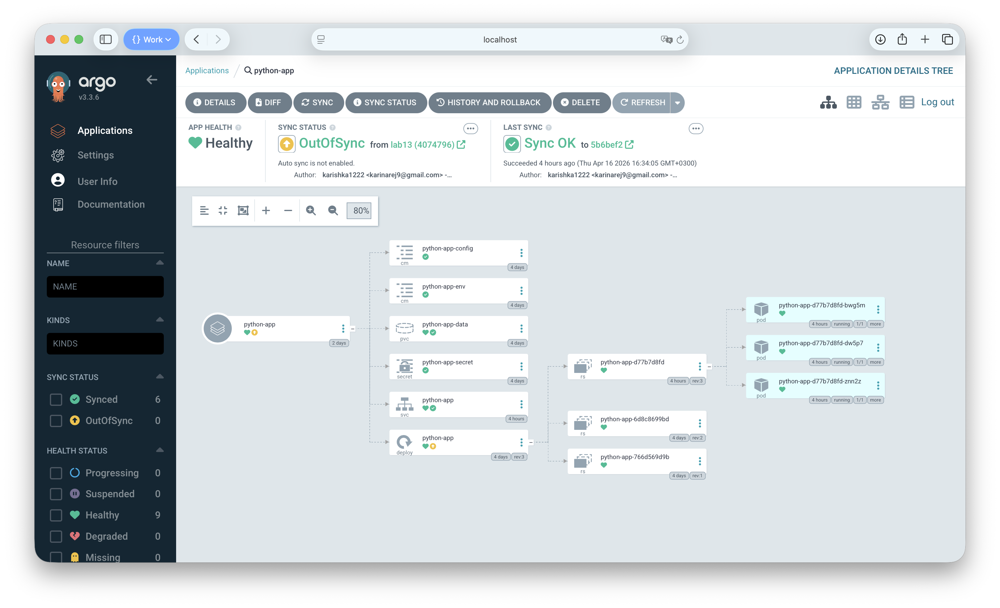
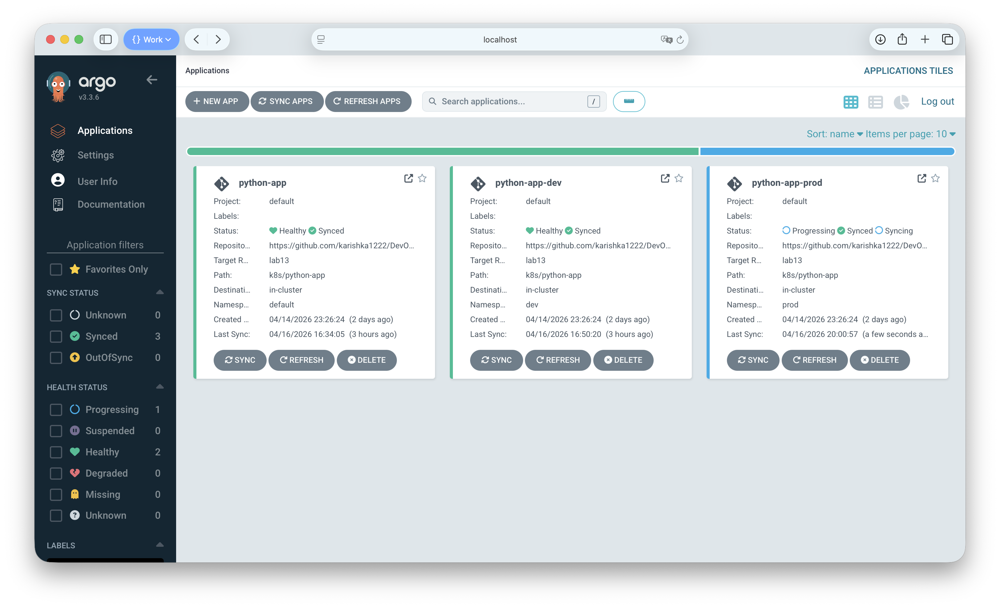
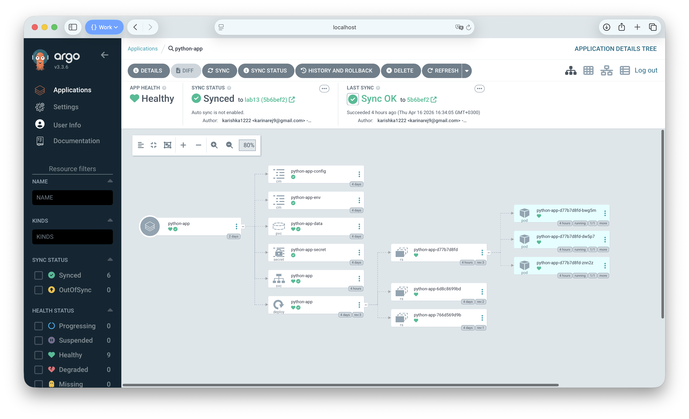
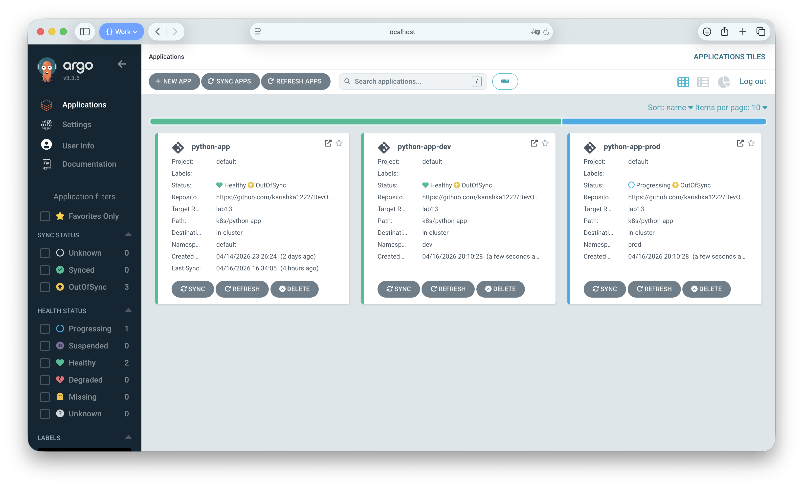

# ArgoCD GitOps Deployment

## 1. ArgoCD Setup

### Installation

```bash
helm repo add argo https://argoproj.github.io/argo-helm
helm repo update
kubectl create namespace argocd
helm install argocd argo/argo-cd --namespace argocd
kubectl wait --for=condition=ready pod -l app.kubernetes.io/name=argocd-server -n argocd --timeout=120s
```

### Pods Verification

```
$ kubectl get pods -n argocd
NAME                                                READY   STATUS    RESTARTS      AGE
argocd-application-controller-0                     1/1     Running   1 (75m ago)   82m
argocd-applicationset-controller-58c9647667-mn2zw   1/1     Running   1 (75m ago)   82m
argocd-dex-server-d68bfd4b7-qmfnv                   1/1     Running   0             82m
argocd-notifications-controller-58f8fcd889-6qqkh    1/1     Running   1 (75m ago)   82m
argocd-redis-5d5bb8d56b-8bdlb                       1/1     Running   1 (75m ago)   82m
argocd-repo-server-5d5755cbb-6d2gq                  1/1     Running   1 (75m ago)   82m
argocd-server-5964cdf9fb-96tmn                      1/1     Running   1 (75m ago)   82m
```

### UI Access

```bash
kubectl port-forward svc/argocd-server -n argocd 8080:443
# https://localhost:8080, username: admin
kubectl -n argocd get secret argocd-initial-admin-secret -o jsonpath="{.data.password}" | base64 -d
```

### CLI

```bash
brew install argocd
argocd login localhost:8080 --insecure
```

```
$ argocd version --client
argocd: v3.3.6+998fb59.dirty
  BuildDate: 2026-03-27T19:12:28Z
  GitTag: v3.3.6
  GoVersion: go1.26.1
  Platform: darwin/arm64
```

## 2. Application Configuration

### Manifest (`k8s/argocd/application.yaml`)

```yaml
apiVersion: argoproj.io/v1alpha1
kind: Application
metadata:
  name: python-app
  namespace: argocd
spec:
  project: default
  source:
    repoURL: https://github.com/karishka1222/DevOps-Core-Course.git
    targetRevision: lab13
    path: k8s/python-app
    helm:
      valueFiles:
        - values.yaml
  destination:
    server: https://kubernetes.default.svc
    namespace: default
  syncPolicy:
    syncOptions:
      - CreateNamespace=true
```

- **source.repoURL** — GitHub repo with Helm chart
- **source.path** — chart path within repo (`k8s/python-app`)
- **source.helm.valueFiles** — selects which values file to render the chart with
- **destination** — target cluster (`kubernetes.default.svc`) and namespace (`default`)
- **syncPolicy** — manual sync (no `automated` block), only `CreateNamespace` option

### Deploy & Sync

```bash
kubectl apply -f k8s/argocd/application.yaml
argocd app sync python-app
```

```
$ argocd app get python-app
Name:               argocd/python-app
Server:             https://kubernetes.default.svc
Namespace:          default
Sync Policy:        Manual
Sync Status:        Synced to lab13 (5b6bef2)
Health Status:      Healthy

GROUP  KIND                   NAMESPACE  NAME               STATUS  HEALTH   HOOK      MESSAGE
batch  Job                    default    python-app-pre-install   Succeeded   PreSync
       Secret                 default    python-app-secret        Synced
       ConfigMap              default    python-app-config        Synced
       ConfigMap              default    python-app-env           Synced
       PersistentVolumeClaim  default    python-app-data          Synced     Healthy
       Service                default    python-app               Synced     Healthy
apps   Deployment             default    python-app               Synced     Healthy
batch  Job                    default    python-app-post-install  Succeeded  PostSync
```

### GitOps Workflow Test

1. Changed `replicaCount` in `values.yaml`
2. Committed and pushed to `lab13` branch
3. ArgoCD detected OutOfSync status within ~3 minutes
4. Ran `argocd app sync python-app` to apply changes



## 3. Multi-Environment Deployment

### Namespaces

```bash
kubectl create namespace dev
kubectl create namespace prod
```

### Dev — Auto-Sync (`application-dev.yaml`)

| Parameter | Value |
|-----------|-------|
| Replicas | 1 |
| Resources | 64Mi/50m req, 128Mi/100m limit |
| Service | ClusterIP |
| Sync | **Automated** (prune + selfHeal) |

`selfHeal: true` — reverts manual cluster modifications to match Git.
`prune: true` — deletes resources removed from Git.

### Prod — Manual Sync (`application-prod.yaml`)

| Parameter | Value |
|-----------|-------|
| Replicas | 5 |
| Resources | 256Mi/200m req, 512Mi/500m limit |
| Service | LoadBalancer |
| Sync | **Manual** |

Manual sync for prod ensures change review, controlled timing, and rollback planning.

### App List

```
$ argocd app list
NAME                    CLUSTER                         NAMESPACE  PROJECT  STATUS  HEALTH       SYNCPOLICY  CONDITIONS
argocd/python-app       https://kubernetes.default.svc  default    default  Synced  Healthy      Manual      <none>
argocd/python-app-dev   https://kubernetes.default.svc  dev        default  Synced  Healthy      Auto-Prune  <none>
argocd/python-app-prod  https://kubernetes.default.svc  prod       default  Synced  Progressing  Manual      <none>
```

### Verification

```
$ kubectl get pods -n dev
NAME                              READY   STATUS    RESTARTS   AGE
python-app-dev-5545989f84-tzsk2   1/1     Running   0          13m

$ kubectl get pods -n prod
NAME                                READY   STATUS    RESTARTS   AGE
python-app-prod-547c445f5-2vbgg     1/1     Running   0          23m
python-app-prod-547c445f5-6s9mn     1/1     Running   0          23m
python-app-prod-547c445f5-9plh2     1/1     Running   0          23m
python-app-prod-547c445f5-pzf9v     1/1     Running   0          23m
python-app-prod-547c445f5-zbdc8     1/1     Running   0          22m
```

Dev: 1 replica, Prod: 5 replicas — different configurations applied correctly.

### Namespace Separation

Each environment is deployed to its own namespace (`dev`, `prod`), providing:
- Resource isolation between environments
- Independent RBAC policies
- Separate resource quotas
- Clear ownership boundaries

### Sync Policy Comparison

| Aspect | Dev | Prod |
|--------|-----|------|
| Sync mode | Automated | Manual |
| Self-heal | Enabled | Disabled |
| Prune | Enabled | Disabled |
| Rationale | Fast iteration, auto-deploy on push | Change review, controlled releases |

## 4. Self-Healing Evidence

### Test 1: Manual Scale (Dev)

Before scaling — 1 replica as defined in `values-dev.yaml`:

```
$ kubectl get pods -n dev
NAME                              READY   STATUS    RESTARTS   AGE
python-app-dev-5545989f84-26m5v   1/1     Running   0          20m
```

Manually scaling to 5 replicas:

```
$ kubectl scale deployment python-app-dev -n dev --replicas=5
deployment.apps/python-app-dev scaled

$ kubectl get pods -n dev
NAME                              READY   STATUS    RESTARTS   AGE
python-app-dev-5545989f84-26m5v   1/1     Running   0          20m
python-app-dev-5545989f84-z4js2   0/1     Pending   0          0s
```

After ArgoCD self-heal (~30 seconds later):

```
$ kubectl get pods -n dev
NAME                              READY   STATUS    RESTARTS   AGE
python-app-dev-5545989f84-26m5v   1/1     Running   0          21m
```

ArgoCD detected the drift and reverted replicas from 5 back to 1.

### Test 2: Pod Deletion

This tests **Kubernetes** self-healing (ReplicaSet controller), not ArgoCD.

Before deletion:

```
$ kubectl get pods -n dev
NAME                              READY   STATUS    RESTARTS   AGE
python-app-dev-5545989f84-26m5v   1/1     Running   0          24m
```

Deleting the pod:

```
$ kubectl delete pod -n dev -l app.kubernetes.io/name=python-app
pod "python-app-dev-5545989f84-26m5v" deleted
```

Immediately after — Kubernetes already created a replacement:

```
$ kubectl get pods -n dev
NAME                              READY   STATUS    RESTARTS   AGE
python-app-dev-5545989f84-tzsk2   1/1     Running   0          31s
```

The ReplicaSet controller recreated the pod instantly to maintain the desired count.

### Test 3: Configuration Drift (Image Tag)

Manually changing the image tag to a non-existent value:

```
$ kubectl set image deployment/python-app-dev python-app=karishka1222/devops-python-app:nonexistent -n dev
deployment.apps/python-app-dev image updated

$ kubectl get deployment python-app-dev -n dev -o jsonpath='{.spec.template.spec.containers[0].image}'
karishka1222/devops-python-app:nonexistent
```

After ~60 seconds, ArgoCD self-heal reverted the image:

```
$ kubectl get deployment python-app-dev -n dev -o jsonpath='{.spec.template.spec.containers[0].image}'
karishka1222/devops-python-app:latest
```

ArgoCD detected the spec drift and restored the correct image tag from Git.

### Kubernetes vs ArgoCD Self-Healing

| Aspect | Kubernetes | ArgoCD |
|--------|-----------|--------|
| What heals | Pod count / health | Full resource spec |
| Trigger | Pod crash or deletion | Config drift from Git |
| Mechanism | ReplicaSet controller | Git comparison + re-apply |
| Speed | Immediate | ~3 min poll (or faster with selfHeal) |
| Example | Pod dies → new pod | Image changed → reverted |

### Sync Triggers

- **Automatic**: ArgoCD polls Git every ~3 minutes
- **Manual**: `argocd app sync <name>` or UI button
- **Webhook**: GitHub webhook for instant detection (optional)

## 5. Screenshots

### ArgoCD UI — All Applications



### Application Details — python-app-dev



### Sync Status / Resource Tree


## 6. Bonus: ApplicationSet

### Manifest (`k8s/argocd/applicationset.yaml`)

```yaml
apiVersion: argoproj.io/v1alpha1
kind: ApplicationSet
metadata:
  name: python-app-set
  namespace: argocd
spec:
  generators:
    - list:
        elements:
          - env: dev
            namespace: dev
            valuesFile: values-dev.yaml
          - env: prod
            namespace: prod
            valuesFile: values-prod.yaml
  template:
    metadata:
      name: 'python-app-{{env}}'
    spec:
      project: default
      source:
        repoURL: https://github.com/karishka1222/DevOps-Core-Course.git
        targetRevision: lab13
        path: k8s/python-app
        helm:
          valueFiles:
            - '{{valuesFile}}'
      destination:
        server: https://kubernetes.default.svc
        namespace: '{{namespace}}'
      syncPolicy:
        syncOptions:
          - CreateNamespace=true
```

### How It Works

The **List generator** iterates over `elements`, producing one Application per entry.
Placeholders (`{{env}}`, `{{namespace}}`, `{{valuesFile}}`) are substituted per element.

### Benefits over Individual Applications

| Aspect | Individual Apps | ApplicationSet |
|--------|----------------|---------------|
| Maintenance | Edit each file | Single template |
| Scaling | Linear file growth | Add list element |
| Consistency | Manual sync | Guaranteed by template |
| Adding env | New YAML file | New list entry |

### Generator Types

- **List** — explicit parameter sets (used here)
- **Git** — auto-discover from repo directories/files
- **Cluster** — multi-cluster deployments
- **Matrix** — combine multiple generators
- **Merge** — merge generator outputs

### Deployment

```bash
# Delete individual apps first to avoid conflicts
kubectl delete -f k8s/argocd/application-dev.yaml
kubectl delete -f k8s/argocd/application-prod.yaml
# Apply ApplicationSet
kubectl apply -f k8s/argocd/applicationset.yaml
argocd app list
```


