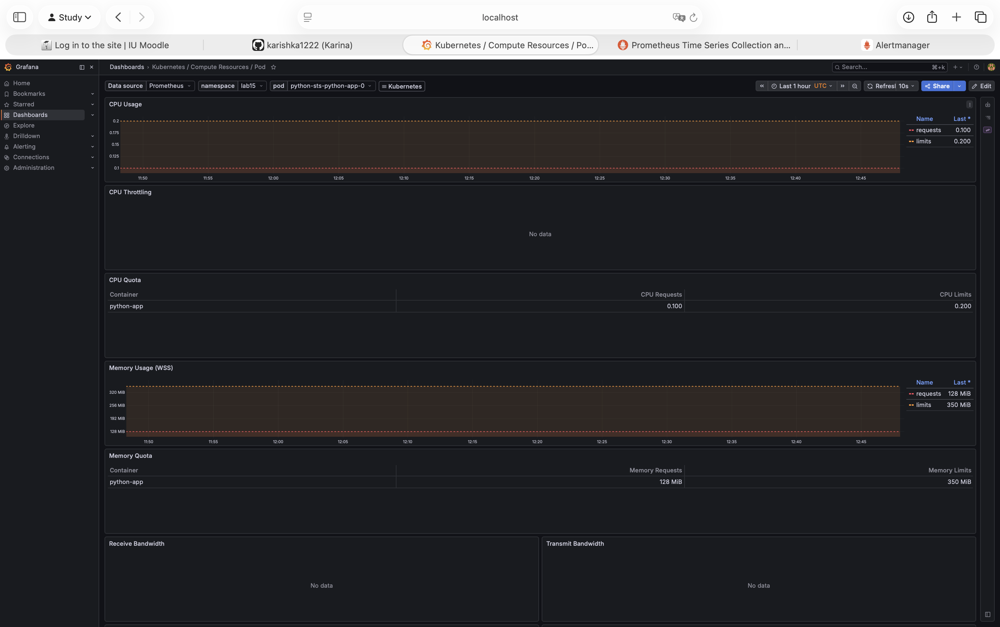
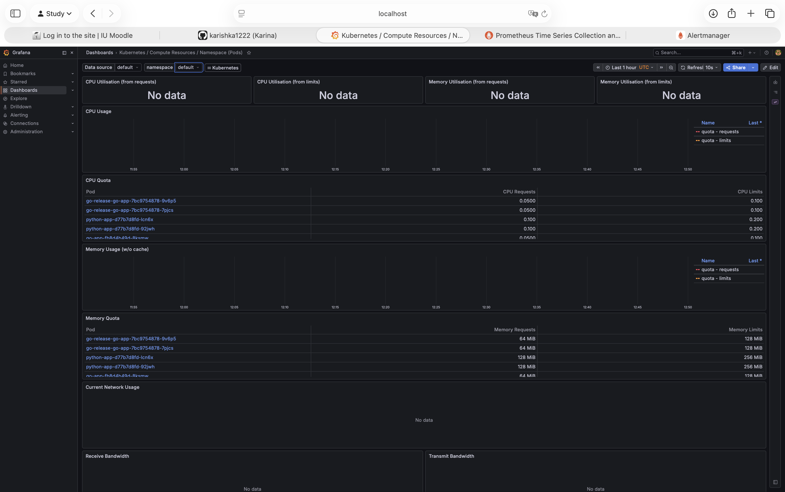
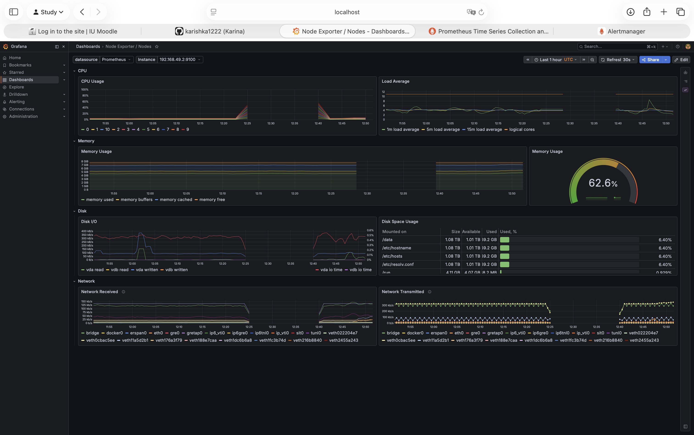
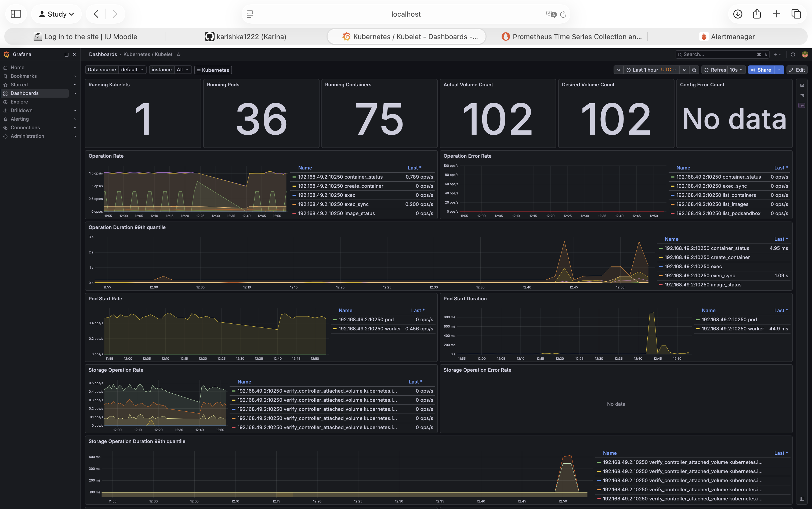
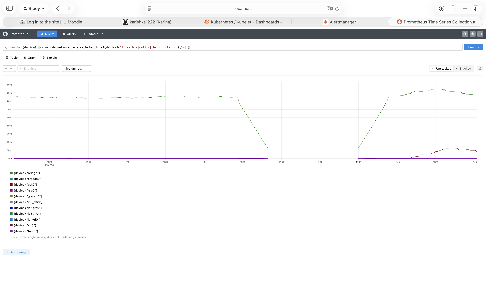
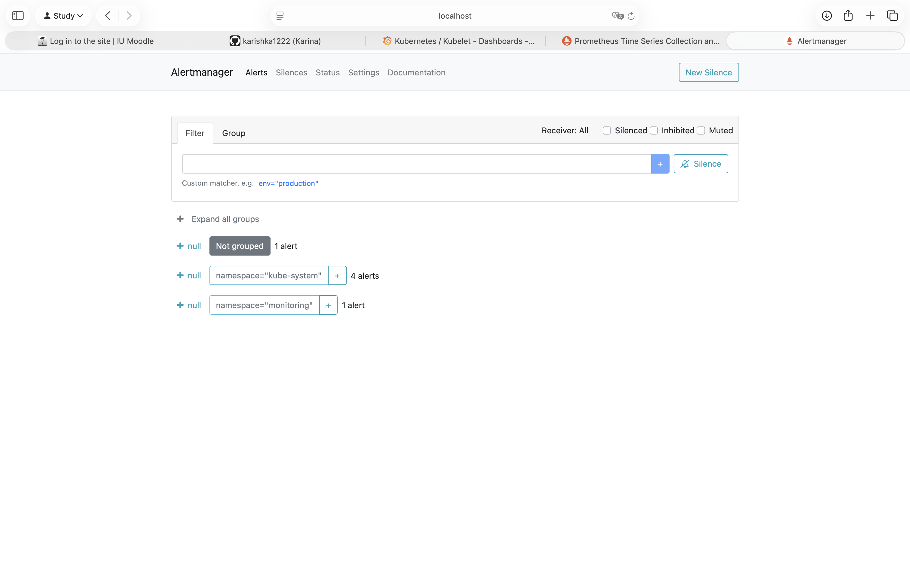
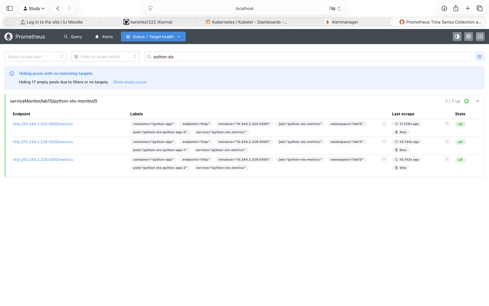
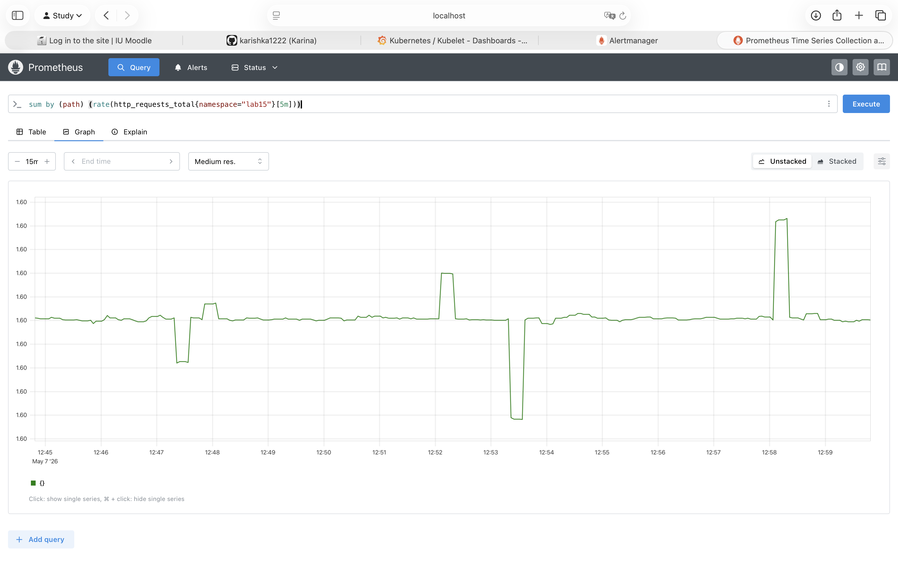

# Lab 16 — Monitoring & Init Containers

Cluster monitoring with the kube-prometheus-stack and two init-container patterns.

- Stack chart: `prometheus-community/kube-prometheus-stack-84.5.0` (operator `v0.90.1`)
- Namespace: `monitoring`
- App stack: `python-sts` StatefulSet from lab15 (namespace `lab15`)
- Init-container demos + ServiceMonitor live in namespace `lab16`/`lab15`

---

## 1. Stack components

| Component | Role |
|---|---|
| **Prometheus Operator** | Watches `Prometheus`, `ServiceMonitor`, `PodMonitor`, `Alertmanager`, `PrometheusRule` CRDs and reconciles them into running Prometheus / Alertmanager StatefulSets and their scrape config. |
| **Prometheus** | Time-series database. Discovers targets through `ServiceMonitor`/`PodMonitor`, scrapes their `/metrics` endpoints on the configured interval, evaluates recording and alerting rules. |
| **Alertmanager** | Receives alerts fired by Prometheus, deduplicates / groups / silences them, and routes them to receivers (email, Slack, PagerDuty, …). |
| **Grafana** | Visualisation. Pre-provisioned with dashboards for nodes, pods, kubelet, API server, etc., backed by Prometheus as a datasource. |
| **kube-state-metrics** | Reads the Kubernetes API and exposes object state as metrics (`kube_pod_status_phase`, `kube_deployment_status_replicas`, …). It does **not** expose perf data — only object state. |
| **node-exporter** | DaemonSet on every node. Exposes host-level metrics (CPU, memory, disk, network, filesystem) read from `/proc` and `/sys`. |

Plus the cluster-wide `kubelet` scrape job that pulls cAdvisor container metrics and kubelet metrics from each node.

---

## 2. Installation

```
$ helm repo add prometheus-community https://prometheus-community.github.io/helm-charts
$ helm repo update
$ helm install monitoring prometheus-community/kube-prometheus-stack \
    --namespace monitoring --create-namespace --wait --timeout 10m
```

```
$ helm list -n monitoring
NAME      	NAMESPACE 	REVISION	UPDATED                             	STATUS  	CHART                       	APP VERSION
monitoring	monitoring	1       	2026-05-06 15:19:35.584093 +0300 MSK	deployed	kube-prometheus-stack-84.5.0	v0.90.1
```

```
$ kubectl get pods,svc -n monitoring
NAME                                                         READY   STATUS    RESTARTS        AGE
pod/alertmanager-monitoring-kube-prometheus-alertmanager-0   2/2     Running   0               4h19m
pod/monitoring-grafana-94bb46d7-kw25x                        3/3     Running   0               4h22m
pod/monitoring-kube-prometheus-operator-54f68d65b4-cbhhp     1/1     Running   3 (168m ago)    4h22m
pod/monitoring-kube-state-metrics-5957bd45bc-dvrl2           1/1     Running   1 (162m ago)    4h22m
pod/monitoring-prometheus-node-exporter-xtbjr                1/1     Running   50 (162m ago)   25h
pod/prometheus-monitoring-kube-prometheus-prometheus-0       2/2     Running   0               4h19m

NAME                                              TYPE        CLUSTER-IP       EXTERNAL-IP   PORT(S)                      AGE
service/alertmanager-operated                     ClusterIP   None             <none>        9093/TCP,9094/TCP,9094/UDP   24h
service/monitoring-grafana                        ClusterIP   10.105.30.138    <none>        80/TCP                       25h
service/monitoring-kube-prometheus-alertmanager   ClusterIP   10.107.131.148   <none>        9093/TCP,8080/TCP            25h
service/monitoring-kube-prometheus-operator       ClusterIP   10.109.242.128   <none>        443/TCP                      25h
service/monitoring-kube-prometheus-prometheus     ClusterIP   10.103.220.78    <none>        9090/TCP,8080/TCP            25h
service/monitoring-kube-state-metrics             ClusterIP   10.102.115.56    <none>        8080/TCP                     25h
service/monitoring-prometheus-node-exporter       ClusterIP   10.103.98.191    <none>        9100/TCP                     25h
service/prometheus-operated                       ClusterIP   None             <none>        9090/TCP                     24h
```

The stack went through several OOM cycles during the lab — the minikube docker container has a 4.5 GiB memory limit and the cumulative footprint of all the older Helm releases plus the monitoring stack pushed the kubelet into eviction. After uninstalling the unused releases (`argocd`, `python-dev`, `python-dev-install`, `python-bg`, `python-canary`, `rollouts-ui-demo`) the cluster stabilised and the monitoring stack stopped restarting.

---

## 3. Access

```
$ kubectl port-forward svc/monitoring-grafana                       -n monitoring 3000:80
$ kubectl port-forward svc/monitoring-kube-prometheus-prometheus    -n monitoring 9090:9090
$ kubectl port-forward svc/monitoring-kube-prometheus-alertmanager  -n monitoring 9093:9093
```

Grafana: `admin / prom-operator` (`kubectl get secret monitoring-grafana -n monitoring -o jsonpath='{.data.admin-password}' | base64 -d`).

---

## 4. Dashboard answers

Numbers below come from PromQL queries against the same data the bundled Grafana dashboards render. Relevant dashboards in parentheses.

### Q1 — StatefulSet pod resources (`Kubernetes / Compute Resources / Pod`)

```
$ promql: sort_desc(sum by (pod) (rate(container_cpu_usage_seconds_total{namespace="lab15", pod=~"python-sts-.*"}[5m])))
  python-sts-python-app-1 = 0.00247 cores
  python-sts-python-app-2 = 0.00231 cores
  python-sts-python-app-0 = 0.00212 cores

$ promql: sum by (pod) (container_memory_working_set_bytes{namespace="lab15", pod=~"python-sts-.*"})
  python-sts-python-app-1 = 29.35 MiB
  python-sts-python-app-2 = 26.72 MiB
  python-sts-python-app-0 = 26.40 MiB
```

The three replicas of the lab15 StatefulSet sit at ~2 millicores and ~27 MiB of working set. The Grafana panels for `pod-0` show the configured **Quotas** (100 m / 200 m for CPU, 128 / 350 MiB for memory) — actual usage is two orders of magnitude below the limits. `Receive/Transmit Bandwidth` panels render `No data` because cAdvisor in this minikube does not expose `container_network_*` metrics (see Q5).



### Q2 — Top / bottom pods by CPU in `default` (`Compute Resources / Namespace (Pods)`)

```
$ promql: sort_desc(sum by (pod) (rate(container_cpu_usage_seconds_total{namespace="default"}[5m])))
  vault-0                                  0.0201 cores   ← highest
  vault-agent-injector-848dd747d7-8sjsf    0.0035
  python-app-d77b7d8fd-lcn6x               0.0021
  python-app-d77b7d8fd-rq9zf               0.0021
  python-app-d77b7d8fd-92jwh               0.0021
  go-app-fb8d4b49d-jpwbv                   0.00071
  go-app-fb8d4b49d-kpktk                   0.00051
  go-release-go-app-7bc9754878-9v6p5       0.00051
  go-release-go-app-7bc9754878-7pjcs       0.00049
  go-release-go-app-7bc9754878-xkkwc       0.00045
  go-app-fb8d4b49d-8ksmw                   0.00044   ← lowest
```

Most CPU: `vault-0` (the embedded BoltDB does periodic background work). Least: one of the `go-app` / `go-release` replicas — they all idle around 0.5 mcores. The Grafana **CPU Utilisation** panels at the top of the dashboard render `No data` for `go-app` and `vault` because those Helm charts don't set `resources.requests`, and the dashboard's main rows compute `usage / requests`. The lower **Memory Quota** table still lists every pod with its limit (e.g. `python-app` 128/256 MiB).



### Q3 — Node metrics (`Node Exporter / Nodes`)

```
$ promql: 100 * (1 - (node_memory_MemAvailable_bytes / node_memory_MemTotal_bytes))     →  ~62 %  (gauge in screenshot: 62.6 %)
$ promql: (node_memory_MemTotal_bytes - node_memory_MemAvailable_bytes) / 1024 / 1024   →  ~4700 MiB
$ promql: count by (instance) (node_cpu_seconds_total{mode="idle"})                     →  11 logical CPUs
$ promql: 1 - avg(rate(node_cpu_seconds_total{mode="idle"}[5m]))                        →  ~6 % CPU used
```

Single minikube node (8 GiB RAM allocated to the docker driver, 11 logical CPUs visible inside the VM). Memory is the tight resource — the host has 7.6 GiB total inside the VM (`MemTotal`), and ~62 % of it is occupied by the cluster + monitoring stack. That's exactly why the cluster OOM'd earlier and why I had to uninstall the heavy unused releases (`argocd`, `python-dev*`, `python-bg`, `python-canary`, `rollouts-ui-demo`) before continuing.



### Q4 — Kubelet (`Kubernetes / Kubelet`)

```
$ promql: sum(kubelet_running_pods)                                                     →  36 pods
$ promql: sum(kubelet_running_containers{container_state="running"})                    →  40 containers
$ promql: sum by (container_state) (kubelet_running_containers)
   running   40
   exited    31    ← exited containers are kept around for log retrieval
   created   3
   unknown   1
```

The Grafana **Kubelet** dashboard's three big stats up top read **Running Kubelets: 1**, **Running Pods: 36**, **Running Containers: 75** — the last number is *all* containers the kubelet is tracking (running + exited + created), not only the live ones. PromQL `kubelet_running_containers{container_state="running"}` pulls out just the 40 live ones.



### Q5 — Network for `default` pods (`Compute Resources / Namespace (Pods)`)

```
$ promql: container_network_receive_bytes_total                                         →  no samples
$ promql: container_network_transmit_bytes_total                                        →  no samples
```

> **Important caveat:** the cAdvisor exporter shipped with this version of `minikube` (v1.38.1, k8s v1.34) does **not** publish `container_network_*` metrics — `kubectl --raw=/api/v1/nodes/minikube/proxy/metrics/cadvisor | grep ^container_network` returns nothing. The corresponding Grafana panel renders the same way (empty). I fall back to `node_network_*` on the node:

```
$ promql: sum(rate(node_network_receive_bytes_total{device!~"lo|veth.*|cali.*|cbr.*|docker.*"}[5m]))    →  16 507 B/s
$ promql: sum(rate(node_network_transmit_bytes_total{device!~"lo|veth.*|cali.*|cbr.*|docker.*"}[5m]))   →  40 124 B/s

$ promql: sort_desc(sum by (device) (rate(node_network_receive_bytes_total[5m])))   (top devices)
   lo                82 643 B/s   (intra-node traffic, kube-dns / kubelet)
   vethadfc03a1      16 958 B/s
   bridge            16 170 B/s
   vethf281ba81       6 262 B/s
   eth0                 337 B/s   (north-south)
   …
```

Per-pod interface (`vethXXXXX`) shows which pod's pair generates the most traffic; the pair is matched via `kube_pod_info`/`kube_pod_network_*` if needed.



### Q6 — Active alerts (Alertmanager UI)

```
$ promql: count(ALERTS{alertstate="firing"})                                       →  6–7

$ promql: count by (alertname,severity) (ALERTS{alertstate="firing"})
   Watchdog                  / none        1
   etcdInsufficientMembers   / critical    1
   etcdMembersDown           / warning     1
   NodeClockNotSynchronising / warning     1
   TargetDown                / warning     3
```

The Alertmanager UI groups alerts by namespace label, so the screenshot shows `Not grouped: 1 alert` (Watchdog), `namespace="kube-system": 4 alerts` (etcd + TargetDown for the four control-plane scrape jobs that have no endpoints) and `namespace="monitoring": 1 alert` — total **6 visible groups, ~7 individual alerts** depending on whether `NodeClockNotSynchronising` is currently firing.

* `Watchdog` — synthetic always-on alert that proves the pipeline is healthy end-to-end.
* `etcdInsufficientMembers` / `etcdMembersDown` / `TargetDown` ×3 — single-node minikube doesn't expose `kube-controller-manager`, `kube-scheduler`, `kube-proxy`, `etcd`, `kube-etcd` over the standard scrape addresses, so the prebuilt `ServiceMonitors` for those control-plane components show no targets and trip these alerts. That's the expected state on stock minikube; on a real multi-master cluster these would all be green.
* `NodeClockNotSynchronising` — the minikube node lost time sync against the host after the docker container was restarted; not a problem for the lab.



---

## 5. Init containers

Manifests are in [`k8s/init-containers/`](init-containers/).

### 5.1 Download pattern (`init-download.yaml`)

```yaml
initContainers:
  - name: init-download
    image: busybox:1.36
    command: ['sh','-c','wget -q -O /work-dir/index.html https://kubernetes.io/ && echo "downloaded $(wc -c < /work-dir/index.html) bytes"']
    volumeMounts: [{name: workdir, mountPath: /work-dir}]
containers:
  - name: web
    image: nginx:1.27-alpine
    ports: [{containerPort: 80}]
    volumeMounts: [{name: workdir, mountPath: /usr/share/nginx/html}]
volumes:
  - name: workdir
    emptyDir: {}
```

```
$ kubectl apply -f k8s/init-containers/init-download.yaml
pod/init-download-demo created

$ kubectl get pod init-download-demo -n lab16
NAME                 READY   STATUS    RESTARTS   AGE
init-download-demo   1/1     Running   0          2s

$ kubectl logs init-download-demo -c init-download -n lab16
wget: note: TLS certificate validation not implemented
downloaded 38308 bytes

$ kubectl exec -n lab16 init-download-demo -c web -- wc -c /usr/share/nginx/html/index.html
38308 /usr/share/nginx/html/index.html

$ kubectl exec -n lab16 init-download-demo -c web -- wget -qO- http://localhost/ | head -c 200
<!doctype html><html lang=en class=no-js dir=ltr><head class=live-site><meta charset=utf-8><meta name=viewport content="width=device-width,initial-scale=1,shrink-to-fit=no"><meta name=generator conten
```

The init container downloaded `kubernetes.io` (38 308 bytes) into a shared `emptyDir`. nginx then served the same file from `/usr/share/nginx/html/`.

### 5.2 Wait-for-service pattern (`init-wait-for-service.yaml`)

```yaml
initContainers:
  - name: wait-for-backend
    image: busybox:1.36
    command:
      - sh
      - -c
      - |
        until nslookup backend-svc.lab16.svc.cluster.local; do
          echo "  service not ready, retry in 2s"
          sleep 2
        done
        echo "service is up, proceeding"
containers:
  - name: app
    image: busybox:1.36
    command: ["sh","-c","echo main container started; sleep 3600"]
```

To prove the pattern actually blocks, the Pod is applied **first**, the dependency Service+Deployment **second**:

```
# 1. Pod only — backend-svc does not exist yet
$ awk '/^---$/{exit} {print}' k8s/init-containers/init-wait-for-service.yaml | kubectl apply -f -
pod/wait-for-service-demo created

$ kubectl get pod wait-for-service-demo -n lab16
NAME                    READY   STATUS     RESTARTS   AGE
wait-for-service-demo   0/1     Init:0/1   0          8s

$ kubectl logs wait-for-service-demo -c wait-for-backend -n lab16 --tail=10
** server can't find backend-svc.lab16.svc.cluster.local: NXDOMAIN
  service not ready, retry in 2s
** server can't find backend-svc.lab16.svc.cluster.local: NXDOMAIN
  service not ready, retry in 2s
…
```

```
# 2. now create the Service + backend Deployment
$ kubectl apply -f k8s/init-containers/init-wait-for-service.yaml
pod/wait-for-service-demo unchanged
service/backend-svc created
deployment.apps/backend created

$ kubectl get pod wait-for-service-demo -n lab16
NAME                    READY   STATUS    RESTARTS   AGE
wait-for-service-demo   1/1     Running   0          10s

$ kubectl logs wait-for-service-demo -c wait-for-backend -n lab16 --tail=8
** server can't find backend-svc.lab16.svc.cluster.local: NXDOMAIN
  service not ready, retry in 2s
Server:		10.96.0.10
Address:	10.96.0.10:53

Name:	backend-svc.lab16.svc.cluster.local
Address: 10.100.101.222

service is up, proceeding

$ kubectl logs wait-for-service-demo -c app -n lab16
main container started
```

The init container looped on `nslookup` returning `NXDOMAIN` until the Service was created, then resolved it and exited; only at that point did the `app` container start.

---

## 6. Bonus — custom metrics & ServiceMonitor

The Flask app already exposes `/metrics` on port `5000` via `prometheus_client`. The existing Service `python-sts-python-app` (lab15) leaves its port nameless, but a `ServiceMonitor` references ports **by name**, so I added a small dedicated metrics-only Service rather than mutating the Helm-managed one.

`k8s/init-containers/servicemonitor.yaml`:

```yaml
apiVersion: v1
kind: Service
metadata:
  name: python-sts-metrics
  namespace: lab15
  labels:
    app.kubernetes.io/name: python-app
    app.kubernetes.io/instance: python-sts
    monitoring: "true"
spec:
  type: ClusterIP
  selector:
    app.kubernetes.io/name: python-app
    app.kubernetes.io/instance: python-sts
  ports:
    - name: http
      port: 5000
      targetPort: 5000
---
apiVersion: monitoring.coreos.com/v1
kind: ServiceMonitor
metadata:
  name: python-sts-monitor
  namespace: lab15
  labels:
    release: monitoring          # matches Prometheus.serviceMonitorSelector
spec:
  selector:
    matchLabels:
      monitoring: "true"
      app.kubernetes.io/name: python-app
  namespaceSelector:
    matchNames: [lab15]
  endpoints:
    - port: http
      path: /metrics
      interval: 15s
```

```
$ kubectl apply -f k8s/init-containers/servicemonitor.yaml
service/python-sts-metrics created
servicemonitor.monitoring.coreos.com/python-sts-monitor created
```

Verification — Prometheus auto-discovered all three pods of the StatefulSet (the screenshot shows the same in `Status → Target health`, scrape-pool `serviceMonitor/lab15/python-sts-monitor/0` → 3 / 3 up):

```
$ curl -s http://localhost:9090/api/v1/targets | jq -r '.data.activeTargets[] | select(.scrapePool=="serviceMonitor/lab15/python-sts-monitor/0") | "\(.scrapeUrl)  health=\(.health)"'
http://10.244.2.225:5000/metrics  health=up
http://10.244.2.228:5000/metrics  health=up
http://10.244.2.229:5000/metrics  health=up
```



Counter check — the app accumulated traffic from the cluster's own readiness/liveness probes plus a few manual hits:

```
$ promql: sum by (method) (http_requests_total{namespace="lab15"})
  {method=GET}  12 130
```

The Prometheus graph below plots `sum by (path) (rate(http_requests_total{namespace="lab15"}[5m]))` over a 15-minute window — a steady ~1.6 req/s baseline with two visible spikes when I ran a short `curl` loop against `python-sts-python-app:80`. Prometheus is clearly scraping the app's `/metrics` endpoint through the ServiceMonitor.



---

## 7. Cleanup

```
$ kubectl delete -f k8s/init-containers/                # init demos + ServiceMonitor
$ kubectl delete namespace lab16
$ helm uninstall monitoring -n monitoring && kubectl delete ns monitoring
```
