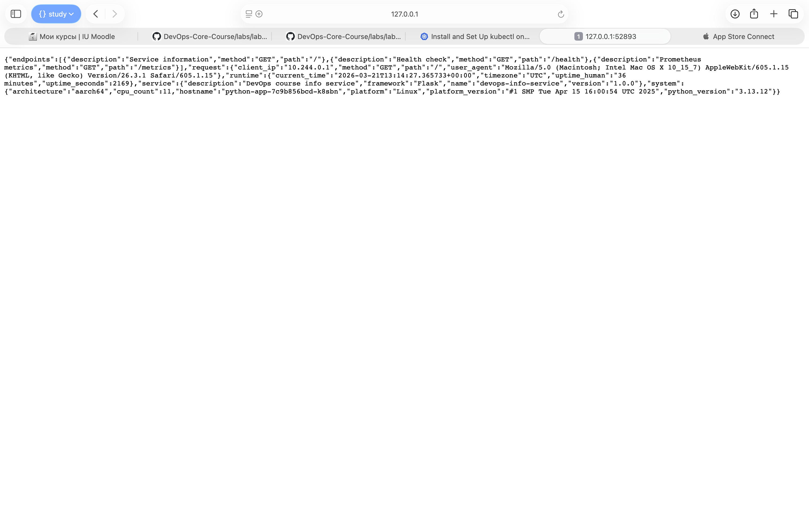
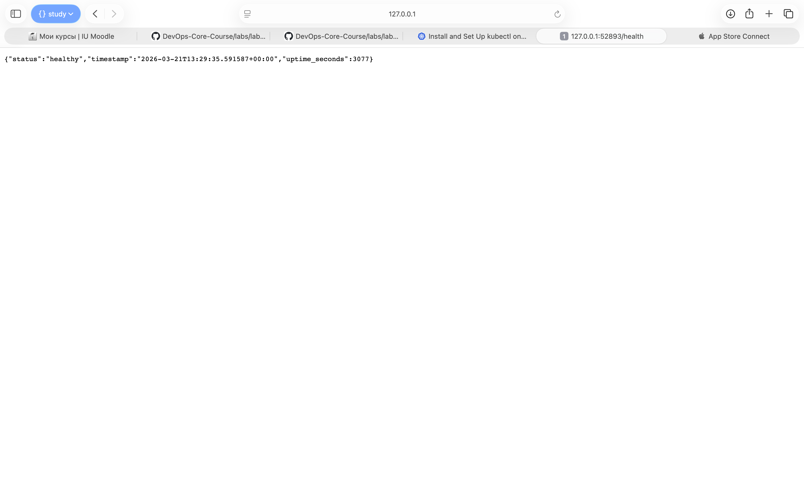

# Kubernetes Deployment

## Architecture Overview

```
                    ┌─────────────────────────────────┐
                    │        Kubernetes Cluster        │
                    │                                  │
  User ──► NodePort │  Service ──► Deployment (3 pods) │
           :30080   │  :80→5000   python-app           │
                    │                                  │
                    │  Ingress (local.example.com)      │
                    │  ├─ /app1 → python-app-service   │
                    │  └─ /app2 → go-app-service       │
                    │                                  │
                    │  go-app-service ──► go-app (3)   │
                    │  :80→8080                        │
                    └─────────────────────────────────┘
```

- **Python app**: 3 replicas, 128Mi–256Mi RAM, 100m–200m CPU per pod
- **Go app** (bonus): 3 replicas, 64Mi–128Mi RAM, 50m–100m CPU per pod
- **Networking**: NodePort for direct access, Ingress for path-based routing with TLS

## Manifest Files

| File | Description |
|------|-------------|
| `deployment.yml` | Python app Deployment — 3 replicas, health probes, resource limits, rolling update strategy |
| `service.yml` | NodePort Service for Python app — exposes port 80→5000, nodePort 30080 |
| `deployment-go.yml` | Go app Deployment (bonus) — 3 replicas, health probes, resource limits |
| `service-go.yml` | ClusterIP Service for Go app (bonus) — exposes port 80→8080 |
| `ingress.yml` | Ingress with TLS (bonus) — path-based routing `/app1`, `/app2` |

### Key Configuration Choices

- **3 replicas**: balance between availability and resource usage for dev
- **Rolling update with maxUnavailable: 0**: ensures zero downtime during updates
- **Resource requests/limits**: prevents resource starvation; requests guarantee scheduling, limits cap usage
- **Liveness probe**: restarts unhealthy containers (checks `/health`)
- **Readiness probe**: removes unready pods from Service (shorter intervals for faster traffic routing)

#### Terminal output showing successful cluster setup

```
karinasiniatullina@MacBook-Pro--Karina ~ % brew install minikube
==> Auto-updating Homebrew...
Adjust how often this is run with `$HOMEBREW_AUTO_UPDATE_SECS` or disable with
`$HOMEBREW_NO_AUTO_UPDATE=1`. Hide these hints with `$HOMEBREW_NO_ENV_HINTS=1` (see `man brew`).
==> Auto-updated Homebrew!
Updated 1 tap (hashicorp/tap).

You have 65 outdated formulae installed.

==> Fetching downloads for: minikube
✔︎ Bottle Manifest minikube (1.38.1)                  Downloaded    8.4KB/  8.4KB
✔︎ Bottle Manifest kubernetes-cli (1.35.3)            Downloaded    7.5KB/  7.5KB
✔︎ Bottle kubernetes-cli (1.35.3)                     Downloaded   18.1MB/ 18.1MB
✔︎ Bottle minikube (1.38.1)                           Downloaded   51.9MB/ 51.9MB
==> Installing minikube dependency: kubernetes-cli
==> Pouring kubernetes-cli--1.35.3.arm64_tahoe.bottle.tar.gz
🍺  /opt/homebrew/Cellar/kubernetes-cli/1.35.3: 261 files, 62MB
==> Pouring minikube--1.38.1.arm64_tahoe.bottle.tar.gz
🍺  /opt/homebrew/Cellar/minikube/1.38.1: 11 files, 135.7MB
==> Running `brew cleanup minikube`...
Disable this behaviour by setting `HOMEBREW_NO_INSTALL_CLEANUP=1`.
Hide these hints with `HOMEBREW_NO_ENV_HINTS=1` (see `man brew`).
==> Caveats
zsh completions have been installed to:
  /opt/homebrew/share/zsh/site-functions
```
```
karinasiniatullina@MacBook-Pro--Karina DevOps-Core-Course % minikube start
😄  minikube v1.38.1 on Darwin 26.3.1 (arm64)
✨  Automatically selected the docker driver
❗  Starting v1.39.0, minikube will default to "containerd" container runtime. See #21973 for more info.
📌  Using Docker Desktop driver with root privileges
👍  Starting "minikube" primary control-plane node in "minikube" cluster
🚜  Pulling base image v0.0.50 ...
💾  Downloading Kubernetes v1.35.1 preload ...
    > preloaded-images-k8s-v18-v1...:  243.95 MiB / 243.95 MiB  100.00% 887.54 
    > gcr.io/k8s-minikube/kicbase...:  483.40 MiB / 483.40 MiB  100.00% 952.40 
🔥  Creating docker container (CPUs=2, Memory=4600MB) ...
🐳  Preparing Kubernetes v1.35.1 on Docker 29.2.1 ...
🔗  Configuring bridge CNI (Container Networking Interface) ...
🔎  Verifying Kubernetes components...
    ▪ Using image gcr.io/k8s-minikube/storage-provisioner:v5
🌟  Enabled addons: storage-provisioner, default-storageclass
🏄  Done! kubectl is now configured to use "minikube" cluster and "default" namespace by default
```

#### Output of kubectl cluster-info

```
karinasiniatullina@MacBook-Pro--Karina DevOps-Core-Course % kubectl cluster-info
Kubernetes control plane is running at https://127.0.0.1:63803
CoreDNS is running at https://127.0.0.1:63803/api/v1/namespaces/kube-system/services/kube-dns:dns/proxy

To further debug and diagnose cluster problems, use 'kubectl cluster-info dump'.
```

#### Output of kubectl get nodes

```
karinasiniatullina@MacBook-Pro--Karina DevOps-Core-Course % kubectl get nodes
NAME       STATUS   ROLES           AGE   VERSION
minikube   Ready    control-plane   15h   v1.35.1
```

#### Why Minikube

Minikube was chosen because it is the most full-featured local Kubernetes solution — it supports addons (Ingress, metrics-server, dashboard), runs on Docker Desktop, and closely resembles a real cluster. Unlike kind, minikube provides `minikube service` for easy NodePort access and built-in addon management, which simplifies local development and testing.

## Deployment Evidence

### kubectl get pods

```
karinasiniatullina@MacBook-Pro--Karina DevOps-Core-Course % kubectl get pods   
NAME                          READY   STATUS    RESTARTS   AGE
python-app-7c9b856bcd-dnlt9   1/1     Running   0          4m6s
python-app-7c9b856bcd-k8sbn   1/1     Running   0          4m6s
python-app-7c9b856bcd-ngpd7   1/1     Running   0          4m6s
```

### kubectl get all

```
karinasiniatullina@MacBook-Pro--Karina DevOps-Core-Course % kubectl get all
NAME                              READY   STATUS    RESTARTS   AGE
pod/python-app-7c9b856bcd-dnlt9   1/1     Running   0          54m
pod/python-app-7c9b856bcd-k8sbn   1/1     Running   0          54m
pod/python-app-7c9b856bcd-ngpd7   1/1     Running   0          54m

NAME                         TYPE        CLUSTER-IP      EXTERNAL-IP   PORT(S)        AGE
service/kubernetes           ClusterIP   10.96.0.1       <none>        443/TCP        20h
service/python-app-service   NodePort    10.100.220.46   <none>        80:30080/TCP   19m

NAME                         READY   UP-TO-DATE   AVAILABLE   AGE
deployment.apps/python-app   3/3     3            3           54m

NAME                                    DESIRED   CURRENT   READY   AGE
replicaset.apps/python-app-7c9b856bcd   3         3         3       54m
```

### kubectl get pods,svc -o wide

```
karinasiniatullina@MacBook-Pro--Karina DevOps-Core-Course % kubectl get pods,svc -o wide
NAME                              READY   STATUS    RESTARTS   AGE   IP            NODE       NOMINATED NODE   READINESS GATES
pod/python-app-7c9b856bcd-dnlt9   1/1     Running   0          54m   10.244.0.12   minikube   <none>           <none>
pod/python-app-7c9b856bcd-k8sbn   1/1     Running   0          54m   10.244.0.14   minikube   <none>           <none>
pod/python-app-7c9b856bcd-ngpd7   1/1     Running   0          54m   10.244.0.13   minikube   <none>           <none>

NAME                         TYPE        CLUSTER-IP      EXTERNAL-IP   PORT(S)        AGE   SELECTOR
service/kubernetes           ClusterIP   10.96.0.1       <none>        443/TCP        20h   <none>
service/python-app-service   NodePort    10.100.220.46   <none>        80:30080/TCP   19m   app=python-app
```

### kubectl describe deployment python-app

```
karinasiniatullina@MacBook-Pro--Karina DevOps-Core-Course % kubectl describe deployment python-app                                     
Name:                   python-app
Namespace:              default
CreationTimestamp:      Sat, 21 Mar 2026 15:38:17 +0300
Labels:                 app=python-app
                        version=v1
Annotations:            deployment.kubernetes.io/revision: 1
Selector:               app=python-app
Replicas:               3 desired | 3 updated | 3 total | 3 available | 0 unavailable
StrategyType:           RollingUpdate
MinReadySeconds:        0
RollingUpdateStrategy:  0 max unavailable, 1 max surge
Pod Template:
  Labels:  app=python-app
           version=v1
  Containers:
   python-app:
    Image:      karishka1222/devops-python-app:latest
    Port:       5000/TCP
    Host Port:  0/TCP
    Limits:
      cpu:     200m
      memory:  256Mi
    Requests:
      cpu:      100m
      memory:   128Mi
    Liveness:   http-get http://:5000/health delay=10s timeout=3s period=5s #success=1 #failure=3
    Readiness:  http-get http://:5000/health delay=5s timeout=2s period=3s #success=1 #failure=3
    Environment:
      HOST:        0.0.0.0
      PORT:        5000
    Mounts:        <none>
  Volumes:         <none>
  Node-Selectors:  <none>
  Tolerations:     <none>
Conditions:
  Type           Status  Reason
  ----           ------  ------
  Available      True    MinimumReplicasAvailable
  Progressing    True    NewReplicaSetAvailable
OldReplicaSets:  <none>
NewReplicaSet:   python-app-7c9b856bcd (3/3 replicas created)
Events:
  Type    Reason             Age    From                   Message
  ----    ------             ----   ----                   -------
  Normal  ScalingReplicaSet  4m17s  deployment-controller  Scaled up replica set python-app-7c9b856bcd from 0 to 3
```

### App working (curl output)




## Operations Performed

### Deploy commands

```bash
kubectl apply -f k8s/deployment.yml
kubectl apply -f k8s/service.yml
```

### Scaling to 5 replicas

```bash
kubectl scale deployment/python-app --replicas=5
kubectl get pods -w
kubectl rollout status deployment/python-app
```

Scaling output:

```
karinasiniatullina@MacBook-Pro--Karina DevOps-Core-Course % kubectl scale deployment/python-app --replicas=5
deployment.apps/python-app scaled

karinasiniatullina@MacBook-Pro--Karina DevOps-Core-Course % kubectl get pods -w
NAME                          READY   STATUS    RESTARTS   AGE
python-app-7c9b856bcd-dnlt9   1/1     Running   0          3h32m
python-app-7c9b856bcd-k8sbn   1/1     Running   0          3h32m
python-app-7c9b856bcd-mln99   1/1     Running   0          62s
python-app-7c9b856bcd-ngpd7   1/1     Running   0          3h32m
python-app-7c9b856bcd-twrfk   1/1     Running   0          62s
```

### Rolling Update

```bash
kubectl apply -f k8s/deployment.yml
kubectl rollout status deployment/python-app
```

Rolling update output:

```
karinasiniatullina@MacBook-Pro--Karina DevOps-Core-Course % kubectl apply -f k8s/deployment.yml
deployment.apps/python-app configured

karinasiniatullina@MacBook-Pro--Karina DevOps-Core-Course % kubectl rollout status deployment/python-app
Waiting for deployment "python-app" rollout to finish: 2 out of 3 new replicas have been updated...
Waiting for deployment "python-app" rollout to finish: 2 out of 3 new replicas have been updated...
Waiting for deployment "python-app" rollout to finish: 2 out of 3 new replicas have been updated...
Waiting for deployment "python-app" rollout to finish: 1 old replicas are pending termination...
Waiting for deployment "python-app" rollout to finish: 1 old replicas are pending termination...
deployment "python-app" successfully rolled out
```

### Rollback

```bash
kubectl rollout history deployment/python-app
kubectl rollout undo deployment/python-app
kubectl rollout status deployment/python-app
```

Rollback output:

```
karinasiniatullina@MacBook-Pro--Karina DevOps-Core-Course % kubectl rollout history deployment/python-app                                                  
deployment.apps/python-app 
REVISION  CHANGE-CAUSE
1         <none>
2         <none>

karinasiniatullina@MacBook-Pro--Karina DevOps-Core-Course % kubectl rollout undo deployment/python-app
deployment.apps/python-app rolled back

karinasiniatullina@MacBook-Pro--Karina DevOps-Core-Course % kubectl rollout status deployment/python-app
Waiting for deployment "python-app" rollout to finish: 1 out of 3 new replicas have been updated...
Waiting for deployment "python-app" rollout to finish: 1 out of 3 new replicas have been updated...
Waiting for deployment "python-app" rollout to finish: 1 out of 3 new replicas have been updated...
Waiting for deployment "python-app" rollout to finish: 2 out of 3 new replicas have been updated...
Waiting for deployment "python-app" rollout to finish: 2 out of 3 new replicas have been updated...
Waiting for deployment "python-app" rollout to finish: 2 out of 3 new replicas have been updated...
Waiting for deployment "python-app" rollout to finish: 1 old replicas are pending termination...
Waiting for deployment "python-app" rollout to finish: 1 old replicas are pending termination...
deployment "python-app" successfully rolled out
```

### Service Access

```bash
minikube service python-app-service --url
# or
kubectl port-forward service/python-app-service 8080:80
```

Service verification output:

```
karinasiniatullina@MacBook-Pro--Karina DevOps-Core-Course % kubectl apply -f k8s/service.yml
service/python-app-service created

karinasiniatullina@MacBook-Pro--Karina DevOps-Core-Course % minikube service python-app-service --url
http://127.0.0.1:52893
❗  Because you are using a Docker driver on darwin, the terminal needs to be open to run it.
```

## Production Considerations

### Health Checks
- **Liveness probe** (HTTP GET `/health`): restarts container if unresponsive — self-healing.
- **Readiness probe** (HTTP GET `/health`): removes pod from Service if unhealthy — traffic goes only to healthy instances.
- Readiness has shorter `initialDelaySeconds` (5s vs 10s) to start serving faster; liveness gives more startup time.

### Resource Limits
- **Requests** guarantee minimum resources for scheduling.
- **Limits** cap max usage to protect the node.
- Flask app has low footprint: 128Mi/100m base is sufficient; 2x limits handle spikes.

### Production Improvements
- Use specific image tags instead of `:latest` for reproducible deployments
- Add `PodDisruptionBudget` for availability during node maintenance
- Implement `HorizontalPodAutoscaler` for automatic scaling
- Add network policies for pod-to-pod traffic control
- Use namespaces to isolate environments (dev/staging/prod)
- Set up Prometheus + Grafana monitoring (app already exposes `/metrics`)
- Add `podAntiAffinity` to spread replicas across nodes

### Monitoring
The app exposes Prometheus metrics at `/metrics`. In production, deploy Prometheus ServiceMonitor to scrape these endpoints and Grafana dashboards for visualization.

## Challenges & Solutions

| Challenge | Solution |
|-----------|----------|
| Pods in CrashLoopBackOff | Check logs: `kubectl logs <pod>`. Usually wrong port or missing env vars |
| Readiness probe failing | Ensure `/health` returns 200. Check `kubectl describe pod` for probe details |
| Service not routing traffic | Verify label selectors match between Service and Deployment |
| Image pull errors | Ensure image exists on Docker Hub: `docker pull karishka1222/devops-python-app:latest` |

Debugging commands:

```bash
kubectl describe pod <pod-name>
kubectl logs <pod-name>
kubectl get events --sort-by=.metadata.creationTimestamp
kubectl exec -it <pod-name> -- /bin/bash
```

## Bonus: Ingress with TLS

### Setup

```bash
minikube addons enable ingress

openssl req -x509 -nodes -days 365 -newkey rsa:2048 \
  -keyout tls.key -out tls.crt \
  -subj "/CN=local.example.com/O=local.example.com"

kubectl create secret tls tls-secret --key tls.key --cert tls.crt

kubectl apply -f k8s/deployment-go.yml
kubectl apply -f k8s/service-go.yml
kubectl apply -f k8s/ingress.yml

echo "$(minikube ip) local.example.com" | sudo tee -a /etc/hosts
```

### Ingress manifest (ingress.yml)

```yaml
apiVersion: networking.k8s.io/v1
kind: Ingress
metadata:
  name: apps-ingress
  annotations:
    nginx.ingress.kubernetes.io/rewrite-target: /
spec:
  ingressClassName: nginx
  tls:
    - hosts:
        - local.example.com
      secretName: tls-secret
  rules:
    - host: local.example.com
      http:
        paths:
          - path: /app1
            pathType: Prefix
            backend:
              service:
                name: python-app-service
                port:
                  number: 80
          - path: /app2
            pathType: Prefix
            backend:
              service:
                name: go-app-service
                port:
                  number: 80
```

### All Ingress resources

```
karinasiniatullina@MacBook-Pro--Karina DevOps-Core-Course % kubectl get all,ingress
NAME                              READY   STATUS    RESTARTS   AGE
pod/go-app-fb8d4b49d-dkf92        1/1     Running   0          25s
pod/go-app-fb8d4b49d-jfttb        1/1     Running   0          25s
pod/go-app-fb8d4b49d-qz5ff        1/1     Running   0          25s
pod/python-app-7c9b856bcd-25g7f   1/1     Running   0          16h
pod/python-app-7c9b856bcd-gfj5b   1/1     Running   0          16h
pod/python-app-7c9b856bcd-zvjxt   1/1     Running   0          16h

NAME                         TYPE        CLUSTER-IP      EXTERNAL-IP   PORT(S)        AGE
service/go-app-service       ClusterIP   10.97.10.23     <none>        80/TCP         20s
service/kubernetes           ClusterIP   10.96.0.1       <none>        443/TCP        39h
service/python-app-service   NodePort    10.100.220.46   <none>        80:30080/TCP   19h

NAME                         READY   UP-TO-DATE   AVAILABLE   AGE
deployment.apps/go-app       3/3     3            3           25s
deployment.apps/python-app   3/3     3            3           20h

NAME                                    DESIRED   CURRENT   READY   AGE
replicaset.apps/go-app-fb8d4b49d        3         3         3       25s
replicaset.apps/python-app-6dc4c9bfd6   0         0         0       16h
replicaset.apps/python-app-7c9b856bcd   3         3         3       20h

NAME                                     CLASS   HOSTS               ADDRESS   PORTS     AGE
ingress.networking.k8s.io/apps-ingress   nginx   local.example.com             80, 443   15s
```

### Routing verification (curl)

```
karinasiniatullina@MacBook-Pro--Karina DevOps-Core-Course % curl -k https://127.0.0.1/app1 -H "Host: local.example.com"
{"endpoints":[{"description":"Service information","method":"GET","path":"/"},{"description":"Health check","method":"GET","path":"/health"},{"description":"Prometheus metrics","method":"GET","path":"/metrics"}],"request":{"client_ip":"10.244.0.25","method":"GET","path":"/","user_agent":"curl/8.7.1"},"runtime":{"current_time":"2026-03-22T08:47:04.650301+00:00","timezone":"UTC","uptime_human":"16 hours, 25 minutes","uptime_seconds":59134},"service":{"description":"DevOps course info service","framework":"Flask","name":"devops-info-service","version":"1.0.0"},"system":{"architecture":"aarch64","cpu_count":11,"hostname":"python-app-7c9b856bcd-zvjxt","platform":"Linux","platform_version":"#1 SMP Tue Apr 15 16:00:54 UTC 2025","python_version":"3.13.12"}}

karinasiniatullina@MacBook-Pro--Karina DevOps-Core-Course % curl -k https://127.0.0.1/app2 -H "Host: local.example.com"
{"service":{"name":"devops-info-service","version":"1.0.0","description":"DevOps course info service","framework":"Go net/http"},"system":{"hostname":"go-app-fb8d4b49d-qz5ff","platform":"linux","platform_version":"linux arm64","architecture":"arm64","cpu_count":11,"go_version":"go1.23.12"},"runtime":{"uptime_seconds":399,"uptime_human":"6 minutes","current_time":"2026-03-22T08:47:11.281415678Z","timezone":"UTC"},"request":{"client_ip":"10.244.0.1","user_agent":"curl/8.7.1","method":"GET","path":"/"},"endpoints":[{"path":"/","method":"GET","description":"Service information"},{"path":"/health","method":"GET","description":"Health check"}]}
```

### Ingress vs NodePort
- **NodePort**: L4 load balancing, one port per service (30000–32767), no SSL termination
- **Ingress**: L7 routing, multiple services behind one endpoint, TLS termination, path/host-based routing — more production-appropriate
