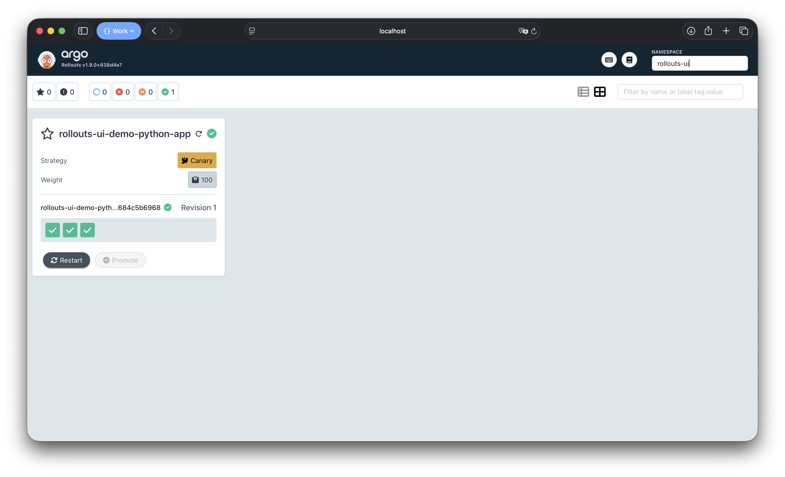
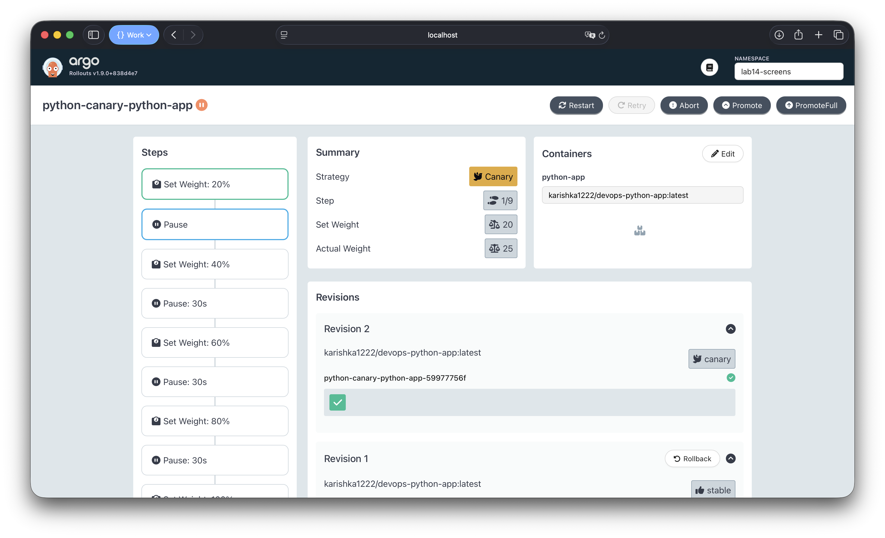
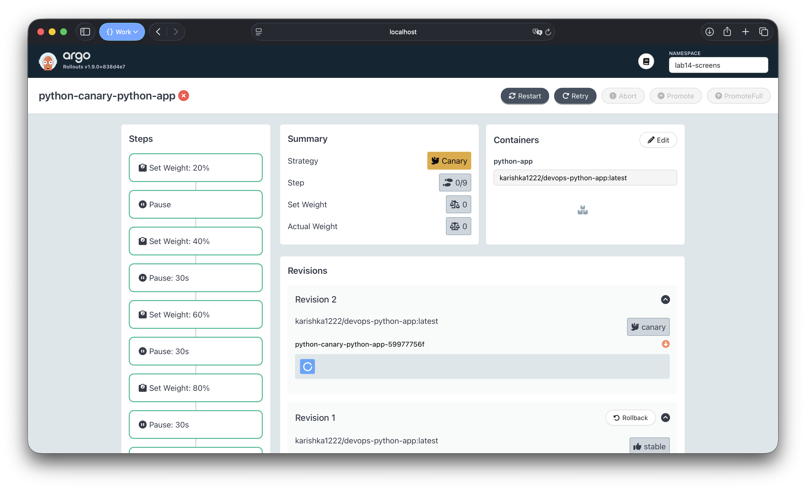
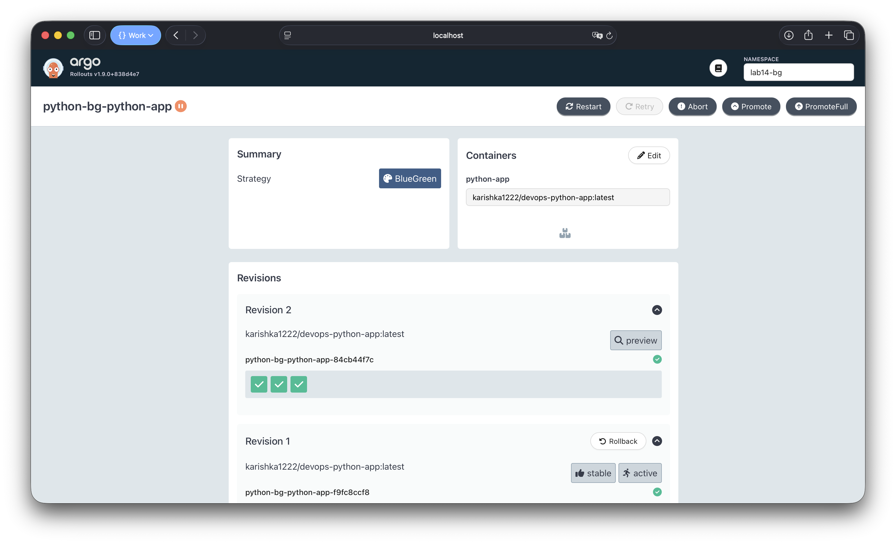

# Argo Rollouts — Progressive Delivery

## 1. Argo Rollouts Setup

### Installation

```bash
kubectl create namespace argo-rollouts
kubectl apply -n argo-rollouts -f https://github.com/argoproj/argo-rollouts/releases/latest/download/install.yaml
kubectl apply -n argo-rollouts -f https://github.com/argoproj/argo-rollouts/releases/latest/download/dashboard-install.yaml

# kubectl plugin (macOS): pick amd64 or arm64 to match `uname -m`
curl -LO https://github.com/argoproj/argo-rollouts/releases/latest/download/kubectl-argo-rollouts-darwin-amd64
chmod +x kubectl-argo-rollouts-darwin-amd64
sudo mv kubectl-argo-rollouts-darwin-amd64 /usr/local/bin/kubectl-argo-rollouts
```

### Verification

Controller and dashboard pods running:

```
$ kubectl get pods -n argo-rollouts
NAME                                      READY   STATUS    RESTARTS   AGE
argo-rollouts-5f64f8d68-7h822             1/1     Running   0          62m
argo-rollouts-dashboard-755bbc64c-wvngq   1/1     Running   0          61m
```

Plugin version:

```
$ kubectl argo rollouts version
kubectl-argo-rollouts: v1.8.3+49fa151
  BuildDate: 2025-06-04T22:19:21Z
  GitCommit: 49fa1516cf71672b69e265267da4e1d16e1fe114
  GoVersion: go1.23.9
  Platform: darwin/amd64
```

### Dashboard Access

```bash
kubectl port-forward --address 127.0.0.1 svc/argo-rollouts-dashboard -n argo-rollouts 3100:3100
```

Open **`http://127.0.0.1:3100/rollouts/`** (include the `/rollouts/` path). If the UI stays on **Loading** with an empty list, ensure at least one `Rollout` exists (`kubectl get rollouts -A`).



---

## 2. Rollout vs Deployment

| Aspect | Deployment | Rollout |
|--------|-----------|---------|
| API | `apps/v1` | `argoproj.io/v1alpha1` |
| Strategies | `RollingUpdate`, `Recreate` | `canary`, `blueGreen` |
| Traffic control | None (all-at-once) | Weighted shifting, preview services |
| Analysis | Not supported | Built-in `AnalysisTemplate` |
| Rollback | `kubectl rollout undo` | `kubectl argo rollouts abort` / `undo` |
| Dashboard | None | Dedicated Rollouts Dashboard |

The Rollout CRD is a drop-in replacement for Deployment — the pod template spec is identical. Only `apiVersion`, `kind`, and `strategy` change.

In this chart, `rollout.enabled` controls which resource is rendered:
- `false` (default) → standard `Deployment`
- `true` → `Rollout` with the chosen strategy

---

## 3. Canary Deployment

### Configuration

Canary steps in `values-canary.yaml`:

```yaml
rollout:
  enabled: true
  strategy: canary
  canary:
    steps:
      - setWeight: 20
      - pause: {}          # manual promotion required
      - setWeight: 40
      - pause: { duration: 30s }
      - setWeight: 60
      - pause: { duration: 30s }
      - setWeight: 80
      - pause: { duration: 30s }
      - setWeight: 100
```

### Deploy

```bash
kubectl create namespace lab14-screens --dry-run=client -o yaml | kubectl apply -f -
helm upgrade --install python-canary ./k8s/python-app \
  -f k8s/python-app/values.yaml \
  -f k8s/python-app/values-canary.yaml \
  -n lab14-screens \
  --set persistence.enabled=false \
  --set vault.enabled=false
```

### Initial Stable State

```
$ kubectl argo rollouts get rollout python-canary-python-app -n lab14-screens
Name:            python-canary-python-app
Namespace:       lab14-screens
Status:          ✔ Healthy
Strategy:        Canary
  Step:          9/9
  SetWeight:     100
  ActualWeight:  100
Images:          karishka1222/devops-python-app:latest (stable)
Replicas:
  Desired:       3
  Current:       3
  Updated:       3
  Ready:         3
  Available:     3

⟳ python-canary-python-app                            Rollout     ✔ Healthy
└──# revision:1
   └──⧉ python-canary-python-app-7ccd5cd7c9           ReplicaSet  ✔ Healthy  stable
      ├──□ python-canary-python-app-7ccd5cd7c9-5cwwx  Pod         ✔ Running  ready:1/1
      ├──□ python-canary-python-app-7ccd5cd7c9-5x7qn  Pod         ✔ Running  ready:1/1
      └──□ python-canary-python-app-7ccd5cd7c9-k2j8m  Pod         ✔ Running  ready:1/1
```

### Canary Progression — Paused at 20%

Trigger a new revision (example: bump `config.environment`):

```bash
helm upgrade python-canary ./k8s/python-app \
  -f k8s/python-app/values.yaml \
  -f k8s/python-app/values-canary.yaml \
  -n lab14-screens \
  --set persistence.enabled=false \
  --set vault.enabled=false \
  --set config.environment=screenshot-canary-1
```

The rollout then pauses at step 1/9 (20% weight):

```
$ kubectl argo rollouts get rollout python-canary-python-app -n lab14-screens
Name:            python-canary-python-app
Status:          ॥ Paused
Message:         CanaryPauseStep
Strategy:        Canary
  Step:          1/9
  SetWeight:     20
  ActualWeight:  25
Images:          karishka1222/devops-python-app:latest (canary, stable)
Replicas:
  Desired:       3
  Current:       4
  Updated:       1
  Ready:         4
  Available:     4

⟳ python-canary-python-app                            Rollout     ॥ Paused
├──# revision:4
│  └──⧉ python-canary-python-app-6b5d5fdbc8           ReplicaSet  ✔ Healthy  canary
│     └──□ python-canary-python-app-6b5d5fdbc8-tvl2w  Pod         ✔ Running  ready:1/1
└──# revision:3
   └──⧉ python-canary-python-app-7ccd5cd7c9           ReplicaSet  ✔ Healthy  stable
      ├──□ python-canary-python-app-7ccd5cd7c9-5cwwx  Pod         ✔ Running  ready:1/1
      ├──□ python-canary-python-app-7ccd5cd7c9-5x7qn  Pod         ✔ Running  ready:1/1
      └──□ python-canary-python-app-7ccd5cd7c9-k2j8m  Pod         ✔ Running  ready:1/1
```

### Manual Promotion

```bash
$ kubectl argo rollouts promote python-canary-python-app -n lab14-screens
rollout 'python-canary-python-app' promoted
```

After promote, rollout advanced to 40% and continued automatically through 60% → 80% → 100%:

```
Status:          ॥ Paused
Message:         CanaryPauseStep
Strategy:        Canary
  Step:          3/9
  SetWeight:     40
  ActualWeight:  33
```

### Completed Rollout (100%)

```
$ kubectl argo rollouts get rollout python-canary-python-app -n lab14-screens
Name:            python-canary-python-app
Status:          ✔ Healthy
Strategy:        Canary
  Step:          9/9
  SetWeight:     100
  ActualWeight:  100
Images:          karishka1222/devops-python-app:latest (stable)
Replicas:
  Desired:       3
  Current:       3
  Updated:       3
  Ready:         3
  Available:     3

⟳ python-canary-python-app                            Rollout     ✔ Healthy
├──# revision:4
│  └──⧉ python-canary-python-app-6b5d5fdbc8           ReplicaSet  ✔ Healthy  stable
│     ├──□ python-canary-python-app-6b5d5fdbc8-tvl2w  Pod         ✔ Running  ready:1/1
│     ├──□ python-canary-python-app-6b5d5fdbc8-h2cn5  Pod         ✔ Running  ready:1/1
│     └──□ python-canary-python-app-6b5d5fdbc8-v44cr  Pod         ✔ Running  ready:1/1
└──# revision:3
   └──⧉ python-canary-python-app-7ccd5cd7c9           ReplicaSet  • ScaledDown
```



### Abort / Rollback

Triggered another update, then aborted at 20%:

```bash
$ kubectl argo rollouts abort python-canary-python-app -n lab14-screens
rollout 'python-canary-python-app' aborted
```

```
$ kubectl argo rollouts get rollout python-canary-python-app -n lab14-screens
Name:            python-canary-python-app
Status:          ✖ Degraded
Message:         RolloutAborted: Rollout aborted update to revision 5
Strategy:        Canary
  Step:          0/9
  SetWeight:     0
  ActualWeight:  0
Images:          karishka1222/devops-python-app:latest (stable)
Replicas:
  Desired:       3
  Current:       3
  Updated:       0
  Ready:         3
  Available:     3

⟳ python-canary-python-app                            Rollout     ✖ Degraded
├──# revision:5
│  └──⧉ python-canary-python-app-c8c9994c7            ReplicaSet  • ScaledDown   canary
└──# revision:4
   └──⧉ python-canary-python-app-6b5d5fdbc8           ReplicaSet  ✔ Healthy      stable
      ├──□ python-canary-python-app-6b5d5fdbc8-tvl2w  Pod         ✔ Running      ready:1/1
      ├──□ python-canary-python-app-6b5d5fdbc8-h2cn5  Pod         ✔ Running      ready:1/1
      └──□ python-canary-python-app-6b5d5fdbc8-v44cr  Pod         ✔ Running      ready:1/1
```

Canary pods terminated instantly, all traffic reverted to stable.



---

## 4. Blue-Green Deployment

### Configuration

Blue-green in `values-bluegreen.yaml`:

```yaml
rollout:
  enabled: true
  strategy: blueGreen
  blueGreen:
    autoPromotionEnabled: false
```

The chart creates two services:
- `python-app` — active service (production traffic)
- `python-app-preview` — preview service (new version for testing)

### Deploy

```bash
kubectl create namespace lab14-bg --dry-run=client -o yaml | kubectl apply -f -
helm upgrade --install python-bluegreen ./k8s/python-app \
  -f k8s/python-app/values.yaml \
  -f k8s/python-app/values-bluegreen.yaml \
  -n lab14-bg \
  --set persistence.enabled=false \
  --set vault.enabled=false
```

To start a **new** revision (green) without `helm upgrade` (the controller patches Service selectors and Helm may hit a conflict), patch the pod template:

```bash
kubectl patch rollout python-bluegreen-python-app -n lab14-bg --type='json' \
  -p='[{"op":"add","path":"/spec/template/metadata/annotations/trigger","value":"1"}]'
```

On a second run, use `replace` instead of `add`, or change the annotation value.

### Initial State (Blue)

```
$ kubectl argo rollouts get rollout python-bluegreen-python-app -n lab14-bg
Name:            python-bluegreen-python-app
Status:          ✔ Healthy
Strategy:        BlueGreen
Images:          karishka1222/devops-python-app:latest (stable, active)
Replicas:
  Desired:       3
  Current:       3
  Updated:       3
  Ready:         3
  Available:     3

⟳ python-bluegreen-python-app                            Rollout     ✔ Healthy
└──# revision:1
   └──⧉ python-bluegreen-python-app-76bdc7c769           ReplicaSet  ✔ Healthy  stable,active
      ├──□ python-bluegreen-python-app-76bdc7c769-8k7pl  Pod         ✔ Running  ready:1/1
      ├──□ python-bluegreen-python-app-76bdc7c769-8ttsr  Pod         ✔ Running  ready:1/1
      └──□ python-bluegreen-python-app-76bdc7c769-9r7ch  Pod         ✔ Running  ready:1/1

$ kubectl get svc -n lab14-bg
NAME                                  TYPE        CLUSTER-IP     EXTERNAL-IP   PORT(S)   AGE
python-bluegreen-python-app           ClusterIP   10.96.134.75   <none>        80/TCP    26s
python-bluegreen-python-app-preview   ClusterIP   10.96.38.26    <none>        80/TCP    26s
```

### Green Deployed — Paused (Preview)

After update, green ReplicaSet created alongside blue. 6 pods total (2× resources):

```
$ kubectl argo rollouts get rollout python-bluegreen-python-app -n lab14-bg
Name:            python-bluegreen-python-app
Status:          ॥ Paused
Message:         BlueGreenPause
Strategy:        BlueGreen
Images:          karishka1222/devops-python-app:latest (active, preview, stable)
Replicas:
  Desired:       3
  Current:       6
  Updated:       3
  Ready:         3
  Available:     3

⟳ python-bluegreen-python-app                            Rollout     ॥ Paused
├──# revision:3
│  └──⧉ python-bluegreen-python-app-7554dc6c8f           ReplicaSet  ✔ Healthy   preview
│     ├──□ python-bluegreen-python-app-7554dc6c8f-6smn4  Pod         ✔ Running   ready:1/1
│     ├──□ python-bluegreen-python-app-7554dc6c8f-tfhnk  Pod         ✔ Running   ready:1/1
│     └──□ python-bluegreen-python-app-7554dc6c8f-v2dj9  Pod         ✔ Running   ready:1/1
└──# revision:1
   └──⧉ python-bluegreen-python-app-76bdc7c769           ReplicaSet  ✔ Healthy   stable,active
      ├──□ python-bluegreen-python-app-76bdc7c769-8k7pl  Pod         ✔ Running   ready:1/1
      ├──□ python-bluegreen-python-app-76bdc7c769-8ttsr  Pod         ✔ Running   ready:1/1
      └──□ python-bluegreen-python-app-76bdc7c769-9r7ch  Pod         ✔ Running   ready:1/1
```

At this point both services are accessible:

```bash
kubectl port-forward svc/python-bluegreen-python-app 8080:80 -n lab14-bg         # active
kubectl port-forward svc/python-bluegreen-python-app-preview 8081:80 -n lab14-bg  # preview
```

### Promotion (Green → Active)

```bash
$ kubectl argo rollouts promote python-bluegreen-python-app -n lab14-bg
rollout 'python-bluegreen-python-app' promoted
```

After promotion, green becomes `stable,active` and old blue scales down:

```
Status:          ✔ Healthy
Strategy:        BlueGreen
Images:          karishka1222/devops-python-app:latest (active, stable)

⟳ python-bluegreen-python-app                            Rollout     ✔ Healthy
├──# revision:3
│  └──⧉ python-bluegreen-python-app-7554dc6c8f           ReplicaSet  ✔ Healthy   stable,active
│     ├──□ python-bluegreen-python-app-7554dc6c8f-6smn4  Pod         ✔ Running   ready:1/1
│     ├──□ python-bluegreen-python-app-7554dc6c8f-tfhnk  Pod         ✔ Running   ready:1/1
│     └──□ python-bluegreen-python-app-7554dc6c8f-v2dj9  Pod         ✔ Running   ready:1/1
└──# revision:1
   └──⧉ python-bluegreen-python-app-76bdc7c769           ReplicaSet  ✔ Healthy   delay:24s
```

### Instant Rollback

```bash
$ kubectl argo rollouts undo python-bluegreen-python-app -n lab14-bg
rollout 'python-bluegreen-python-app' undo
```

Undo immediately creates the previous revision as preview. After promote, traffic switches back instantly — no gradual shifting needed.



---

## 5. Strategy Comparison

| Criteria | Canary | Blue-Green |
|----------|--------|------------|
| Traffic shift | Gradual (%, configurable) | Instant (0% → 100%) |
| Rollback speed | Instant (abort shifts to stable) | Instant (switch service selector) |
| Resource cost | Shared pods, lower overhead | 2× pods during deploy |
| Testing | Subset of real users | Isolated preview service |
| Complexity | More steps to configure | Simpler (two services) |
| Risk | Lower (small % exposed) | Higher (full switch) |

### When to Use

- **Canary**: production with real user traffic validation, metric-driven promotion, minimizing blast radius
- **Blue-Green**: need full pre-production testing of new version, instant cutover, compliance requirements for pre-deploy validation

---

## 6. CLI Commands Reference

| Command | Description |
|---------|-------------|
| `kubectl argo rollouts get rollout <name> -w` | Watch rollout status live |
| `kubectl argo rollouts promote <name>` | Promote to next step / activate green |
| `kubectl argo rollouts abort <name>` | Abort rollout, revert to stable |
| `kubectl argo rollouts retry rollout <name>` | Retry after abort |
| `kubectl argo rollouts undo <name>` | Rollback to previous revision |
| `kubectl argo rollouts set image <name> <c>=` | Trigger new rollout |
| `kubectl argo rollouts status <name>` | Check current status |
| `kubectl argo rollouts list rollouts` | List all rollouts |
