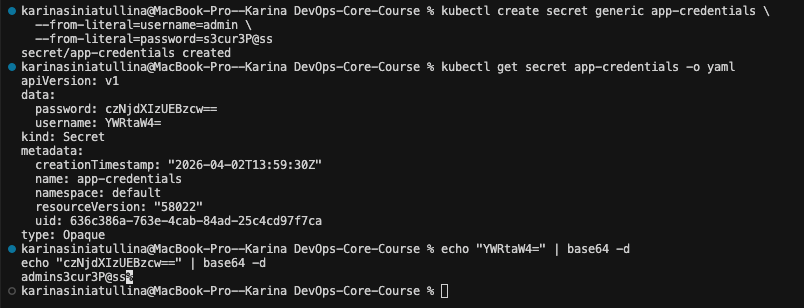

# Kubernetes Secrets & HashiCorp Vault

## Kubernetes Secrets

### Creating a Secret

```bash
kubectl create secret generic app-credentials \
  --from-literal=username=admin \
  --from-literal=password=s3cur3P@ss
```

Output:

```
secret/app-credentials created
```

### Viewing the Secret

```bash
kubectl get secret app-credentials -o yaml
```

Output:

```yaml
apiVersion: v1
data:
  password: czNjdXIzUEBzcw==
  username: YWRtaW4=
kind: Secret
metadata:
  name: app-credentials
  namespace: default
type: Opaque
```

### Decoding Base64 Values

```bash
echo "YWRtaW4=" | base64 -d        # admin
echo "czNjdXIzUEBzcw==" | base64 -d  # s3cur3P@ss
```



### Base64 Encoding vs Encryption

| Aspect | Base64 Encoding | Encryption |
|--------|----------------|------------|
| Purpose | Data representation | Data protection |
| Reversibility | Anyone can decode | Requires a key |
| Security | None — purely a format | Provides confidentiality |

Kubernetes Secrets are **base64-encoded, NOT encrypted** by default. Anyone with API access can decode them. For production, enable **etcd encryption at rest** via `EncryptionConfiguration` and restrict access with RBAC.

---

## Helm Secret Integration

### Chart Structure

```
python-app/
├── Chart.yaml
├── values.yaml
├── templates/
│   ├── _helpers.tpl        # includes envVars named template
│   ├── deployment.yaml     # consumes secret via envFrom
│   ├── secrets.yaml        # Secret resource
│   ├── serviceaccount.yaml # for Vault integration
│   ├── service.yaml
│   └── hooks/
│       ├── pre-install-job.yaml
│       └── post-install-job.yaml
```

### Secret Template (`templates/secrets.yaml`)

```yaml
apiVersion: v1
kind: Secret
metadata:
  name: {{ include "python-app.fullname" . }}-secret
  labels:
    {{- include "python-app.labels" . | nindent 4 }}
type: Opaque
stringData:
  {{- range $key, $value := .Values.secrets }}
  {{ $key }}: {{ $value | quote }}
  {{- end }}
```

Uses `stringData` so values are written in plain text and auto-encoded to base64 by Kubernetes.

### Secret Values in `values.yaml`

```yaml
secrets:
  username: "admin"
  password: "changeme"
```

These are **placeholder values**. Real secrets should be injected at deploy time via `--set`:

```bash
helm upgrade python-app ./python-app \
  --set secrets.username=realuser \
  --set secrets.password=realpassword
```

### Consuming Secrets in Deployment

The deployment uses `envFrom` with `secretRef` to inject all keys as environment variables:

```yaml
envFrom:
  - secretRef:
      name: {{ include "python-app.fullname" . }}-secret
```

### Verification

Deploy and verify:

```bash
helm upgrade --install python-app ./python-app
kubectl exec -it <pod-name> -- env | grep -E "username|password"
```

Expected output:

```
username=admin
password=changeme
```

`kubectl describe pod` shows `SecretRef` but **not** the actual secret values.

```bash
$ kubectl exec -it python-app-5959569bb5-28dxc -- env | grep -E "username|password"
username=admin
password=changeme
```

```bash
$ kubectl describe pod python-app-5959569bb5-28dxc | grep -A5 "Environment"
    Environment Variables from:
      python-app-secret  Secret  Optional: false
    Environment:
      HOST:  0.0.0.0
      PORT:  5000
    Mounts:
      /var/run/secrets/kubernetes.io/serviceaccount from kube-api-access-l69kw (ro)
```

---

## Resource Management

### Configuration

From `values.yaml`:

```yaml
resources:
  requests:
    memory: "128Mi"
    cpu: "100m"
  limits:
    memory: "256Mi"
    cpu: "200m"
```

### Requests vs Limits

| | Requests | Limits |
|-|----------|--------|
| **Purpose** | Minimum guaranteed resources | Maximum allowed resources |
| **Scheduling** | Used by scheduler to place pods | Not used for scheduling |
| **Enforcement** | Soft — pod can use more if available | Hard — pod is killed/throttled if exceeded |

- **CPU**: throttled when exceeding limit (not killed)
- **Memory**: pod is OOMKilled when exceeding limit

### Choosing Values

- **Requests**: set to average usage observed during normal load
- **Limits**: set to ~2x requests to handle spikes; avoid over-provisioning
- Use `kubectl top pods` to monitor actual resource usage

---

## Vault Integration

### Installation

```bash
helm repo add hashicorp https://helm.releases.hashicorp.com
helm repo update
helm install vault hashicorp/vault \
  --set "server.dev.enabled=true" \
  --set "injector.enabled=true"
```

### Verify Pods

```bash
kubectl get pods -l app.kubernetes.io/name=vault
```

Expected output:

```
NAME      READY   STATUS    RESTARTS   AGE
vault-0   1/1     Running   0          116s
```

### Configure KV Secrets Engine

```bash
kubectl exec -it vault-0 -- /bin/sh

vault secrets enable -path=secret kv-v2
vault kv put secret/python-app/config username="admin" password="vaultSecret123"
vault kv get secret/python-app/config
```

### Configure Kubernetes Authentication

```bash
vault auth enable kubernetes

vault write auth/kubernetes/config \
  kubernetes_host="https://$KUBERNETES_PORT_443_TCP_ADDR:443"

vault policy write python-app - <<EOF
path "secret/data/python-app/config" {
  capabilities = ["read"]
}
EOF

vault write auth/kubernetes/role/python-app \
  bound_service_account_names=python-app \
  bound_service_account_namespaces=default \
  policies=python-app \
  ttl=24h
```

### Enable Vault Agent Injection

The deployment includes Vault annotations (activated when `vault.enabled=true`):

```yaml
annotations:
  vault.hashicorp.com/agent-inject: "true"
  vault.hashicorp.com/role: "python-app"
  vault.hashicorp.com/agent-inject-secret-config: "secret/data/python-app/config"
```

Deploy with Vault enabled:

```bash
helm upgrade python-app ./python-app --set vault.enabled=true
```

### Verify Secret Injection

```bash
kubectl exec -it <pod-name> -c python-app -- cat /vault/secrets/config
```

Expected:

```bash
$ kubectl get pods | grep python-app
python-app-6f58fb59f4-6ck44   2/2     Running   0   53s
python-app-6f58fb59f4-dd4rd   2/2     Running   0   47s
python-app-6f58fb59f4-nqxc5   2/2     Running   0   40s
```

`2/2` confirms the Vault Agent sidecar is running alongside the app container.

```bash
$ kubectl exec -it python-app-6f58fb59f4-6ck44 -c python-app -- cat /vault/secrets/config
username=admin
password=vaultSecret123
```

### Sidecar Injection Pattern

Vault Agent Injector works as a **mutating admission webhook**:

1. Pod is created with Vault annotations
2. Injector adds an **init container** that authenticates with Vault and fetches secrets
3. Injector adds a **sidecar container** that keeps secrets refreshed
4. Secrets are written to a shared volume at `/vault/secrets/`
5. The application reads secrets from files — no Vault SDK needed

---

## Security Analysis

### Kubernetes Secrets vs Vault

| Feature | K8s Secrets | HashiCorp Vault |
|---------|-------------|-----------------|
| Encryption at rest | Optional (etcd config) | Built-in (AES-256) |
| Access control | RBAC | Policies + RBAC |
| Audit logging | API server audit | Built-in audit backend |
| Dynamic secrets | No | Yes (DB creds, AWS, etc.) |
| Rotation | Manual | Automatic with leases |
| Complexity | Low | Medium-High |
| External dependencies | None | Vault server |

### When to Use Each

- **K8s Secrets**: non-critical environments, dev/staging, simple apps with few secrets
- **Vault**: production, regulated industries, dynamic credentials needed, multi-cluster setups, audit requirements

### Production Recommendations

1. **Never** commit real secrets to Git — use placeholders + `--set` or external managers
2. Enable **etcd encryption at rest** for K8s Secrets
3. Use **RBAC** to restrict who can read secrets
4. For production workloads, use **Vault** or a cloud-native secret manager (AWS Secrets Manager, GCP Secret Manager)
5. Rotate secrets regularly; Vault automates this with **dynamic secrets**
6. Enable Vault **audit logging** for compliance

---

## Bonus: Vault Agent Templates

### Template Annotation

The deployment uses a Vault Agent template to render secrets in `.env` format:

```yaml
vault.hashicorp.com/agent-inject-template-config: |
  {{- with secret "secret/data/python-app/config" -}}
  username={{ .Data.data.username }}
  password={{ .Data.data.password }}
  {{- end -}}
```

This renders `/vault/secrets/config` as a key=value file instead of raw JSON.

### Dynamic Secret Rotation

- Vault Agent sidecar runs continuously and watches for secret changes
- When a secret is updated in Vault, the Agent re-renders the template file
- Default refresh interval is controlled by `vault.hashicorp.com/agent-cache-enable`

The `vault.hashicorp.com/agent-inject-command-<name>` annotation specifies a shell command to execute **after** the secret file is re-rendered. This enables automatic application reloading:

```yaml
vault.hashicorp.com/agent-inject-command-config: "kill -HUP $(pidof python)"
```

The command runs inside the Vault Agent init container's context, so it has access to the pod's process namespace. Common use cases: sending SIGHUP to reload config, touching a trigger file, or calling a health endpoint.

### Named Template for Environment Variables

In `_helpers.tpl`:

```yaml
{{- define "python-app.envVars" -}}
{{- range .Values.env }}
- name: {{ .name }}
  value: {{ .value | quote }}
{{- end }}
{{- end }}
```

Used in `deployment.yaml`:

```yaml
env:
  {{- include "python-app.envVars" . | nindent 12 }}
```

**Benefits**: DRY principle — if multiple templates need the same env vars, they include the named template instead of duplicating YAML.
