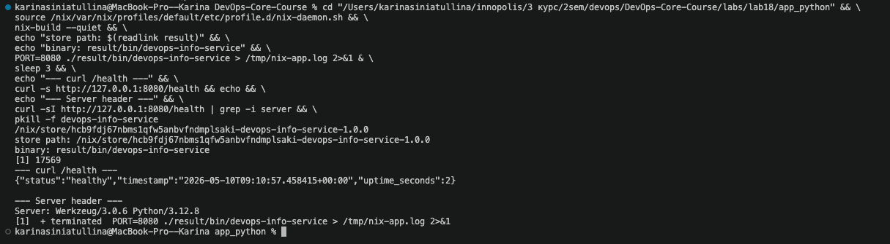
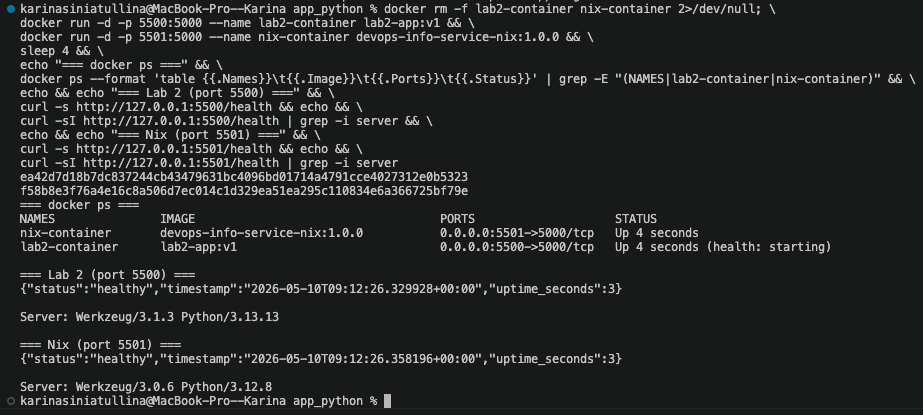

# Lab 18 — Reproducible Builds with Nix

Source layout: [`labs/lab18/app_python/`](lab18/app_python/) — `default.nix`, `docker.nix`, `flake.nix`, `flake.lock`, plus the Lab 1 `app.py` / `requirements.txt` and the Lab 2 `Dockerfile` for direct comparison.

Host: macOS 15 (`aarch64-darwin`), Apple Silicon. Determinate Nix 3.20.0 (Nix 2.34.6).

---

## Task 1 — Reproducible Python App (revisiting Lab 1)

### 1.1 Install Nix

Used the Determinate Systems installer (recommended in the lab):

```
$ curl --proto '=https' --tlsv1.2 -sSf -L https://install.determinate.systems/nix | sh -s -- install --determinate
INFO nix-installer v3.20.0
…
INFO Step: Configuring the Determinate Nix daemon

$ nix --version
nix (Determinate Nix 3.20.0) 2.34.6
```

`nix run nixpkgs#hello` returned `Hello, world!` — the daemon is healthy and substitution from `cache.nixos.org` works.

### 1.2 / 1.3 — `default.nix` for the Flask app

Pinning is done with a content-addressed `fetchTarball` that locks both the nixpkgs commit (`50ab793…`, the `nixos-24.11` release branch) and the NAR hash. Nothing in this expression depends on the host's network, channels, or wall-clock time.

```nix
{
  pkgs ? import
    (fetchTarball {
      url = "https://github.com/NixOS/nixpkgs/archive/50ab793786d9de88ee30ec4e4c24fb4236fc2674.tar.gz";
      sha256 = "1s2gr5rcyqvpr58vxdcb095mdhblij9bfzaximrva2243aal3dgx";
    })
    { },
}:

pkgs.python3Packages.buildPythonApplication {
  pname = "devops-info-service";
  version = "1.0.0";

  # Filter build artefacts so the source hash stays stable across rebuilds.
  src = pkgs.lib.cleanSourceWith {
    src = ./.;
    filter = path: _type:
      let base = baseNameOf (toString path); in
      base != "result"
      && !(pkgs.lib.hasPrefix "result-" base)
      && !(pkgs.lib.hasSuffix ".tar.gz" base)
      && base != "__pycache__"
      && base != ".direnv";
  };

  format = "other";

  propagatedBuildInputs = with pkgs.python3Packages; [ flask prometheus-client requests ];
  nativeBuildInputs = [ pkgs.makeWrapper ];

  installPhase = ''
    runHook preInstall
    mkdir -p $out/bin $out/share/devops-info-service
    cp app.py $out/share/devops-info-service/app.py
    makeWrapper ${pkgs.python3.interpreter} $out/bin/devops-info-service \
      --add-flags "$out/share/devops-info-service/app.py" \
      --prefix PYTHONPATH : "$PYTHONPATH"
    runHook postInstall
  '';

  meta = with pkgs.lib; {
    description = "DevOps Info Service - Flask app exposing system info, visit counter, and Prometheus metrics";
    license = licenses.mit;
    platforms = platforms.unix;
  };
}
```

Field-by-field:
- `pkgs ?` — defaulted *input*, not a mutable global. Callers (e.g. `flake.nix`) can pass a different `pkgs` and get a different platform's build with the same expression.
- `fetchTarball { sha256 = … }` — fixed-output derivation. If the tarball ever changes, the hash mismatch fails the build before any code runs.
- `cleanSourceWith` — narrows the source closure. `result` is the symlink that `nix-build` writes into the working dir; without filtering it, the next build's source hash flips because the symlink target is part of the input. Same for stray `*.tar.gz`, `__pycache__`, `.direnv`.
- `format = "other"` — the project has no `setup.py` / `pyproject.toml`, so we drive `installPhase` ourselves.
- `propagatedBuildInputs` — these end up on `PYTHONPATH` of any consumer. Versions come from the pinned nixpkgs (Flask 3.0.3, Werkzeug 3.0.6, prometheus-client 0.21.0), **not** PyPI: `requirements.txt` says `Flask==3.1.0`, but Nix prefers the nixpkgs snapshot for closure-wide consistency.
- `makeWrapper` — produces a tiny shim that calls the exact Python interpreter from the closure with `PYTHONPATH` set to that closure's site-packages. The result is a self-contained `bin/devops-info-service` that ignores any system Python.

Build and run:

```
$ nix-build
…
/nix/store/hcb9fdj67nbms1qfw5anbvfndmplsaki-devops-info-service-1.0.0

$ ls result/bin/
devops-info-service

$ PORT=8080 ./result/bin/devops-info-service > /tmp/nix-app.log 2>&1 &
$ curl -s http://127.0.0.1:8080/health
{"status":"healthy","timestamp":"2026-05-09T13:42:54.966037+00:00","uptime_seconds":2}

$ curl -s http://127.0.0.1:8080/visits
{"visits":2}

$ curl -sI http://127.0.0.1:8080/health | grep -i server
Server: Werkzeug/3.0.6 Python/3.12.8
```

### 1.4 — Reproducibility proof

Three builds: a fresh build, a rerun (cache hit), and a forced rebuild after deleting the store path.

```
$ nix-build --quiet
/nix/store/hcb9fdj67nbms1qfw5anbvfndmplsaki-devops-info-service-1.0.0
$ nix-hash --type sha256 result
14e5400e158e11eb7a62bb0562c78b5ce03ec2bd854ec9aa0b9fd80408530c69

$ rm result && nix-build --quiet
/nix/store/hcb9fdj67nbms1qfw5anbvfndmplsaki-devops-info-service-1.0.0

$ rm result && nix-store --delete /nix/store/hcb9fdj67nbms1qfw5anbvfndmplsaki-devops-info-service-1.0.0
1 store paths deleted, 15.4 KiB freed
$ nix-build --quiet
/nix/store/hcb9fdj67nbms1qfw5anbvfndmplsaki-devops-info-service-1.0.0
$ nix-hash --type sha256 result
14e5400e158e11eb7a62bb0562c78b5ce03ec2bd854ec9aa0b9fd80408530c69
```

The store path **and** the NAR content hash are identical across the cache hit and the force-rebuild. That hash is what cache.nixos.org uses to serve binaries — bit-for-bit reproducibility is what makes a shared binary cache safe.

#### Store path anatomy

```
/nix/store/hcb9fdj67nbms1qfw5anbvfndmplsaki-devops-info-service-1.0.0
└─ /nix/store ─┘└──── 32-char base32 hash ────┘└────── name-version ──────┘
```

The hash is computed over the *deriver* — the Nix expression, every transitive build input, compiler flags, environment, the literal source. Change any of them and the hash changes. The name-version suffix is purely cosmetic; uniqueness lives in the hash.

#### Comparing with `pip install -r requirements.txt`

Two clean venvs against an unpinned `flask` (the worst-case `requirements.txt`):

```
$ echo flask > requirements-unpinned.txt

$ python3 -m venv /tmp/lab18-venv1 && /tmp/lab18-venv1/bin/pip install -q -r requirements-unpinned.txt
$ /tmp/lab18-venv1/bin/pip freeze
blinker==1.9.0
click==8.3.3
Flask==3.1.3
itsdangerous==2.2.0
Jinja2==3.1.6
MarkupSafe==3.0.3
Werkzeug==3.1.8

$ python3 -m venv /tmp/lab18-venv2 && /tmp/lab18-venv2/bin/pip install -q -r requirements-unpinned.txt
$ diff <(…venv1 freeze) <(…venv2 freeze)
(no diff — same minute, same machine, same PyPI snapshot)
```

The two freezes match on this machine *today*, but that's a snapshot of the world at this moment, not a guarantee. Real drift comes from the time axis and the transitive closure:

| What was pinned | Lab 1 `requirements.txt` (today) | What pip installs from PyPI today (unpinned) | What Nix delivers from pinned nixpkgs |
|-----------------|----------------------------------|----------------------------------------------|---------------------------------------|
| Flask | `==3.1.0` | `3.1.3` | `3.0.3` |
| Werkzeug (transitive) | `==3.1.3` | `3.1.8` | `3.0.6` |
| prometheus-client | `==0.23.1` | `0.23.1` | `0.21.0` |
| Python interpreter | system (whatever is on `PATH`) | system | `3.12.8` (from `/nix/store`) |

`requirements.txt` only pins what *you* declared; transitive dependencies (`Werkzeug`, `Jinja2`, `MarkupSafe`, …) drift on every release. Nix pins the entire closure — interpreter, libc, every Python wheel — under one content hash.

**Why `requirements.txt` is weaker:** it pins names, not bytes, and only at the top level. Even pip-tools / poetry lockfiles only solve the version-resolution part; they still depend on the local Python build, the OpenSSL the wheels were compiled against, the user's `~/.cache/pip`, and the `manylinux` glibc baseline. Nix sandboxes the whole build with no network access and no system paths, so the build has nothing to diverge on.

**If I had used Nix in Lab 1 from day one:** Lab 4's CI would have skipped the `pip install --no-deps --require-hashes` workaround entirely, the `python:3.13-slim` base image upgrade wouldn't have shifted Werkzeug under us, and onboarding a new machine would be `nix develop` instead of "right Python? right pip? right OpenSSL?".

### 1.5 — App from Nix vs. app from Lab 1 venv

Both run the same `app.py`. The Nix version differs only in **how it gets there**:

| | Lab 1 (`venv` + `pip`) | Lab 18 (Nix) |
|---|---|---|
| Python | system (`/Library/Frameworks/Python.framework/.../python3.12`) | `/nix/store/iki3g1iyxydm65k7hm0r3ssm8l6mvlb6-python3-3.12.8/bin/python3.12` |
| Flask | resolved at `pip install` time, varies | locked by nixpkgs commit `50ab793` |
| Closure | implicit (whatever's on the box) | 146.5 MiB, fully enumerable: `nix-store -q --requisites result \| wc -l` |
| Reproducibility | "same on a good day" | bit-for-bit, content-hashed |

`/health` and `/visits` return identical JSON in both — the user-visible behaviour is unchanged; only the build story differs.

**Screenshot:** terminal showing `nix-build` output, then `./result/bin/devops-info-service` running, with `curl /health` returning JSON and the `Server` header (`Werkzeug/3.0.6 Python/3.12.8`) confirming the closure is in use.



---

## Task 2 — Reproducible Docker Images (revisiting Lab 2)

### 2.1 — Lab 2 Dockerfile recap (from `labs/lab18/app_python/Dockerfile`)

```Dockerfile
FROM python:3.13-slim
WORKDIR /app
RUN useradd -r -s /bin/bash -u 1000 appuser && mkdir -p /data && chown -R appuser:appuser /app /data
COPY requirements.txt .
RUN pip install --no-cache-dir -r requirements.txt
COPY app.py .
USER appuser
EXPOSE 5000
ENV HOST=0.0.0.0 PORT=5000 PYTHONUNBUFFERED=1
HEALTHCHECK …
CMD ["python", "app.py"]
```

Two clean builds without cache, seconds apart:

```
$ docker build --quiet -t lab2-app:v1 ./app_python/
$ docker inspect lab2-app:v1 --format '{{.Created}}'
2026-05-09T14:13:33.564320252Z

$ docker build --quiet --no-cache -t lab2-app:v2 ./app_python/
$ docker inspect lab2-app:v2 --format '{{.Created}}'
2026-05-09T14:13:46.417886258Z

$ docker save lab2-app:v1 | shasum -a 256
4fd138bc787870bf5f3c1a3033c5355886b7c8228622ffd625ebbe7f219991e6  -
$ docker save lab2-app:v2 | shasum -a 256
1d3358a27aebb0af522eb85cb086402c497656938092448b617eb2883014a3a5  -
```

Identical Dockerfile, identical sources, **different image hashes**. Every BuildKit layer carries the wall-clock build timestamp, so layer hashes (and the image hash that aggregates them) move every build.

### 2.2 — `docker.nix` with `dockerTools.buildLayeredImage`

```nix
{
  pkgs ? import (fetchTarball {
    url = "https://github.com/NixOS/nixpkgs/archive/50ab793786d9de88ee30ec4e4c24fb4236fc2674.tar.gz";
    sha256 = "1s2gr5rcyqvpr58vxdcb095mdhblij9bfzaximrva2243aal3dgx";
  }) { },
}:
let app = import ./default.nix { inherit pkgs; }; in
pkgs.dockerTools.buildLayeredImage {
  name = "devops-info-service-nix";
  tag = "1.0.0";
  contents = [ app pkgs.cacert ];
  config = {
    Cmd = [ "${app}/bin/devops-info-service" ];
    ExposedPorts = { "5000/tcp" = { }; };
    Env = [ "PORT=5000" "HOST=0.0.0.0" "VISITS_FILE=/tmp/data/visits" "PYTHONUNBUFFERED=1" ];
  };
  created = "1970-01-01T00:00:01Z";  # fixed epoch — no wall-clock leakage
}
```

- `buildLayeredImage` packs each `/nix/store` path as its own layer keyed by content hash, instead of one fat squashed layer with a build timestamp.
- `created = "1970-01-01T00:00:01Z"` is the single most important line: it removes the only wall-clock-driven field from the OCI manifest. Setting it to `"now"` (the Docker default) breaks reproducibility instantly.
- No base image — the only thing in the tarball is the closure of `app` plus `cacert`. There is no `python:3.13-slim` upstream that can move out from under us.

#### macOS caveat

`dockerTools.buildLayeredImage` requires a Linux builder, and Determinate Nix on `aarch64-darwin` doesn't ship one by default. Two paths I considered:

1. Stand up `nix-darwin`'s `linux-builder` (a small NixOS VM). Real solution but out of scope here.
2. Build inside a `linux/arm64` `nixos/nix` container, streaming the resulting tarball to the host via stdout.

Picked option 2. The build is still 100% Nix — the container just gives Nix a Linux kernel:

```
$ docker run --rm --platform linux/arm64 -v "$LAB":/work -w /work nixos/nix:latest \
    sh -c 'OUT=$(nix-build --no-out-link docker.nix); cat "$OUT"' \
    > devops-info-service-nix.tar.gz
```

Streaming via stdout (rather than `cp -L result …`) is deliberate: writing the tarball into the working tree would feed a 76 MiB byte-for-byte-changing file back into the next build's source closure on the next invocation.

Twice in a row from a fresh container each time:

```
$ … build #1 …  →  ba2fe142733d0bbe9567e221327910b077858571fc3be1a7657ac89f52c26f9a
$ … build #2 …  →  ba2fe142733d0bbe9567e221327910b077858571fc3be1a7657ac89f52c26f9a
✅ Docker image bit-for-bit IDENTICAL: ba2fe142…
```

```
$ docker load -i devops-info-service-nix.tar.gz
Loaded image: devops-info-service-nix:1.0.0
$ docker inspect devops-info-service-nix:1.0.0 --format '{{.Created}}'
1970-01-01T00:00:01Z
```

### 2.3 — Side-by-side test

```
$ docker run -d -p 5500:5000 --name lab2-container lab2-app:v1
$ docker run -d -p 5501:5000 --name nix-container devops-info-service-nix:1.0.0

$ curl -s http://127.0.0.1:5500/health
{"status":"healthy","timestamp":"2026-05-09T14:32:30.815617+00:00","uptime_seconds":4}
$ curl -s http://127.0.0.1:5501/health
{"status":"healthy","timestamp":"2026-05-09T14:32:30.834404+00:00","uptime_seconds":3}

$ curl -sI http://127.0.0.1:5500/health | grep -i server
Server: Werkzeug/3.1.3 Python/3.13.13
$ curl -sI http://127.0.0.1:5501/health | grep -i server
Server: Werkzeug/3.0.6 Python/3.12.8

$ docker ps --format 'table {{.Names}}\t{{.Image}}\t{{.Ports}}\t{{.Status}}'
NAMES               IMAGE                                   PORTS                    STATUS
nix-container       devops-info-service-nix:1.0.0           0.0.0.0:5501->5000/tcp   Up 4 seconds
lab2-container      lab2-app:v1                             0.0.0.0:5500->5000/tcp   Up 4 seconds
```

Both serve the same JSON. The only externally visible difference is the `Server` header — pinned nixpkgs gives Python 3.12.8 / Werkzeug 3.0.6, `python:3.13-slim` + `pip` gives whatever that base image and PyPI happened to be at build time (3.13.13 / 3.1.3 today, something else next month).

**Screenshot:** `docker ps` plus the two `curl` calls against ports `5500` and `5501`, showing both containers up and serving identical JSON.



### 2.4 — Hash comparison summary

| Image | Build #1 SHA256 | Build #2 SHA256 | Same? |
|-------|-----------------|-----------------|-------|
| `lab2-app` (Lab 2 Dockerfile, `docker save \| sha256`) | `4fd138bc7878…1e6` | `1d3358a27aeb…3a5` | ❌ |
| `devops-info-service-nix` (Nix `dockerTools`, raw tarball) | `ba2fe14273…f9a` | `ba2fe14273…f9a` | ✅ |

### 2.5 — `docker history`

Lab 2 — every layer carries `19 minutes ago`, `18 hours ago`, and so on; rebuild it tomorrow and those numbers (and the underlying creation timestamps in the manifest) shift:

```
$ docker history lab2-app:v1
IMAGE          CREATED          CREATED BY                                      SIZE     COMMENT
5391c97013e6   19 minutes ago   CMD ["python" "app.py"]                          0B      buildkit.dockerfile.v0
<missing>      19 minutes ago   HEALTHCHECK …                                    0B      buildkit.dockerfile.v0
<missing>      19 minutes ago   ENV HOST=0.0.0.0 PORT=5000 PYTHONUNBUFFERED=1    0B      buildkit.dockerfile.v0
<missing>      19 minutes ago   EXPOSE map[5000/tcp:{}]                          0B      buildkit.dockerfile.v0
<missing>      19 minutes ago   USER appuser                                     0B      buildkit.dockerfile.v0
<missing>      19 minutes ago   COPY app.py . # buildkit                         20.5kB  buildkit.dockerfile.v0
<missing>      19 minutes ago   RUN /bin/sh -c pip install --no-cache-dir -r…    20MB    buildkit.dockerfile.v0
<missing>      19 minutes ago   COPY requirements.txt . # buildkit               12.3kB  buildkit.dockerfile.v0
<missing>      19 minutes ago   RUN /bin/sh -c useradd -r -s /bin/bash -u 10…    49.2kB  buildkit.dockerfile.v0
<missing>      19 minutes ago   WORKDIR /app                                     8.19kB  buildkit.dockerfile.v0
<missing>      18 hours ago     CMD ["python3"]                                  0B      buildkit.dockerfile.v0
<missing>      18 hours ago     RUN /bin/sh -c set -eux;  for src in idle3 p…    16.4kB  buildkit.dockerfile.v0
<missing>      18 hours ago     RUN /bin/sh -c set -eux;   savedAptMark="$(a…    43.4MB  buildkit.dockerfile.v0
…
```

Nix — every layer is a content-addressed `/nix/store` path, and `CREATED` is `N/A` (the epoch we set):

```
$ docker history devops-info-service-nix:1.0.0
IMAGE          CREATED   CREATED BY   SIZE     COMMENT
cd37856d09f0   N/A                    57.3kB   store paths: ['/nix/store/aa75p018wbjgpp9f08xx370dcxrilg0a-devops-info-service-nix-customisation-layer']
<missing>      N/A                    57.3kB   store paths: ['/nix/store/dvcarn550jh5mgpihsv76cy2px82czx9-devops-info-service-1.0.0']
<missing>      N/A                    823kB    store paths: ['/nix/store/n5cpiw9jvirj5529j0byrzsbs3kbc5yx-python3.12-requests-2.32.3']
<missing>      N/A                    856kB    store paths: ['/nix/store/6pszds9j5cayrax1700ix7zssplk1l9f-python3.12-prometheus-client-0.21.0']
<missing>      N/A                    1.33MB   store paths: ['/nix/store/viiila8ik4ysnzwjf3s4kcy4hrj30sl2-python3.12-flask-3.0.3']
<missing>      N/A                    2.99MB   store paths: ['/nix/store/2sg84yz0kxsy5aqkamvf7478v645mx2a-python3.12-werkzeug-3.0.6']
<missing>      N/A                    1.6MB    store paths: ['/nix/store/03162ys3wbp6cy0qwmaqkqk71d2qg1w0-python3.12-urllib3-2.2.3']
…
```

42 layers vs 19 — `buildLayeredImage` puts each closure path on its own layer, so a Werkzeug bump only invalidates one layer instead of the entire `pip install` blob.

### 2.6 — Sizes

```
$ docker images --format 'table {{.Repository}}:{{.Tag}}\t{{.Size}}\t{{.CreatedSince}}' \
    | grep -E "(lab2-app|devops-info-service-nix)"
lab2-app:v2                             227MB    a few seconds ago
lab2-app:v1                             227MB    seconds ago
devops-info-service-nix:1.0.0           450MB    56 years ago
```

The Nix image is **bigger** (450 MB on-disk image / 76 MB tarball vs 227 MB), not smaller. Reason: `python:3.13-slim` is a Debian-curated minimal image where shared `libc`/`libssl`/etc. live in `/usr/lib`, while the Nix closure ships every transitive dependency as its own `/nix/store` directory — readline, ncurses, openssl, libxml2, the full Python `lib/python3.12/test` suite, etc. The "56 years ago" is `1970-01-01T00:00:01Z` rendered as a delta — exactly what we asked for.

If size mattered more than auditability, `dockerTools.buildLayeredImage` accepts a `maxLayers` cap and a `withFakeRoot` slim-down, and there's `pkgs.python3.override { enableOptimizations = false; openssl = pkgs.openssl-static; }` etc. But for this lab, **byte-stability** is the win, not byte-count.

| Aspect | Lab 2 Dockerfile | Lab 18 Nix `dockerTools` |
|--------|------------------|---------------------------|
| Base image | `python:3.13-slim` (mutable tag) | none — pure derivations |
| Build timestamps | each layer | fixed `1970-01-01T00:00:01Z` |
| Same source → same image hash? | ❌ different every build | ✅ `ba2fe14273…f9a` both runs |
| Layer count | 19 | 42 (one per `/nix/store` path) |
| Image size | 227 MB | 450 MB (76 MB tarball) |
| Cache invalidation on dependency bump | re-runs `pip install` (one big layer) | one layer per package bumps |

### 2.7 — Why traditional Dockerfiles can't be bit-for-bit reproducible

Three structural reasons, in decreasing order of fixability:

1. **Wall-clock metadata.** BuildKit writes `created` per layer and per image. Even with everything else identical, the manifest hash moves on every build. Fixable with `SOURCE_DATE_EPOCH` in newer BuildKit, but it's opt-in.
2. **Mutable upstream tags.** `python:3.13-slim` resolves to a different digest tomorrow when Docker Hub re-publishes the patch release, and every layer below it is invalidated. Pinning by digest (`python:3.13-slim@sha256:…`) helps but you still inherit whatever `apt`/`pip` does inside the layer.
3. **Network-driven build steps.** `pip install -r requirements.txt` reads PyPI live; `apt-get install` reads the Debian archive live. Even with locked package versions, build-time wheel resolution / index probing can yield different binary contents (different metadata files, different `*.dist-info/RECORD` ordering on different filesystems).

Nix's sandbox kills #2 and #3 by construction: builds run with no network, only declared inputs available, and every input is itself content-hashed. Fixing #1 is just `created = "1970-01-01T00:00:01Z"`.

### 2.8 — Where reproducibility matters in practice

- **CI/CD:** an image built last Tuesday and an image rebuilt today *must* be the same byte-for-byte if you want digest-based promotion (`stage` → `prod`) to mean anything.
- **Security audits:** `nix-store -q --requisites $(readlink result)` lists the **complete** set of packages and source versions in the closure. Equivalent for a Debian-based image is "trust the SBOM the scanner produced."
- **Rollbacks:** rolling back to last week's manifest digest gets you the exact same closure. With `python:3.13-slim`, you might get the same layer cache locally, but a new puller in prod hits Docker Hub's *current* `slim` tag and gets something else.
- **Forensics / "works on my machine":** `nix store diff-closures` between the dev box and the broken prod build pinpoints the package that drifted, in seconds.

### 2.9 — If I redid Lab 2 with Nix

`Dockerfile` becomes a 25-line `docker.nix`. The Helm chart from Lab 12 already references images by digest (`tag: "sha256:…"`), and pairing that with Nix-built tarballs gives end-to-end content addressing from the Python source to the running pod, with no `latest`-shaped surprises in the middle.

---

## Bonus — Modern Nix with Flakes (and Lab 10 comparison)

### Bonus.1 — `flake.nix`

```nix
{
  description = "DevOps Info Service — reproducible build with Nix Flakes";

  inputs = {
    nixpkgs.url = "github:NixOS/nixpkgs/nixos-24.11";
    flake-utils.url = "github:numtide/flake-utils";
  };

  outputs = { self, nixpkgs, flake-utils }:
    flake-utils.lib.eachDefaultSystem (system:
      let
        pkgs = nixpkgs.legacyPackages.${system};
        app  = import ./default.nix { inherit pkgs; };
      in {
        packages = {
          default     = app;
          dockerImage = import ./docker.nix { inherit pkgs; };
        };

        apps.default = { type = "app"; program = "${app}/bin/devops-info-service"; };

        devShells.default = pkgs.mkShell {
          name = "devops-info-service-dev";
          packages = with pkgs.python3Packages; [
            pkgs.python3 flask prometheus-client requests pytest
          ];
          shellHook = ''
            echo "devops-info-service dev shell"
            python --version
          '';
        };
      });
}
```

`flake-utils.eachDefaultSystem` automatically expands `packages.<system>.default` for `aarch64-darwin`, `x86_64-darwin`, `aarch64-linux`, `x86_64-linux`. The same flake works on every machine in the team without copy-pasted `let system = "…"` blocks.

### Bonus.2 — `flake.lock`

```
$ nix flake update
• Added input 'flake-utils':
    'github:numtide/flake-utils/11707dc' (2024-11-13)
• Added input 'nixpkgs':
    'github:NixOS/nixpkgs/50ab793' (2025-06-30)
```

Excerpt of `flake.lock`:

```json
"nixpkgs": {
  "locked": {
    "lastModified": 1751274312,
    "narHash": "sha256-/bVBlRpECLVzjV19t5KMdMFWSwKLtb5RyXdjz3LJT+g=",
    "owner": "NixOS",
    "repo": "nixpkgs",
    "rev": "50ab793786d9de88ee30ec4e4c24fb4236fc2674",
    "type": "github"
  },
  "original": { "owner": "NixOS", "ref": "nixos-24.11", "repo": "nixpkgs", "type": "github" }
}
```

Two things worth noting:
- `narHash` pins not just the commit, but the unpacked source tree. Even if GitHub re-tagged the ref, mismatched bytes would fail the build.
- `original` records what we *asked for* (`nixos-24.11`), `locked` records what we *got* (`50ab793`). When somebody rebases the flake against a newer nixpkgs, this diff is the human-readable changelog.

The `nixpkgs` rev in the lockfile (`50ab793…`) is the same one I hard-coded in `default.nix` — by design, so both build paths converge on the same closure.

### Bonus.3 — Flake build matches non-flake build

```
$ nix-build --quiet                        # legacy CLI, default.nix
/nix/store/hcb9fdj67nbms1qfw5anbvfndmplsaki-devops-info-service-1.0.0

$ nix build                                # flake CLI, packages.aarch64-darwin.default
/nix/store/hcb9fdj67nbms1qfw5anbvfndmplsaki-devops-info-service-1.0.0
```

Identical store path. The flake doesn't re-compute anything; it routes through the same `default.nix` and the same pinned nixpkgs. Any other machine with the same Nix version and the same `flake.lock` lands on this exact path — by construction the lock leaves nothing for a second machine to vary.

### Bonus.4 — Dev shell

```
$ nix develop -c bash -c 'python --version && python -c "import flask; print(\"flask\", flask.__version__)"'
devops-info-service dev shell
Python 3.12.8
flask 3.0.3
```

vs Lab 1:

```
$ python -m venv venv
$ source venv/bin/activate
$ pip install -r requirements.txt
$ python --version
Python 3.12.10        ← whatever the system shipped
$ pip show flask | head -2
Name: Flask
Version: 3.1.0        ← what requirements.txt asked for, today
```

`nix develop` is reproducible across machines (Python and Flask versions come from `flake.lock`); `venv + pip` reproduces only the explicit `requirements.txt` and inherits everything else from the host. On a teammate's laptop with a different system Python, the venv silently differs.

### Bonus comparison — Flakes vs Lab 10 Helm `values.yaml`

`k8s/python-app/values.yaml` (Lab 10+) pins images:

```yaml
image:
  repository: karishka1222/devops-python-app
  tag: "latest"
  pullPolicy: IfNotPresent
```

What Lab 10 pins | What Lab 18 pins
:----------------|:-----------------
container image tag (mutable) | nixpkgs revision (immutable, with NAR hash)
nothing about contents of the image | every byte of every transitive dep
nothing about Helm subchart versions (without `Chart.lock`) | every input via `flake.lock`
nothing about the dev environment | `nix develop` — exact same Python/Flask/pytest

| Aspect | Lab 1 (`venv` + `requirements.txt`) | Lab 10 (Helm `values.yaml`) | Lab 18 (Nix Flakes) |
|--------|-------------------------------------|------------------------------|---------------------|
| Locks Python version | ❌ system default | ❌ inherits from base image | ✅ `flake.lock` |
| Locks direct deps | ⚠️ versions, not bytes | ❌ not in scope | ✅ NAR hashes |
| Locks transitive deps | ❌ | ❌ | ✅ entire closure |
| Locks build tools / compilers | ❌ | ❌ | ✅ same closure |
| Reproducibility | probabilistic | tag-shaped | cryptographic |
| Cross-machine identical | ❌ | ⚠️ if image was already pulled | ✅ |
| Dev environment | `venv` (not portable) | n/a | `nix develop` (portable) |
| Time-stable | ❌ packages update | ⚠️ tags can be re-published | ✅ |

**Combined approach:** build the image with Nix → load → tag by content hash → reference that digest in `values.yaml`. Helm gets declarative deployment, Nix guarantees the digest means the closure I think it means.

### Reflection

Flakes turn the "pin everything" promise from "you have to remember to write `==X.Y.Z` everywhere" into "the lock file does it for you, by construction." `flake.lock` would have prevented multiple earlier incidents:
- A transitive Werkzeug upgrade breaking helm-test in Lab 12 — a flake-built image is byte-frozen.
- System-Python differences between Lab 1's `venv` setup and a teammate's machine — `nix develop` would have given everyone the same Python.
- Prometheus stack version drift between local minikube and CI in Lab 16 — again, lock-pinned closure.
