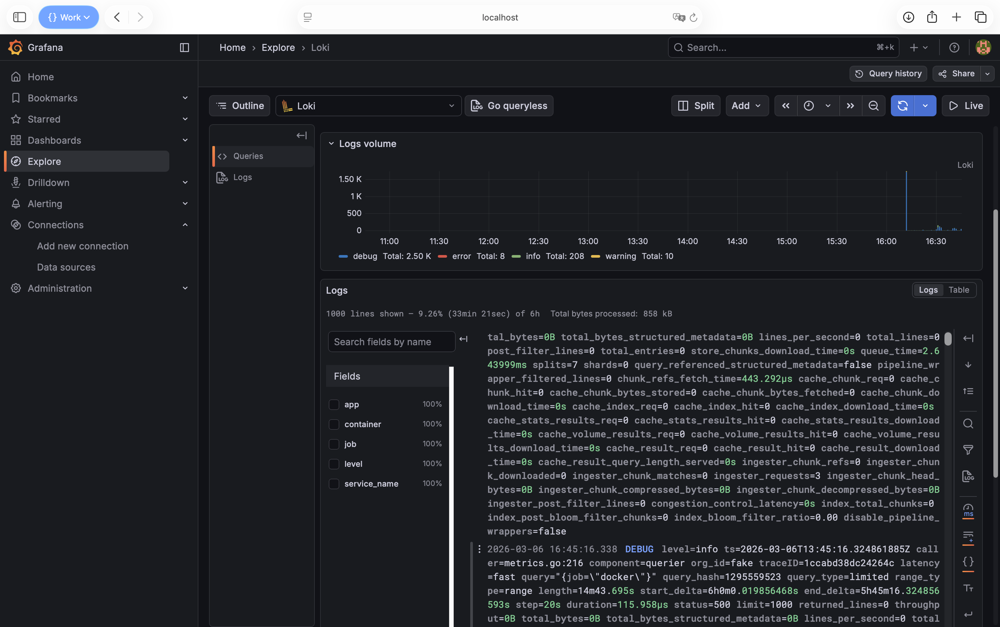
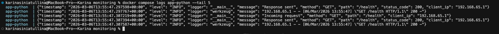
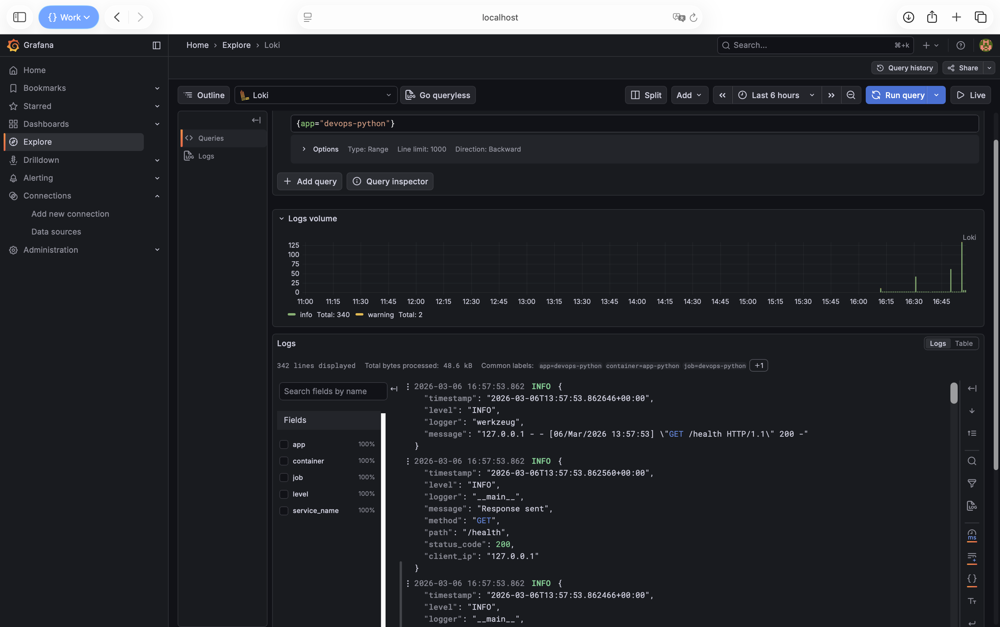
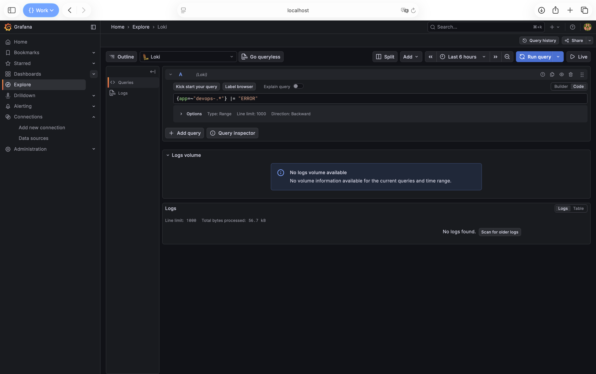
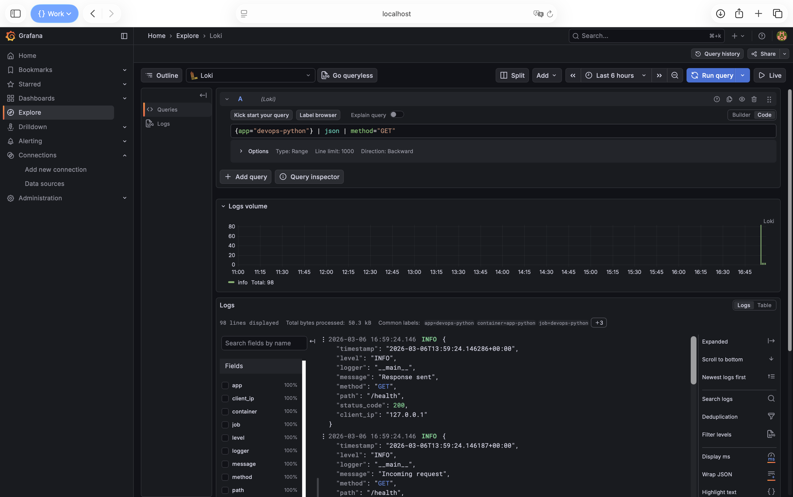
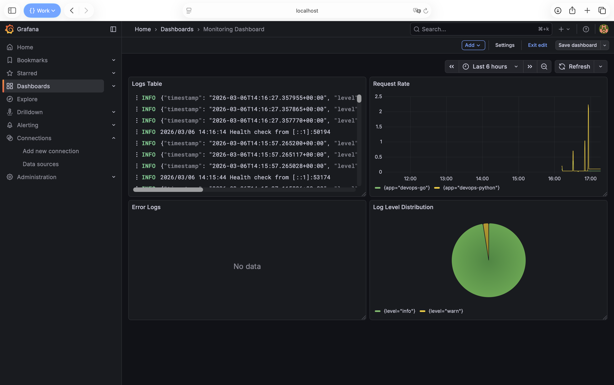
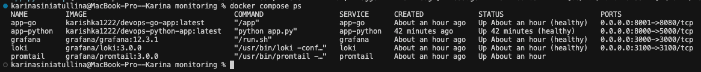
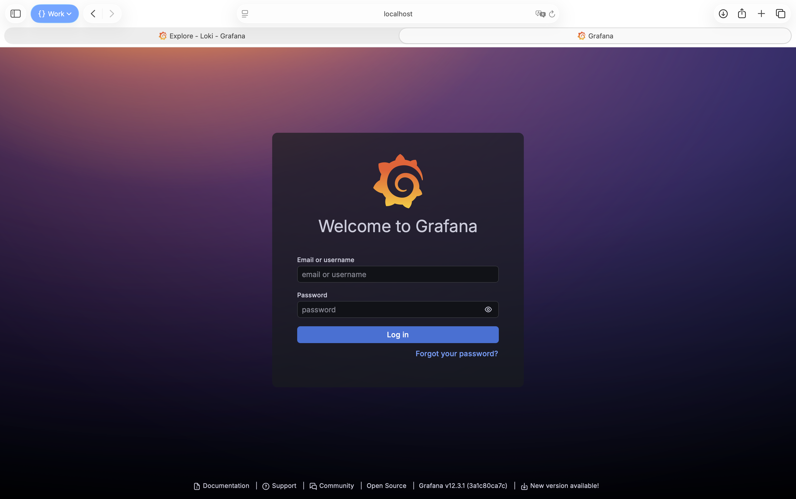

# Lab 7 — Observability & Logging with Loki Stack

## Architecture

```
┌──────────┐     ┌───────────┐     ┌─────────┐
│ app-python│────▸│           │     │         │
│  :8000    │logs │  Promtail │────▸│  Loki   │
│ app-go    │────▸│  :9080    │push │  :3100  │
│  :8001    │     └───────────┘     └────┬────┘
└──────────┘       Docker SD             │
                   via socket        query│
                                    ┌────▼────┐
                                    │ Grafana │
                                    │  :3000  │
                                    └─────────┘
```

- **Loki 3.0** — log aggregation with TSDB index (schema v13), filesystem storage
- **Promtail 3.0** — collects Docker container logs via Docker socket SD
- **Grafana 12.3** — visualization, dashboards, LogQL queries
- **Apps** — Python (Flask, JSON logging) and Go services

All services share a `logging` bridge network. Promtail discovers containers with label `logging=promtail`.

## Setup Guide

```bash
cd monitoring

# Create .env with Grafana credentials
# GF_SECURITY_ADMIN_USER=admin
# GF_SECURITY_ADMIN_PASSWORD=<your_password>

# Deploy
docker compose up -d

# Verify
docker compose ps
curl http://localhost:3100/ready    # Loki
curl http://localhost:3000/api/health  # Grafana
```

**Evidence (Task 1) — Grafana Explore:** logs from at least 3 containers.



Generate test traffic:

```bash
for i in {1..20}; do curl http://localhost:8000/; done
for i in {1..20}; do curl http://localhost:8001/; done
```

## Configuration

### Loki (`loki/config.yml`)

- **TSDB index** with schema v13 — up to 10x faster queries vs boltdb-shipper
- **Filesystem storage** — suitable for single-instance deployment
- **Retention: 168h (7 days)** — enforced by compactor running every 10 min

```yaml
schema_config:
  configs:
    - from: "2024-01-01"
      store: tsdb
      object_store: filesystem
      schema: v13
```

### Promtail (`promtail/config.yml`)

- Docker SD via `/var/run/docker.sock` — auto-discovers containers
- Filters only containers with label `logging=promtail`
- Relabeling extracts `container` name (strips leading `/`) and `app` label

```yaml
docker_sd_configs:
  - host: unix:///var/run/docker.sock
    refresh_interval: 5s
    filters:
      - name: label
        values: ["logging=promtail"]
```

## Application Logging

Python app uses a custom `JSONFormatter` producing structured JSON logs:

```json
{
  "timestamp": "2026-03-05T12:00:00+00:00",
  "level": "INFO",
  "logger": "app",
  "message": "Response sent",
  "method": "GET",
  "path": "/",
  "status_code": 200,
  "client_ip": "172.18.0.1"
}
```

Logging hooks `@app.before_request` and `@app.after_request` capture every HTTP request/response with method, path, status, and client IP.

**Evidence (Task 2)** — JSON log output from app:



**Evidence (Task 2)** — Grafana showing logs from both applications:


**Evidence (Task 2)** — Grafana showing logs from 3+ LogQL queries:







## Dashboard

Four panels created in Grafana:

| # | Panel | Type | LogQL Query |
|---|-------|------|-------------|
| 1 | Logs Table | Logs | `{app=~"devops-.*"}` |
| 2 | Request Rate | Time series | `sum by (app) (rate({app=~"devops-.*"} [1m]))` |
| 3 | Error Logs | Logs | `{app=~"devops-.*"} \| json \| level="ERROR"` |
| 4 | Log Level Distribution | Pie chart | `sum by (level) (count_over_time({app=~"devops-.*"} \| json [5m]))` |

**Evidence (Task 3)** — dashboard with all 4 panels:



## Production Config

**Evidence (Task 4)** — all services healthy:



**Evidence (Task 4)** — Grafana login required (no anonymous access):



- **Anonymous auth disabled** — Grafana requires login, credentials in `.env` (not in repo)
- **Resource limits** on all services (CPU + memory limits and reservations)
- **Health checks** — Loki (`/ready`), Grafana (`/api/health`) with retries and start periods
- **Retention** — 7-day auto-cleanup by Loki compactor
- **Read-only mounts** — config files and Docker socket mounted as `:ro`
- **Restart policy** — `unless-stopped` on all services

## Testing

```bash
# Stack health
docker compose ps                           # all services healthy
curl -s http://localhost:3100/ready          # "ready"
curl -s http://localhost:3000/api/health     # {"database":"ok"}

# Generate logs
for i in {1..20}; do curl -s http://localhost:8000/ > /dev/null; done

# LogQL queries via API
curl -G -s http://localhost:3100/loki/api/v1/query \
  --data-urlencode 'query={app="devops-python"}' | jq .status

# Verify JSON logging
docker compose logs app-python --tail 5
```

## Bonus — Ansible Automation

The monitoring stack is deployed via the `monitoring` Ansible role. Playbook: `ansible/playbooks/deploy-monitoring.yml`. The role creates directories, templates Loki/Promtail/Grafana configs, and runs Docker Compose; it depends on the `docker` role.

**Evidence — first run (deployment):**

```text

PLAY [Deploy Monitoring Stack (Loki + Promtail + Grafana)] *******************************************************************************************************************************************

TASK [Gathering Facts] *******************************************************************************************************************************************************************************
[WARNING]: Host 'lab4-vm' is using the discovered Python interpreter at '/usr/bin/python3.12', but future installation of another Python interpreter could cause a different interpreter to be discovered. See https://docs.ansible.com/ansible-core/2.20/reference_appendices/interpreter_discovery.html for more information.
ok: [lab4-vm]

TASK [docker : Install prerequisites for Docker repository] ******************************************************************************************************************************************
ok: [lab4-vm]

TASK [docker : Create keyrings directory] ************************************************************************************************************************************************************
ok: [lab4-vm]

TASK [docker : Add Docker GPG key] *******************************************************************************************************************************************************************
ok: [lab4-vm]

TASK [docker : Add Docker repository] ****************************************************************************************************************************************************************
ok: [lab4-vm]

TASK [docker : Install Docker packages] **************************************************************************************************************************************************************
ok: [lab4-vm]

TASK [docker : Ensure Docker service is enabled and started] *****************************************************************************************************************************************
ok: [lab4-vm]

TASK [docker : Add user to docker group] *************************************************************************************************************************************************************
ok: [lab4-vm]

TASK [docker : Install python3-docker for Ansible docker modules] ************************************************************************************************************************************
ok: [lab4-vm]

TASK [monitoring : Setup monitoring directory and configs] *******************************************************************************************************************************************
included: /Users/karinasiniatullina/innopolis/3 курс/2sem/devops/DevOps-Core-Course/ansible/roles/monitoring/tasks/setup.yml for lab4-vm

TASK [monitoring : Create monitoring directories] ****************************************************************************************************************************************************
ok: [lab4-vm] => (item=/opt/monitoring)
ok: [lab4-vm] => (item=/opt/monitoring/loki)
ok: [lab4-vm] => (item=/opt/monitoring/promtail)
ok: [lab4-vm] => (item=/opt/monitoring/grafana/provisioning/datasources)

TASK [monitoring : Template Loki config] *************************************************************************************************************************************************************
ok: [lab4-vm]

TASK [monitoring : Template Promtail config] *********************************************************************************************************************************************************
ok: [lab4-vm]

TASK [monitoring : Template Grafana datasource provisioning] *****************************************************************************************************************************************
ok: [lab4-vm]

TASK [monitoring : Template docker-compose file] *****************************************************************************************************************************************************
ok: [lab4-vm]

TASK [monitoring : Deploy monitoring stack] **********************************************************************************************************************************************************
included: /Users/karinasiniatullina/innopolis/3 курс/2sem/devops/DevOps-Core-Course/ansible/roles/monitoring/tasks/deploy.yml for lab4-vm

TASK [monitoring : Deploy monitoring stack with Docker Compose] **************************************************************************************************************************************
changed: [lab4-vm]

TASK [monitoring : Wait for Loki to be ready] ********************************************************************************************************************************************************
ok: [lab4-vm]

TASK [monitoring : Wait for Grafana to be ready] *****************************************************************************************************************************************************
ok: [lab4-vm]

TASK [monitoring : Display deployment status] ********************************************************************************************************************************************************
ok: [lab4-vm] => {
    "msg": "Monitoring stack deployed. Loki: http://localhost:3100 Grafana: http://localhost:3000\n"
}

PLAY RECAP *******************************************************************************************************************************************************************************************
lab4-vm                    : ok=20   changed=1    unreachable=0    failed=0    skipped=0    rescued=0    ignored=0 
```

**Evidence — second run (idempotency, no changes):**

```text

PLAY [Deploy Monitoring Stack (Loki + Promtail + Grafana)] *******************************************************************************************************************************************

TASK [Gathering Facts] *******************************************************************************************************************************************************************************
[WARNING]: Host 'lab4-vm' is using the discovered Python interpreter at '/usr/bin/python3.12', but future installation of another Python interpreter could cause a different interpreter to be discovered. See https://docs.ansible.com/ansible-core/2.20/reference_appendices/interpreter_discovery.html for more information.
ok: [lab4-vm]

TASK [docker : Install prerequisites for Docker repository] ******************************************************************************************************************************************
ok: [lab4-vm]

TASK [docker : Create keyrings directory] ************************************************************************************************************************************************************
ok: [lab4-vm]

TASK [docker : Add Docker GPG key] *******************************************************************************************************************************************************************
ok: [lab4-vm]

TASK [docker : Add Docker repository] ****************************************************************************************************************************************************************
ok: [lab4-vm]

TASK [docker : Install Docker packages] **************************************************************************************************************************************************************
ok: [lab4-vm]

TASK [docker : Ensure Docker service is enabled and started] *****************************************************************************************************************************************
ok: [lab4-vm]

TASK [docker : Add user to docker group] *************************************************************************************************************************************************************
ok: [lab4-vm]

TASK [docker : Install python3-docker for Ansible docker modules] ************************************************************************************************************************************
ok: [lab4-vm]

TASK [monitoring : Setup monitoring directory and configs] *******************************************************************************************************************************************
included: /Users/karinasiniatullina/innopolis/3 курс/2sem/devops/DevOps-Core-Course/ansible/roles/monitoring/tasks/setup.yml for lab4-vm

TASK [monitoring : Create monitoring directories] ****************************************************************************************************************************************************
ok: [lab4-vm] => (item=/opt/monitoring)
ok: [lab4-vm] => (item=/opt/monitoring/loki)
ok: [lab4-vm] => (item=/opt/monitoring/promtail)
ok: [lab4-vm] => (item=/opt/monitoring/grafana/provisioning/datasources)

TASK [monitoring : Template Loki config] *************************************************************************************************************************************************************
ok: [lab4-vm]

TASK [monitoring : Template Promtail config] *********************************************************************************************************************************************************
ok: [lab4-vm]

TASK [monitoring : Template Grafana datasource provisioning] *****************************************************************************************************************************************
ok: [lab4-vm]

TASK [monitoring : Template docker-compose file] *****************************************************************************************************************************************************
ok: [lab4-vm]

TASK [monitoring : Deploy monitoring stack] **********************************************************************************************************************************************************
included: /Users/karinasiniatullina/innopolis/3 курс/2sem/devops/DevOps-Core-Course/ansible/roles/monitoring/tasks/deploy.yml for lab4-vm

TASK [monitoring : Deploy monitoring stack with Docker Compose] **************************************************************************************************************************************
ok: [lab4-vm]

TASK [monitoring : Wait for Loki to be ready] ********************************************************************************************************************************************************
ok: [lab4-vm]

TASK [monitoring : Wait for Grafana to be ready] *****************************************************************************************************************************************************
ok: [lab4-vm]

TASK [monitoring : Display deployment status] ********************************************************************************************************************************************************
ok: [lab4-vm] => {
    "msg": "Monitoring stack deployed. Loki: http://localhost:3100 Grafana: http://localhost:3000\n"
}

PLAY RECAP *******************************************************************************************************************************************************************************************
lab4-vm                    : ok=20   changed=0    unreachable=0    failed=0    skipped=0    rescued=0    ignored=0  
```

## Challenges

- **Loki 3.0 TSDB config**: schema v13 requires `tsdb_shipper` block with `active_index_directory` and `cache_location` — older examples use deprecated boltdb-shipper syntax.
- **Promtail Docker SD filter**: the `filters` block must be inside `docker_sd_configs`, not at `scrape_configs` level.
- **Container name relabeling**: Docker prefixes names with `/` — regex `"/?(.*)"` strips it for clean labels.
