# Lab 8 — Metrics & Monitoring with Prometheus

## 1. Architecture

```
┌─────────────┐    scrape /metrics    ┌──────────────┐    query     ┌─────────────┐
│  app-python  │◄─────────────────────│  Prometheus   │◄────────────│   Grafana    │
│  :5000       │                      │  :9090        │             │  :3000       │
└─────────────┘                      └──────────────┘             └─────────────┘
                                       ▲  ▲  ▲
                              scrape   │  │  │  self-scrape
                         ┌─────────────┘  │  └──────────────┐
                         │                │                  │
                    ┌────┴────┐    ┌──────┴──────┐    ┌─────┴─────┐
                    │  Loki   │    │  Prometheus  │    │  Grafana  │
                    │  :3100  │    │  localhost   │    │  :3000    │
                    └─────────┘    └─────────────┘    └───────────┘
```

Prometheus pulls metrics from all services every 15s. Grafana queries Prometheus via PromQL to render dashboards.

---

## 2. Application Instrumentation

Metrics added to `app_python/app.py` using `prometheus-client==0.23.1`:

| Metric | Type | Labels | Purpose |
|--------|------|--------|---------|
| `http_requests_total` | Counter | method, endpoint, status | Total request count (RED: Rate) |
| `http_request_duration_seconds` | Histogram | method, endpoint | Request latency distribution (RED: Duration) |
| `http_requests_in_progress` | Gauge | — | Concurrent requests |
| `devops_info_endpoint_calls` | Counter | endpoint | Business-level endpoint usage |
| `devops_info_system_collection_seconds` | Histogram | — | System info collection time |

**Why these metrics:**

- `http_requests_total` — Counter is the right type for monotonically increasing values. With `method`, `endpoint`, `status` labels we can compute request rate and error rate (RED: R and E). Label cardinality is kept low (only fixed endpoint paths).
- `http_request_duration_seconds` — Histogram allows computing percentiles (p50, p95, p99) from bucket boundaries. Custom buckets `[5ms..5s]` cover the expected latency range for a lightweight Flask service (RED: D).
- `http_requests_in_progress` — Gauge fits a value that goes up and down. Shows concurrent load and helps detect request queuing.
- `devops_info_endpoint_calls` — Business metric: tracks which endpoints are actually used, independent of HTTP-level counting.
- `devops_info_system_collection_seconds` — Measures time spent in `get_system_info()`, useful for detecting if system calls start degrading.

Metrics are exposed at `GET /metrics` and excluded from self-instrumentation to avoid recursive inflation.

**Metric definitions in code (`app_python/app.py`):**

```python
http_requests_total = Counter(
    'http_requests_total',
    'Total HTTP requests',
    ['method', 'endpoint', 'status']
)

http_request_duration_seconds = Histogram(
    'http_request_duration_seconds',
    'HTTP request duration in seconds',
    ['method', 'endpoint'],
    buckets=[0.005, 0.01, 0.025, 0.05, 0.1, 0.25, 0.5, 1.0, 2.5, 5.0]
)

http_requests_in_progress = Gauge(
    'http_requests_in_progress',
    'HTTP requests currently being processed'
)

endpoint_calls = Counter(
    'devops_info_endpoint_calls',
    'Endpoint call count',
    ['endpoint']
)

system_info_duration = Histogram(
    'devops_info_system_collection_seconds',
    'Time spent collecting system information'
)
```

### Evidence — Task 1

**App running and serving `/metrics`:**

```
(venv) karinasiniatullina@MacBook-Pro--Karina app_python % PORT=8080 python app.py
{"timestamp": "2026-03-16T10:27:44.277118+00:00", "level": "INFO", "logger": "__main__", "message": "Starting DevOps Info Service..."}
{"timestamp": "2026-03-16T10:27:44.277184+00:00", "level": "INFO", "logger": "__main__", "message": "Host: 0.0.0.0, Port: 8080, Debug: False"}
{"timestamp": "2026-03-16T10:27:44.277207+00:00", "level": "INFO", "logger": "__main__", "message": "Visit: http://0.0.0.0:8080/"}
 * Serving Flask app 'app'
 * Debug mode: off
{"timestamp": "2026-03-16T10:27:44.290242+00:00", "level": "INFO", "logger": "werkzeug", "message": "\u001b[31m\u001b[1mWARNING: This is a development server. Do not use it in a production deployment. Use a production WSGI server instead.\u001b[0m\n * Running on all addresses (0.0.0.0)\n * Running on http://127.0.0.1:8080\n * Running on http://10.8.1.8:8080"}
{"timestamp": "2026-03-16T10:27:44.290289+00:00", "level": "INFO", "logger": "werkzeug", "message": "\u001b[33mPress CTRL+C to quit\u001b[0m"}
{"timestamp": "2026-03-16T10:28:04.512760+00:00", "level": "INFO", "logger": "werkzeug", "message": "127.0.0.1 - - [16/Mar/2026 13:28:04] \"GET /metrics HTTP/1.1\" 200 -"}
```

**`curl http://localhost:8080/metrics` output:**

```
# HELP python_gc_objects_collected_total Objects collected during gc
# TYPE python_gc_objects_collected_total counter
python_gc_objects_collected_total{generation="0"} 256.0
python_gc_objects_collected_total{generation="1"} 24.0
python_gc_objects_collected_total{generation="2"} 0.0
# HELP python_gc_objects_uncollectable_total Uncollectable objects found during GC
# TYPE python_gc_objects_uncollectable_total counter
python_gc_objects_uncollectable_total{generation="0"} 0.0
python_gc_objects_uncollectable_total{generation="1"} 0.0
python_gc_objects_uncollectable_total{generation="2"} 0.0
# HELP python_gc_collections_total Number of times this generation was collected
# TYPE python_gc_collections_total counter
python_gc_collections_total{generation="0"} 66.0
python_gc_collections_total{generation="1"} 6.0
python_gc_collections_total{generation="2"} 0.0
# HELP python_info Python platform information
# TYPE python_info gauge
python_info{implementation="CPython",major="3",minor="12",patchlevel="9",version="3.12.9"} 1.0
# HELP http_requests_total Total HTTP requests
# TYPE http_requests_total counter
# HELP http_request_duration_seconds HTTP request duration in seconds
# TYPE http_request_duration_seconds histogram
# HELP http_requests_in_progress HTTP requests currently being processed
# TYPE http_requests_in_progress gauge
http_requests_in_progress 0.0
# HELP devops_info_endpoint_calls_total Endpoint call count
# TYPE devops_info_endpoint_calls_total counter
# HELP devops_info_system_collection_seconds Time spent collecting system information
# TYPE devops_info_system_collection_seconds histogram
devops_info_system_collection_seconds_bucket{le="0.005"} 0.0
devops_info_system_collection_seconds_bucket{le="0.01"} 0.0
devops_info_system_collection_seconds_bucket{le="0.025"} 0.0
devops_info_system_collection_seconds_bucket{le="0.05"} 0.0
devops_info_system_collection_seconds_bucket{le="0.075"} 0.0
devops_info_system_collection_seconds_bucket{le="0.1"} 0.0
devops_info_system_collection_seconds_bucket{le="0.25"} 0.0
devops_info_system_collection_seconds_bucket{le="0.5"} 0.0
devops_info_system_collection_seconds_bucket{le="0.75"} 0.0
devops_info_system_collection_seconds_bucket{le="1.0"} 0.0
devops_info_system_collection_seconds_bucket{le="2.5"} 0.0
devops_info_system_collection_seconds_bucket{le="5.0"} 0.0
devops_info_system_collection_seconds_bucket{le="7.5"} 0.0
devops_info_system_collection_seconds_bucket{le="10.0"} 0.0
devops_info_system_collection_seconds_bucket{le="+Inf"} 0.0
devops_info_system_collection_seconds_count 0.0
devops_info_system_collection_seconds_sum 0.0
# HELP devops_info_system_collection_seconds_created Time spent collecting system information
# TYPE devops_info_system_collection_seconds_created gauge
devops_info_system_collection_seconds_created 1.7736568642766888e+09
```

All 5 custom metrics registered: `http_requests_total` (Counter), `http_request_duration_seconds` (Histogram), `http_requests_in_progress` (Gauge), `devops_info_endpoint_calls_total` (Counter), `devops_info_system_collection_seconds` (Histogram).

---

## 3. Prometheus Configuration

**File:** `monitoring/prometheus/prometheus.yml`

```yaml
global:
  scrape_interval: 15s
  evaluation_interval: 15s

scrape_configs:
  - job_name: 'prometheus'
    static_configs:
      - targets: ['localhost:9090']

  - job_name: 'app'
    static_configs:
      - targets: ['app-python:5000']
    metrics_path: '/metrics'

  - job_name: 'loki'
    static_configs:
      - targets: ['loki:3100']
    metrics_path: '/metrics'

  - job_name: 'grafana'
    static_configs:
      - targets: ['grafana:3000']
    metrics_path: '/metrics'
```

| Job | Target | Path | Description |
|-----|--------|------|-------------|
| prometheus | localhost:9090 | /metrics | Self-monitoring |
| app | app-python:5000 | /metrics | Python application |
| loki | loki:3100 | /metrics | Log aggregator |
| grafana | grafana:3000 | /metrics | Dashboard service |

- **Scrape interval:** 15s
- **Retention time:** 15 days (`--storage.tsdb.retention.time=15d`)
- **Retention size:** 10GB (`--storage.tsdb.retention.size=10GB`)

### Evidence — Task 2

**Prometheus `/targets` — all targets UP:**

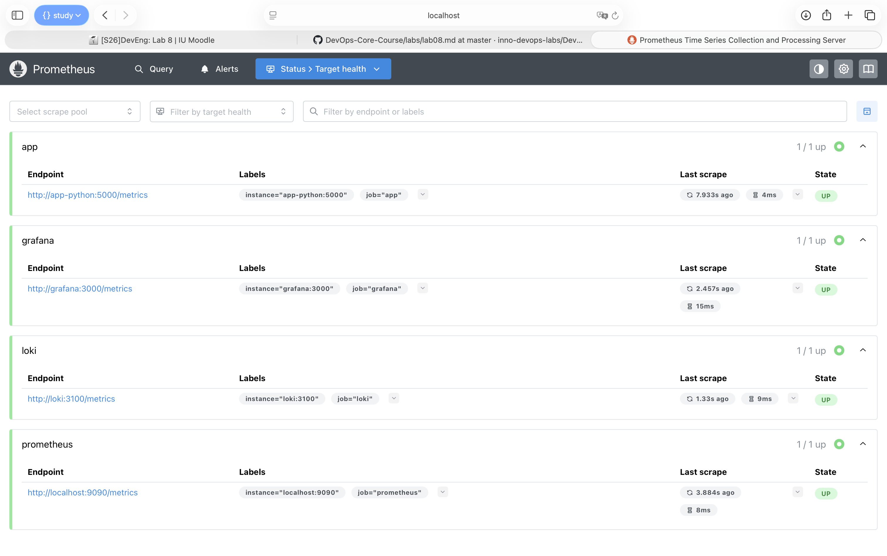

**PromQL query `up` result:**

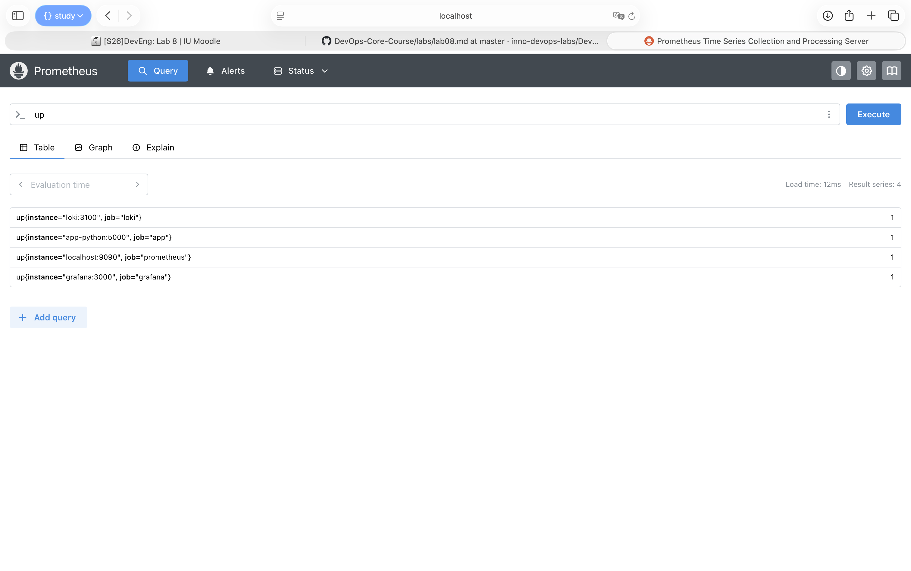

---

## 4. Dashboard Walkthrough

Dashboard: **Application Metrics - DevOps Python App** (7 panels)

1. **Request Rate by Endpoint** — `sum(rate(http_requests_total[5m])) by (endpoint)` — requests/sec per endpoint
2. **Error Rate (5xx)** — `sum(rate(http_requests_total{status=~"5.."}[5m]))` — server error rate
3. **Request Duration p95** — `histogram_quantile(0.95, sum(rate(http_request_duration_seconds_bucket[5m])) by (le, endpoint))` — 95th percentile latency
4. **Request Duration Heatmap** — `sum(increase(http_request_duration_seconds_bucket[5m])) by (le)` — latency distribution
5. **Active Requests** — `http_requests_in_progress` — concurrent in-flight requests
6. **Status Code Distribution** — `sum by (status) (rate(http_requests_total[5m]))` — 2xx/4xx/5xx ratio (pie chart)
7. **Service Uptime** — `up{job="app"}` — service availability (UP/DOWN stat panel)

Dashboard JSON exported to `monitoring/grafana/provisioning/dashboards/app-dashboard.json`.

### Evidence — Task 3

**Custom dashboard with live data (full view) and all 7 panels working:**

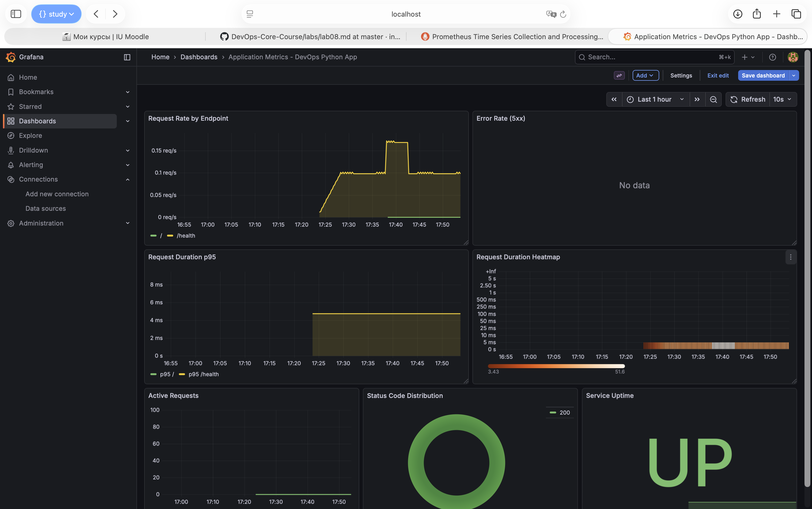

---

## 5. PromQL Examples

```promql
-- 1. Request rate per endpoint (RED: Rate)
sum(rate(http_requests_total[5m])) by (endpoint)

-- 2. Error percentage (RED: Errors)
sum(rate(http_requests_total{status=~"5.."}[5m])) / sum(rate(http_requests_total[5m])) * 100

-- 3. 95th percentile latency (RED: Duration)
histogram_quantile(0.95, sum(rate(http_request_duration_seconds_bucket[5m])) by (le))

-- 4. Average request duration
rate(http_request_duration_seconds_sum[5m]) / rate(http_request_duration_seconds_count[5m])

-- 5. Services currently down
up == 0

-- 6. Total requests in last hour
increase(http_requests_total[1h])

-- 7. Top endpoints by request count
topk(5, sum by (endpoint) (rate(http_requests_total[5m])))
```

Queries 1–3 directly implement the **RED method**: Rate, Errors, Duration.

---

## 6. Production Setup

### Health Checks

All services have Docker health checks:

| Service | Check | Interval |
|---------|-------|----------|
| Loki | `wget http://localhost:3100/ready` | 10s |
| Grafana | `wget http://localhost:3000/api/health` | 10s |
| Prometheus | `wget http://localhost:9090/-/healthy` | 10s |
| app-python | `urllib.request http://localhost:5000/health` | 10s |
| app-go | `wget http://localhost:8080/health` | 10s |

### Resource Limits

| Service | Memory | CPU |
|---------|--------|-----|
| Prometheus | 1G | 1.0 |
| Loki | 1G | 1.0 |
| Grafana | 512M | 1.0 |
| Apps | 256M | 0.5 |

### Retention Policies

- **Prometheus:** 15 days / 10GB (whichever is reached first), set via CLI flags `--storage.tsdb.retention.time=15d` and `--storage.tsdb.retention.size=10GB`
- **Loki:** 168h (7 days)

### Persistent Volumes

- `prometheus-data` → `/prometheus`
- `loki-data` → `/loki`
- `grafana-data` → `/var/lib/grafana`

Data survives `docker compose down` / `docker compose up -d` cycles.

### Evidence — Task 4

**`docker compose ps` — all services healthy:**

```
NAME         IMAGE                                   COMMAND                  SERVICE      CREATED          STATUS                    PORTS
app-go       karishka1222/devops-go-app:latest       "/app"                   app-go       21 seconds ago   Up 10 seconds (healthy)   0.0.0.0:8001->8080/tcp
app-python   karishka1222/devops-python-app:latest   "python app.py"          app-python   21 seconds ago   Up 10 seconds (healthy)   0.0.0.0:8000->5000/tcp
grafana      grafana/grafana:12.3.1                  "/run.sh"                grafana      10 days ago      Up 2 hours (healthy)      0.0.0.0:3000->3000/tcp
loki         grafana/loki:3.0.0                      "/usr/bin/loki -conf…"   loki         10 days ago      Up 2 hours (healthy)      0.0.0.0:3100->3100/tcp
prometheus   prom/prometheus:v3.9.0                  "/bin/prometheus --c…"   prometheus   21 seconds ago   Up 10 seconds (healthy)   0.0.0.0:9090->9090/tcp
promtail     grafana/promtail:3.0.0                  "/usr/bin/promtail -…"   promtail     10 days ago      Up 2 hours  
```

**Data persistence proof:**
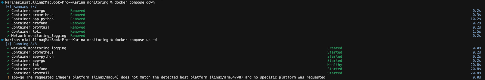
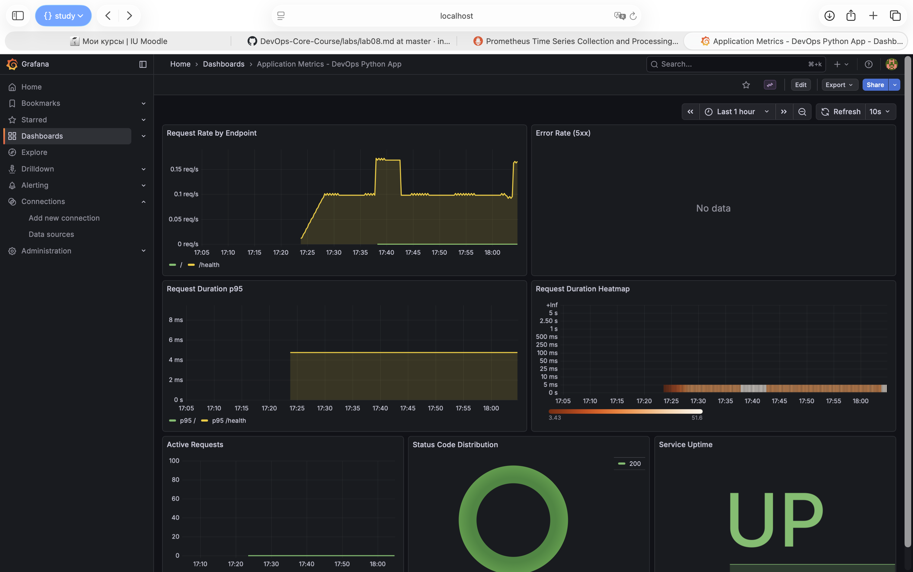

---

## 7. Testing Results

### All services scraping

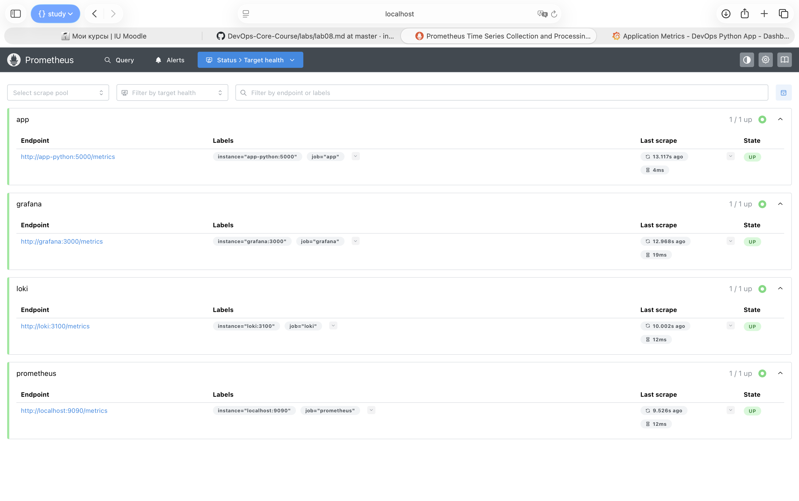

### RED method queries in Prometheus UI
1. Rate query: sum(rate(http_requests_total[5m])) by (endpoint)
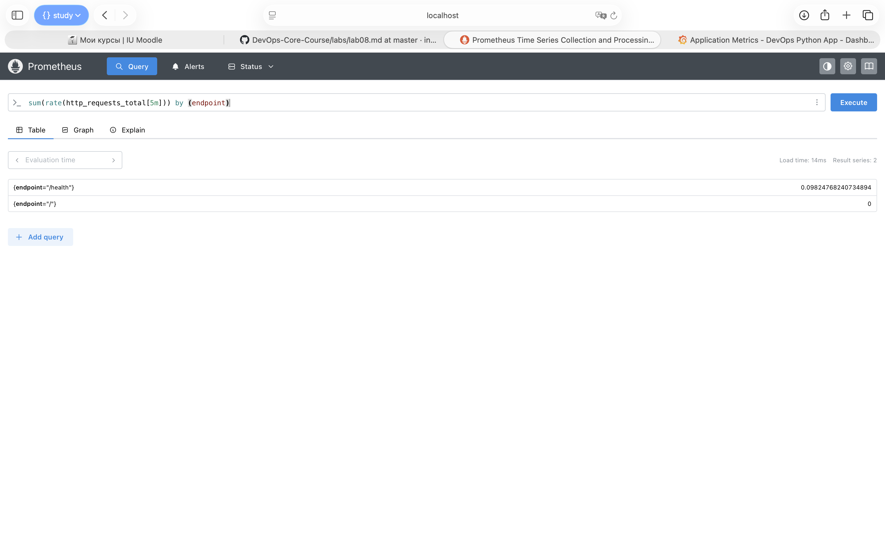
2. Error query: sum(rate(http_requests_total{status=~"5.."}[5m]))
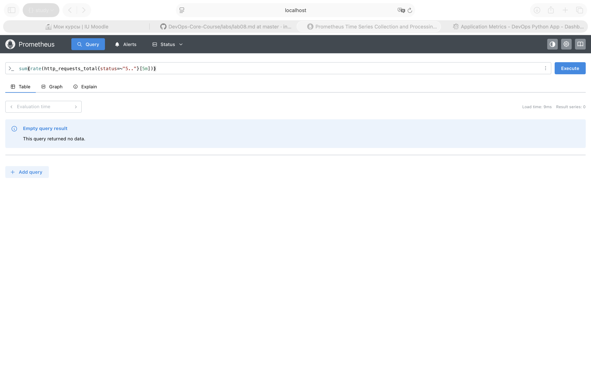
3. Duration query: histogram_quantile(0.95, sum(rate(http_request_duration_seconds_bucket[5m])) by (le))
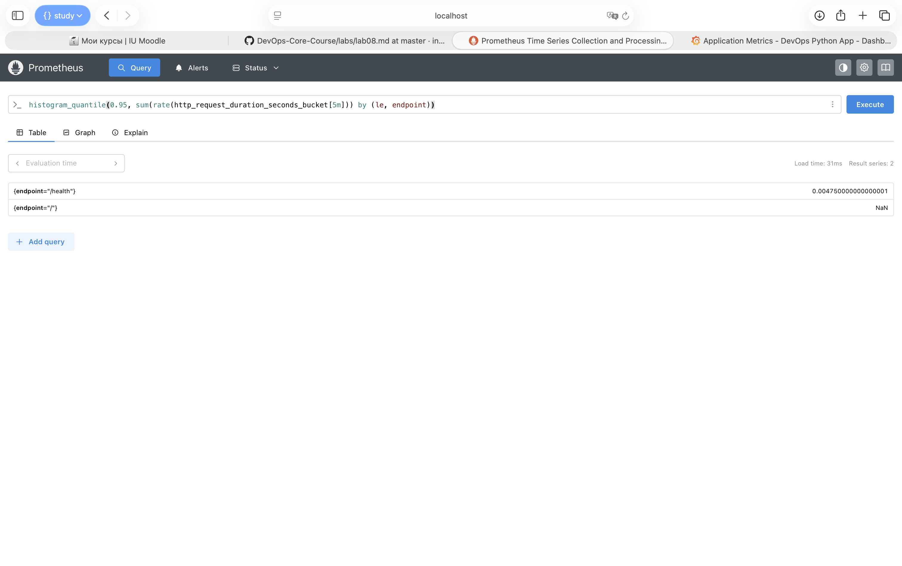


### Dashboard with live data

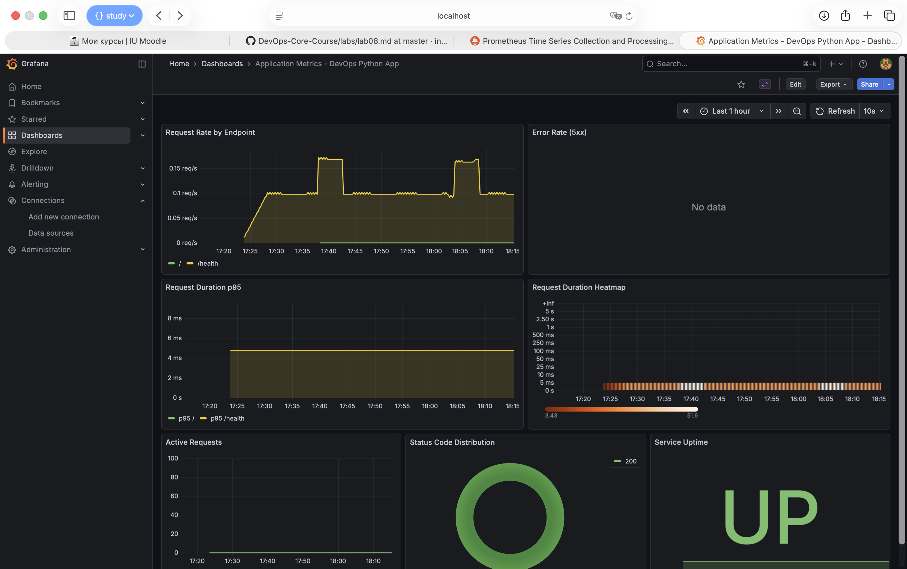

---

## 8. Metrics vs Logs

| Aspect | Metrics (Prometheus, Lab 8) | Logs (Loki, Lab 7) |
|--------|----------------------------|---------------------|
| Format | Numeric time-series | Structured text/JSON events |
| Use case | Rates, aggregations, alerting, SLOs | Debugging, audit trail, error details |
| Query language | PromQL | LogQL |
| Storage efficiency | Very efficient (only numbers) | Larger (full text payloads) |
| Cardinality | Low (labels with few values) | High (every log line is unique) |
| When to use | "How many requests?", "What's the p95?" | "What error message?", "Why did it fail?" |
| Retention | 15 days (sufficient for trends) | 7 days (sufficient for debugging) |
| Example | `rate(http_requests_total[5m])` = 12.5 req/s | `{app="devops-python"} |= "error"` |

**Together** they provide complete observability: metrics detect the problem (spike in error rate), logs explain the cause (stack trace, error message).

---

## 9. Challenges & Solutions

| Challenge | Solution |
|-----------|----------|
| Metrics endpoint inflating request counts | Skip `/metrics` path in `before_request` / `after_request` hooks |
| Histogram bucket selection | Custom buckets `[5ms..5s]` match expected Flask app latency range |
| Container networking for scrape targets | Use Docker Compose service names (`app-python:5000`) instead of `localhost` |
| Grafana datasource auto-provisioning | YAML provisioning file with both Loki and Prometheus datasources |
| Dashboard auto-loading | Dashboard JSON + `dashboards.yml` provider config in provisioning directory |

---

## Bonus: Ansible Automation

### Role structure

```
ansible/roles/monitoring/
├── defaults/main.yml            # All variables (Loki + Prometheus + Grafana)
├── files/
│   └── grafana-app-dashboard.json   # Exported dashboard JSON
├── meta/main.yml                # Dependencies (docker role)
├── tasks/
│   ├── main.yml                 # Entrypoint: assert + setup + deploy
│   ├── setup.yml                # Dirs, templates, provisioning configs
│   └── deploy.yml               # docker compose up + health waits
└── templates/
    ├── docker-compose.yml.j2    # Full stack compose (Loki + Promtail + Prometheus + Grafana + apps)
    ├── loki-config.yml.j2
    ├── promtail-config.yml.j2
    └── prometheus.yml.j2        # Templated from prometheus_targets variable
```

### Key variables (`defaults/main.yml`)

```yaml
prometheus_version: "3.9.0"
prometheus_port: 9090
prometheus_retention_days: 15
prometheus_retention_size: "10GB"
prometheus_scrape_interval: "15s"

prometheus_targets:
  - job: "prometheus"
    targets: ["localhost:9090"]
  - job: "loki"
    targets: ["loki:3100"]
    path: "/metrics"
  - job: "grafana"
    targets: ["grafana:3000"]
    path: "/metrics"
  - job: "app"
    targets: ["app-python:5000"]
    path: "/metrics"
```

### Templated Prometheus config (`templates/prometheus.yml.j2`)

```yaml
global:
  scrape_interval: {{ prometheus_scrape_interval }}
  evaluation_interval: {{ prometheus_scrape_interval }}

scrape_configs:

  - job_name: '{{ target.job }}'
    static_configs:
      - targets: {{ target.targets | to_json }}

    metrics_path: '{{ target.path }}'


```

### Deployment

```bash
ansible-playbook playbooks/deploy-monitoring.yml
```

Deploys: Loki + Promtail + Prometheus + Grafana + apps, with all configs, health checks, resource limits, datasources, and dashboards auto-provisioned.

### Evidence — Bonus

**Ansible playbook execution (first run):**

```
PLAY [Deploy Monitoring Stack (Loki + Promtail + Grafana)] ************************************************************************************************************************************************************************

TASK [Gathering Facts] ************************************************************************************************************************************************************************************************************
[WARNING]: Host 'lab4-vm' is using the discovered Python interpreter at '/usr/bin/python3.12', but future installation of another Python interpreter could cause a different interpreter to be discovered. See https://docs.ansible.com/ansible-core/2.20/reference_appendices/interpreter_discovery.html for more information.
ok: [lab4-vm]

TASK [docker : Install prerequisites for Docker repository] ***********************************************************************************************************************************************************************
ok: [lab4-vm]

TASK [docker : Create keyrings directory] *****************************************************************************************************************************************************************************************
ok: [lab4-vm]

TASK [docker : Add Docker GPG key] ************************************************************************************************************************************************************************************************
ok: [lab4-vm]

TASK [docker : Add Docker repository] *********************************************************************************************************************************************************************************************
ok: [lab4-vm]

TASK [docker : Install Docker packages] *******************************************************************************************************************************************************************************************
ok: [lab4-vm]

TASK [docker : Ensure Docker service is enabled and started] **********************************************************************************************************************************************************************
ok: [lab4-vm]

TASK [docker : Add user to docker group] ******************************************************************************************************************************************************************************************
ok: [lab4-vm]

TASK [docker : Install python3-docker for Ansible docker modules] *****************************************************************************************************************************************************************
ok: [lab4-vm]

TASK [monitoring : Ensure Grafana admin password is set] **************************************************************************************************************************************************************************
ok: [lab4-vm] => {
    "changed": false,
    "msg": "All assertions passed"
}

TASK [monitoring : Setup monitoring directory and configs] ************************************************************************************************************************************************************************
included: /Users/karinasiniatullina/innopolis/3 курс/2sem/devops/DevOps-Core-Course/ansible/roles/monitoring/tasks/setup.yml for lab4-vm

TASK [monitoring : Create monitoring directories] *********************************************************************************************************************************************************************************
ok: [lab4-vm] => (item=/opt/monitoring)
ok: [lab4-vm] => (item=/opt/monitoring/loki)
ok: [lab4-vm] => (item=/opt/monitoring/promtail)
ok: [lab4-vm] => (item=/opt/monitoring/prometheus)
ok: [lab4-vm] => (item=/opt/monitoring/grafana/provisioning/datasources)
ok: [lab4-vm] => (item=/opt/monitoring/grafana/provisioning/dashboards)

TASK [monitoring : Template Loki config] ******************************************************************************************************************************************************************************************
ok: [lab4-vm]

TASK [monitoring : Template Promtail config] **************************************************************************************************************************************************************************************
ok: [lab4-vm]

TASK [monitoring : Template Prometheus config] ************************************************************************************************************************************************************************************
ok: [lab4-vm]

TASK [monitoring : Provision Grafana datasources] *********************************************************************************************************************************************************************************
ok: [lab4-vm]

TASK [monitoring : Remove old Loki-only datasource file] **************************************************************************************************************************************************************************
ok: [lab4-vm]

TASK [monitoring : Provision Grafana dashboard provider config] *******************************************************************************************************************************************************************
ok: [lab4-vm]

TASK [monitoring : Provision Grafana application dashboard] ***********************************************************************************************************************************************************************
changed: [lab4-vm]

TASK [monitoring : Template docker-compose file] **********************************************************************************************************************************************************************************
changed: [lab4-vm]

TASK [monitoring : Deploy monitoring stack] ***************************************************************************************************************************************************************************************
included: /Users/karinasiniatullina/innopolis/3 курс/2sem/devops/DevOps-Core-Course/ansible/roles/monitoring/tasks/deploy.yml for lab4-vm

TASK [monitoring : Deploy monitoring stack with Docker Compose] *******************************************************************************************************************************************************************
changed: [lab4-vm]

TASK [monitoring : Wait for Loki to be ready] *************************************************************************************************************************************************************************************
ok: [lab4-vm]

TASK [monitoring : Wait for Prometheus to be ready] *******************************************************************************************************************************************************************************
ok: [lab4-vm]

TASK [monitoring : Wait for Grafana to be ready] **********************************************************************************************************************************************************************************
ok: [lab4-vm]

TASK [monitoring : Display deployment status] *************************************************************************************************************************************************************************************
ok: [lab4-vm] => {
    "msg": "Monitoring stack deployed. Loki: http://localhost:3100 Prometheus: http://localhost:9090 Grafana: http://localhost:3000\n"
}

PLAY RECAP ************************************************************************************************************************************************************************************************************************
lab4-vm                    : ok=26   changed=3    unreachable=0    failed=0    skipped=0    rescued=0    ignored=0 
```

**Idempotency (second run — no changes):**

```

PLAY [Deploy Monitoring Stack (Loki + Promtail + Grafana)] ************************************************************************************************************************************************************************

TASK [Gathering Facts] ************************************************************************************************************************************************************************************************************
[WARNING]: Host 'lab4-vm' is using the discovered Python interpreter at '/usr/bin/python3.12', but future installation of another Python interpreter could cause a different interpreter to be discovered. See https://docs.ansible.com/ansible-core/2.20/reference_appendices/interpreter_discovery.html for more information.
ok: [lab4-vm]

TASK [docker : Install prerequisites for Docker repository] ***********************************************************************************************************************************************************************
ok: [lab4-vm]

TASK [docker : Create keyrings directory] *****************************************************************************************************************************************************************************************
ok: [lab4-vm]

TASK [docker : Add Docker GPG key] ************************************************************************************************************************************************************************************************
ok: [lab4-vm]

TASK [docker : Add Docker repository] *********************************************************************************************************************************************************************************************
ok: [lab4-vm]

TASK [docker : Install Docker packages] *******************************************************************************************************************************************************************************************
ok: [lab4-vm]

TASK [docker : Ensure Docker service is enabled and started] **********************************************************************************************************************************************************************
ok: [lab4-vm]

TASK [docker : Add user to docker group] ******************************************************************************************************************************************************************************************
ok: [lab4-vm]

TASK [docker : Install python3-docker for Ansible docker modules] *****************************************************************************************************************************************************************
ok: [lab4-vm]

TASK [monitoring : Ensure Grafana admin password is set] **************************************************************************************************************************************************************************
ok: [lab4-vm] => {
    "changed": false,
    "msg": "All assertions passed"
}

TASK [monitoring : Setup monitoring directory and configs] ************************************************************************************************************************************************************************
included: /Users/karinasiniatullina/innopolis/3 курс/2sem/devops/DevOps-Core-Course/ansible/roles/monitoring/tasks/setup.yml for lab4-vm

TASK [monitoring : Create monitoring directories] *********************************************************************************************************************************************************************************
ok: [lab4-vm] => (item=/opt/monitoring)
ok: [lab4-vm] => (item=/opt/monitoring/loki)
ok: [lab4-vm] => (item=/opt/monitoring/promtail)
ok: [lab4-vm] => (item=/opt/monitoring/prometheus)
ok: [lab4-vm] => (item=/opt/monitoring/grafana/provisioning/datasources)
ok: [lab4-vm] => (item=/opt/monitoring/grafana/provisioning/dashboards)

TASK [monitoring : Template Loki config] ******************************************************************************************************************************************************************************************
ok: [lab4-vm]

TASK [monitoring : Template Promtail config] **************************************************************************************************************************************************************************************
ok: [lab4-vm]

TASK [monitoring : Template Prometheus config] ************************************************************************************************************************************************************************************
ok: [lab4-vm]

TASK [monitoring : Provision Grafana datasources] *********************************************************************************************************************************************************************************
ok: [lab4-vm]

TASK [monitoring : Remove old Loki-only datasource file] **************************************************************************************************************************************************************************
ok: [lab4-vm]

TASK [monitoring : Provision Grafana dashboard provider config] *******************************************************************************************************************************************************************
ok: [lab4-vm]

TASK [monitoring : Provision Grafana application dashboard] ***********************************************************************************************************************************************************************
ok: [lab4-vm]

TASK [monitoring : Template docker-compose file] **********************************************************************************************************************************************************************************
ok: [lab4-vm]

TASK [monitoring : Deploy monitoring stack] ***************************************************************************************************************************************************************************************
included: /Users/karinasiniatullina/innopolis/3 курс/2sem/devops/DevOps-Core-Course/ansible/roles/monitoring/tasks/deploy.yml for lab4-vm

TASK [monitoring : Deploy monitoring stack with Docker Compose] *******************************************************************************************************************************************************************
ok: [lab4-vm]

TASK [monitoring : Wait for Loki to be ready] *************************************************************************************************************************************************************************************
ok: [lab4-vm]

TASK [monitoring : Wait for Prometheus to be ready] *******************************************************************************************************************************************************************************
ok: [lab4-vm]

TASK [monitoring : Wait for Grafana to be ready] **********************************************************************************************************************************************************************************
ok: [lab4-vm]

TASK [monitoring : Display deployment status] *************************************************************************************************************************************************************************************
ok: [lab4-vm] => {
    "msg": "Monitoring stack deployed. Loki: http://localhost:3100 Prometheus: http://localhost:9090 Grafana: http://localhost:3000\n"
}

PLAY RECAP ************************************************************************************************************************************************************************************************************************
lab4-vm                    : ok=26   changed=0    unreachable=0    failed=0    skipped=0    rescued=0    ignored=0 
```

**Grafana with both data sources working:**

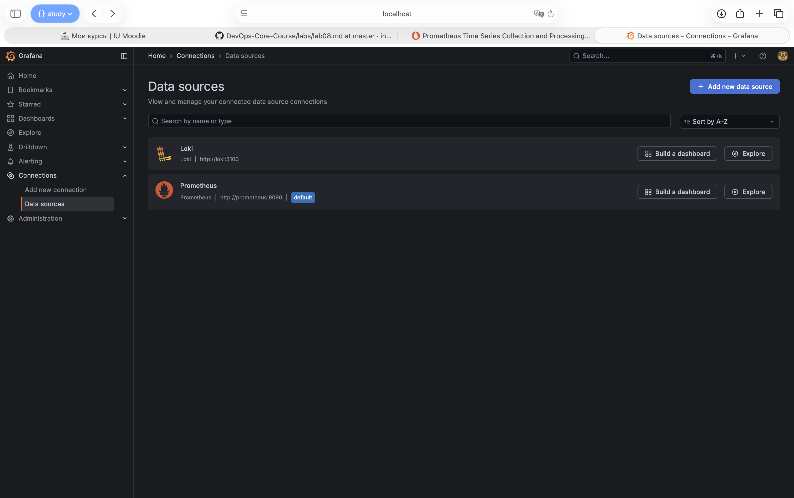

**Both dashboards auto-provisioned:**

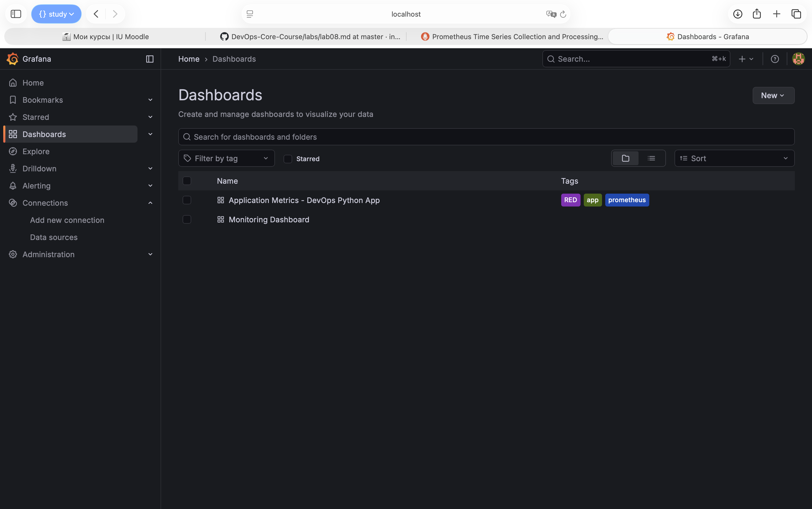